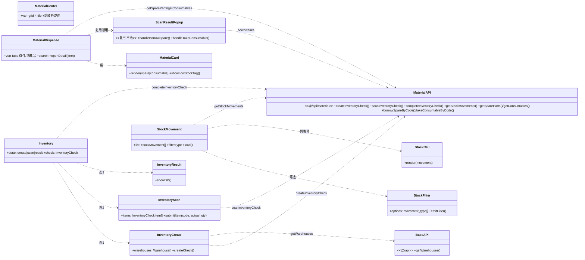
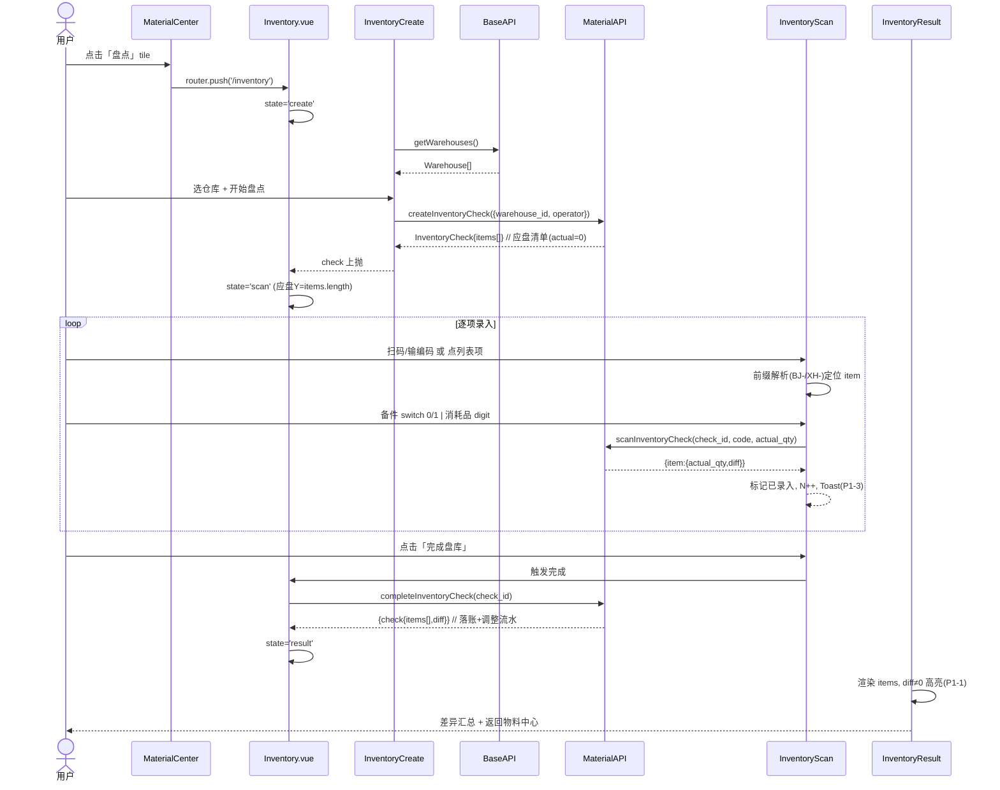
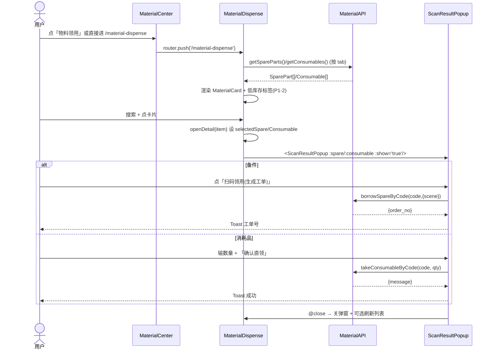
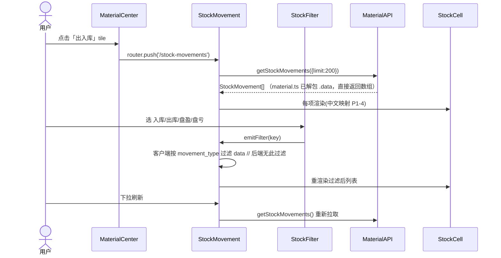

# 物料管理系统 v3.0.0 — 手机端物料模块增量架构设计与任务分解

> 架构师：高见远（software-architect）｜ 关联 PRD：`deliverables/material-mobile-incremental-prd.md`
> 范围：**纯前端增量**，后端 26 个物料路由已就绪，**零后端改动**；技术栈沿用既有 `mobile-frontend`（Vue3 + Vant4 + TS + Pinia + Vue Router）。
> 用户已拍板两点：① 领用"两者都要"（保留扫码领用 + 新增独立物料领用页）；② 新增「物料」底部 Tab 聚合为**物料中心页**（4 tile），不拆 4 个 Tab。

---

## 1. 实现方案 + 框架选型

### 1.1 框架选型（确认，零新增依赖）
- **Vant 4.9** 组件库、**Pinia 2.1** 状态管理、**Vue Router 4.3** 路由、**TypeScript 5.4**、**Vue 3.4**——均已在 `mobile-frontend/package.json` 中，**本次不引入任何新 npm 包**（详见 §6）。
- 摄像头扫码沿用既有 composable `useScanner`（被 `ScanTool.vue` 使用），不重写、不改动 `ScanTool.vue`。

### 1.2 架构模式
沿用既有分层：**View(.vue) → composables/api → Pinia store → `@/api` axios 实例**。本增量不引入新抽象层；新页面按"容器页 + 子组件"组织，便于分批实现与审阅。

### 1.3 关键技术决策（基于已读源码与后端）
1. **盘点"应盘总数"可知**：`createInventoryCheck` 后端会**预置本仓库全部备件(actual=0/system=1)与消耗品(actual=0/system=stock_qty)为 `items` 明细**并返回。→ 盘点页直接以 `items` 为主清单渲染，进度 = `已录入 N / 应盘 Y(items.length)`，无需空扫循环（解答 PRD Q4）。
2. **盘点录入映射后端语义**：提交 `scanInventoryCheck(id, code, actual_qty)`，后端对备件取传入 actual（0/1）、消耗品取传入 actual（实数）。→ 备件用 `van-switch`（在位=1/缺失=0），消耗品用 `van-field digit`（实数），**显式传 actual_qty**。
3. **领用复用 `ScanResultPopup` 整组件**：独立领用页详情直接挂 `<ScanResultPopup :spare/:consumable :show="true">`，borrow/take 逻辑零重写（解答 PRD Q3）。
4. **出入库 `movement_type` 前端过滤**：后端 `GET /stock-movements` **不支持 `movement_type` 过滤**（仅 item_type/operator_name/时间），且枚举仅 `in/out/adjust`（盘盈/盘亏 = `adjust` 的 qty 正负）。→ 移动端**拉取后客户端按 movement_type 过滤**，零后端改动（详见 §8 偏差①）。
5. **角色**：后端 `createInventoryCheck` 与 `completeInventoryCheck` **已 `requireMaterialManager`**；`scanInventoryCheck`/`getStockMovements`/`getInventoryChecks` 仅需登录。→ 前端**不前置拦截**（遵循 PRD Q5 默认"不限制"），但对 403 给出友好提示（见 §8 偏差② / 待确认 Q5）。

---

## 2. 文件列表（相对路径，按 NEW / MODIFIED / REUSED）

### 2.1 新增（NEW）
| 文件 | 说明 | 所属任务 |
| --- | --- | --- |
| `mobile-frontend/src/constants/material.ts` | 共享常量：`MOVEMENT_TYPE_TEXT`（中文映射）、`ITEM_TYPE_TEXT`、`MATERIAL_TABBAR`（物料 Tab 文案/图标） | T01 |
| `mobile-frontend/src/views/MaterialCenter.vue` | 物料中心页：4 tile（备件/消耗品/盘点/出入库）→ 对应路由 | T01 |
| `mobile-frontend/src/views/MaterialDispense.vue` | 独立物料领用页：`van-tabs`(备件/消耗品)+搜索+列表+复用弹窗 | T02 |
| `mobile-frontend/src/components/MaterialCard.vue` | 备件/消耗品通用卡片（含低库存标签 P1-2） | T02 |
| `mobile-frontend/src/composables/useMaterialList.ts` | 封装 `getSpareParts`/`getConsumables` + 关键词搜索 + 低库存判定 | T02 |
| `mobile-frontend/src/views/Inventory.vue` | 盘点三态容器（state 机 + 持有 check + 顶部 nav） | T03 |
| `mobile-frontend/src/views/inventory/InventoryCreate.vue` | 态1：选仓库 + 创建盘库单 | T03 |
| `mobile-frontend/src/views/inventory/InventoryScan.vue` | 态2：应盘清单 + 逐项录入 actual_qty + 进度(P1-3) | T03 |
| `mobile-frontend/src/views/inventory/InventoryResult.vue` | 态3：完成 + 差异高亮(P1-1) | T03 |
| `mobile-frontend/src/views/StockMovement.vue` | 出入库页：列表 + 下拉刷新 + 空态 | T04 |
| `mobile-frontend/src/views/stock/StockFilter.vue` | 出入库 `movement_type` 筛选栏（前端过滤） | T04 |
| `mobile-frontend/src/views/stock/StockCell.vue` | 流水项 cell（含中文映射 P1-4） | T04 |

### 2.2 修改（MODIFIED）
| 文件 | 改动 | 所属任务 |
| --- | --- | --- |
| `mobile-frontend/src/router/index.ts` | 新增 4 条路由：`/material-center`、`/inventory`、`/stock-movements`、`/material-dispense` | T01 |
| `mobile-frontend/src/views/Dashboard.vue` | 底部 `van-tabbar` 增加「物料」项 → `/material-center` | T05 |
| `mobile-frontend/src/views/ToolManagement.vue` | 同上 | T05 |
| `mobile-frontend/src/views/OrderManagement.vue` | 同上 | T05 |
| `mobile-frontend/src/views/Profile.vue` | 同上 | T05 |
| `mobile-frontend/src/views/SparePartList.vue` | 同上（保留既有列表/详情/领用） | T05 |
| `mobile-frontend/src/views/ConsumableList.vue` | 同上（保留既有列表/详情/直领） | T05 |
| `mobile-frontend/src/views/ScanTool.vue` | 仅底部 `van-tabbar` 增加「物料」项（**扫码/工具逻辑零改动**） | T05 |

### 2.3 复用（REUSED，不改动）
- `mobile-frontend/src/components/ScanResultPopup.vue` — 领用逻辑（`handleBorrowSpare`/`handleTakeConsumable`）。
- `mobile-frontend/src/composables/useScanner.ts` — 摄像头扫码（盘点态2 可选启用）。
- `mobile-frontend/src/api/material.ts` — 全部物料 API。
- `mobile-frontend/src/api/index.ts` — `getWarehouses()`。
- `mobile-frontend/src/types/index.ts` — `SparePart`/`Consumable`/`Warehouse`/`StockMovement`/`InventoryCheck`/`InventoryCheckItem`。

---

## 3. 数据结构和接口

### 3.1 组件结构与依赖（类图）


### 3.2 新页面 → 复用类型 / API 对照表
| 页面 | 复用的类型 | 复用的 API | 备注 |
| --- | --- | --- | --- |
| MaterialCenter | — | `router.push` | 无业务数据，仅聚合入口 |
| MaterialDispense | `SparePart` `Consumable` | `getSpareParts` `getConsumables` `borrowSpareByCode` `takeConsumableByCode`（经 ScanResultPopup） | 列表数据直接来自既有 API |
| Inventory | `Warehouse` `InventoryCheck` `InventoryCheckItem` | `getWarehouses` `createInventoryCheck` `scanInventoryCheck` `completeInventoryCheck` | `items` 来自 create 返回 |
| StockMovement | `StockMovement` | `getStockMovements` | `movement_type` 前端过滤 |

### 3.3 盘点核心调用（参数 / 返回）
| 调用 | 入参 | 返回（关键字段） | 说明 |
| --- | --- | --- | --- |
| `getWarehouses()` | — | `Warehouse[]{warehouse_id, warehouse_name, ...}` | 选仓库数据源 |
| `createInventoryCheck({warehouse_id, operator?})` | `warehouse_id:number`；`operator?:string`（取 `authStore.user.real_name||username`） | `InventoryCheck{ check_id, check_no, warehouse_id, status:'pending', items: InventoryCheckItem[] }` | **items 已预置本仓备件/消耗品（actual_qty=0）**；非 material_manager 返回 403 |
| `scanInventoryCheck(check_id, code, actual_qty?)` | `code`（BJ-/XH-）；`actual_qty`：备件 0/1、消耗品实数 | `{ message, item: {item_code, actual_qty, diff} }` | 命中更新 items 对应项 diff；未命中按 code 追加 |
| `completeInventoryCheck(check_id)` | `check_id:number` | `{ message, check:{items[]}, adjustments[] }` | diff≠0 写 adjust 流水、消耗品落账；非 material_manager 返回 403 |

### 3.4 领用核心调用（参数 / 返回）
| 调用 | 入参 | 返回 | 说明 |
| --- | --- | --- | --- |
| `borrowSpareByCode(code, {scene?,expected_return?,purpose?})` | `code=spare_code` | `{ order_no, order_id, spare }` | 生成 pending 工单（ScanResultPopup 内调用，本页不重写） |
| `takeConsumableByCode(code, qty)` | `code=consumable_code`, `qty:number` | `{ message, consumable }` | 扣库存 + 写 out 流水（ScanResultPopup 内调用） |

### 3.5 出入库调用（参数 / 返回 / 过滤）
| 调用 | 入参 | 返回 | 说明 |
| --- | --- | --- | --- |
| `getStockMovements(params?)` | `params:{item_type?,operator_name?,start?,end?,page?,limit?}` | **`StockMovement[]`（注意：移动端 `material.ts` 的 `getStockMovements` 已 `.then(r=>r.data)` 解包，函数直接返回数组，并非 `{total,page,limit,data}` 包装体）** | **后端不支持 `movement_type` 过滤** → 移动端拉取后（建议 `limit:200`）在数组上客户端过滤；分页/总数前端无需使用 |

### 3.6 `movement_type` / `item_type` 中文映射（放 `constants/material.ts`）
```ts
// movement_type 实际枚举仅 in/out/adjust
export const MOVEMENT_TYPE_TEXT: Record<string, string> = {
  in: '入库', out: '出库', adjust: '盘盈/盘亏'
}
// 盘盈/盘亏 由 adjust 的 qty 符号派生：qty>0 盘盈，qty<0 盘亏
export const ITEM_TYPE_TEXT: Record<string, string> = {
  spare: '备件', consumable: '消耗品', tool: '工具'
}
// 出入库筛选选项（前端过滤用）
export const STOCK_FILTER_OPTIONS = [
  { key: 'all',     label: '全部' },
  { key: 'in',      label: '入库', match: (m) => m.movement_type === 'in' },
  { key: 'out',     label: '出库', match: (m) => m.movement_type === 'out' },
  { key: 'profit',  label: '盘盈', match: (m) => m.movement_type === 'adjust' && m.qty > 0 },
  { key: 'loss',    label: '盘亏', match: (m) => m.movement_type === 'adjust' && m.qty < 0 }
]
```

---

## 4. 程序调用流程（时序图，mermaid）

### 4.1 盘点全流程（P0-2）


### 4.2 独立领用全流程（P0-4，复用 ScanResultPopup）


### 4.3 出入库列表流程（P0-3 + P1-4，前端过滤）


---

## 5. 任务列表（有序，含依赖，按实现顺序）

> 规则遵循：≤5 任务；T01 为基座（路由+共享常量+物料中心页）；每任务 ≥3 文件；依赖尽量仅 T01（星型拓扑）。

| TaskID | 任务名 | 源文件（新增/修改） | 依赖 | 优先级 |
| --- | --- | --- | --- | --- |
| **T01** | 基座：路由注册 + 共享映射常量 + 物料中心页 | NEW `router/index.ts`(+4路由)、NEW `constants/material.ts`、NEW `views/MaterialCenter.vue`（含物料 TabBar） | — | P0 |
| **T02** | 独立物料领用页（P0-4，复用 ScanResultPopup；含 P1-2 低库存） | NEW `views/MaterialDispense.vue`、NEW `components/MaterialCard.vue`、NEW `composables/useMaterialList.ts` | T01 | P0 |
| **T03** | 盘点页（P0-2 三态；含 P1-1 差异高亮、P1-3 进度） | NEW `views/Inventory.vue`、NEW `views/inventory/InventoryCreate.vue`、NEW `views/inventory/InventoryScan.vue`、NEW `views/inventory/InventoryResult.vue` | T01 | P0 |
| **T04** | 出入库流水页（P0-3；含 P1-4 中文映射 + 前端过滤） | NEW `views/StockMovement.vue`、NEW `views/stock/StockFilter.vue`、NEW `views/stock/StockCell.vue` | T01 | P0 |
| **T05** | 「物料」底部 TabBar 聚合（P0-5）+ 构建验证 | MOD `views/Dashboard.vue`、`ToolManagement.vue`、`OrderManagement.vue`、`Profile.vue`、`SparePartList.vue`、`ConsumableList.vue`、`ScanTool.vue`（各 +「物料」tabbar-item） | T01（实际最后执行，统一构建验证） | P0 |

**实现顺序建议**：T01 → T02 → T03 → T04 → T05（T05 收尾做各页 TabBar 注入 + `pnpm build` 类型/构建验证）。

### 5.1 各任务落地要点
- **T01**：`router` 增加 4 条懒加载路由；`constants/material.ts` 落地 §3.6 映射与 `MATERIAL_TABBAR`；`MaterialCenter.vue` 用 `van-grid` 4 tile，`router.push` 到 `/spare-parts`、`/consumables`、`/inventory`、`/stock-movements`，页底含标准 5 项 TabBar（物料高亮）。
- **T02**：`useMaterialList.ts` 暴露 `load(tab)`、`keyword`、`filtered`、低库存判定；`MaterialDispense.vue` 用 `van-tabs` 切备件/消耗品，`van-search` 过滤，`MaterialCard` 列表；点卡片 → 设 `selectedSpare/Consumable` 并 `<ScanResultPopup :show="true">`；`@close` 关弹窗。
- **T03**：`Inventory.vue` 持有 `state` 与 `check`；`InventoryCreate` 调 `getWarehouses`+`createInventoryCheck` 拿 `items`；`InventoryScan` 以 `items` 为清单，逐项 `van-switch`(备件)/`van-field digit`(消耗品) → `scanInventoryCheck`，顶部进度 `已录入 N / 应盘 Y`；`InventoryResult` 调 `completeInventoryCheck` 后渲染 `diff≠0` 高亮。
- **T04**：`StockMovement.vue` 拉取后客户端按 `STOCK_FILTER_OPTIONS` 过滤；`StockFilter` 渲染筛选栏；`StockCell` 用 `MOVEMENT_TYPE_TEXT`/`ITEM_TYPE_TEXT` 展示中文。
- **T05**：在 7 个既有视图的 `<van-tabbar>` 中插入 `<van-tabbar-item icon="apps-o" to="/material-center">物料</van-tabbar-item>`（置于「工具」之后；`ScanTool.vue` 置于「扫码」之后，保留其 6 项结构）。全部 `van-tabbar` 已带 `route` 属性，由 `to` 自动高亮，无需改 `active` 索引。最后 `pnpm build`（含 `vue-tsc`）验证。

---

## 6. 依赖包列表（零新增）
| 包 | 版本 | 用途 | 状态 |
| --- | --- | --- | --- |
| `vant` | ^4.9.0 | UI 组件库 | 既有 |
| `@vant/use` | ^1.6.0 | Vant 组合式工具 | 既有 |
| `vue` | ^3.4.0 | 框架 | 既有 |
| `vue-router` | ^4.3.0 | 路由 | 既有 |
| `pinia` | ^2.1.0 | 状态管理 | 既有 |
| `axios` | ^1.7.0 | HTTP（含 `@/api` 实例） | 既有 |
| `html5-qrcode` | ^2.3.8 | 摄像头扫码（`useScanner` 内部） | 既有 |

**结论：本次不新增任何 npm 依赖；不新建/修改 `vite.config.ts`、`tsconfig.json`、`package.json`。**

---

## 7. 共享知识（跨文件约定）

1. **`actual_qty` 录入约定**：备件 → `van-switch`（在位=1/缺失=0）；消耗品 → `van-field type="digit"`（实数）；提交 `scanInventoryCheck` 时**显式传 `actual_qty`**，不依赖后端默认值。
2. **`ScanResultPopup` 复用方式**：仅通过 props 区分——`<ScanResultPopup :spare="sp" :consumable="null" :show="show" @update:show @close />`（备件）或 `:consumable="c" :spare="null"`（消耗品）。组件内部 `kind` 自动判定并渲染 borrow/take 按钮，**本迭代绝不复制其逻辑**。
3. **TabBar 统一结构**：标准 5 项 = `首页(/dashboard,home-o) | 工具(/tools,orders-o) | 物料(/material-center,apps-o) | 工单(/orders,description) | 我的(/profile,contact)`；`ScanTool.vue` 保留自身 6 项（多一个「扫码」）。所有页 `van-tabbar` 带 `route`，由 `to` 自动高亮。文案/图标常量集中在 `constants/material.ts` 的 `MATERIAL_TABBAR`。
4. **`movement_type` 中文映射表位置**：`constants/material.ts`（`MOVEMENT_TYPE_TEXT` + `STOCK_FILTER_OPTIONS`）；`item_type` 映射同文件（`ITEM_TYPE_TEXT`）。任何页面展示流水/盘库类型都从此处取，禁止散落 hardcode。
5. **`getStockMovements` 返回形态**：`mobile-frontend/src/api/material.ts` 中的 `getStockMovements` 已 `.then(r => r.data)` 解包，**函数直接返回 `StockMovement[]` 数组**（不是 `{total,page,limit,data}` 包装体，切勿再写 `.data`）；后端不按 `movement_type` 过滤，移动端在返回的数组上做客户端过滤（建议拉取 `limit:200`）。
6. **角色与权限**：盘点创建/完成后端 `requireMaterialManager`；前端不前置拦截，但 `catch` 中识别 `err.response?.status === 403` 时提示"无权限：仅物料管理员可创建/完成盘库"。
7. **`operator` 取值**：`createInventoryCheck` 的 `operator` 取 `authStore.user.real_name || authStore.user.username`（与 PC 端一致），可省略（后端有默认）。
8. **低库存判定**：`warning_qty != null && stock_qty <= warning_qty`（与 ScanResultPopup 内逻辑一致），用于 `MaterialCard` 的「库存预警」标签（P1-2）。
9. **空值与单位**：`warning_qty` 可能为 `null`；展示库存用 `` `${stock_qty} ${unit || ''}` ``；图片缺失用 `van-icon photo-o` 占位（仿既有列表页）。

---

## 8. 待明确事项（架构师判定 + 须拍板项）

### 8.1 已按默认方案落地（无需用户再拍板）
| PRD 问题 | 判定 / 默认方案 |
| --- | --- |
| **Q1** `actual_qty` 录入方式 | **采用**：备件 `van-switch` 0/1、消耗品 `digit` 实数——与后端语义一致（已读 `materials.js` 确认）。 |
| **Q2** 「物料」Tab 形态 | **采用「物料中心页 4 tile」**——用户已拍板"新增物料底部Tab聚合→物料中心页"，不拆 4 个 Tab。 |
| **Q3** ScanResultPopup 复用粒度 | **整组件复用**（直接挂 `<ScanResultPopup>`），不抽方法、不重写 borrow/take。 |
| **Q4** 应盘总数是否可知 | **可知**：`createInventoryCheck` 返回预置 `items`（actual=0），`应盘Y=items.length`，进度显示"已录入 N / 应盘 Y"。无需用户拍板。 |
| **Q6** TabBar 重构 | **本迭代仅新增入口**，不抽公共 `<AppTabBar>`（P2-3 后续）。 |

### 8.2 与 PRD 预期的偏差（须产品/团队知悉，非用户拍板）
- **偏差① 出入库按 `movement_type` 过滤后端不支持**：`GET /stock-movements` 仅支持 `item_type/operator_name/时间`，无 `movement_type`；且枚举仅 `in/out/adjust`（**盘盈/盘亏 = `adjust` 的 qty 正负**，无独立 `profit`/`loss`/`transfer` 类型）。→ 本设计改**前端客户端过滤**，零后端改动；筛选项提供：全部/入库(in)/出库(out)/盘盈(adjust&qty>0)/盘亏(adjust&qty<0)。**PRD 提到的"调拨/其他"后端无对应，本迭代不提供**（如确需，需后端新增类型，违反 P0-6）。
- **偏差② 盘点创建/完成受 `material_manager` 限制**：后端 `createInventoryCheck`/`completeInventoryCheck` 已 `requireMaterialManager`，`scanInventoryCheck` 仅需登录。这与 PRD Q5"本迭代不限制角色"的期望存在张力（详见下）。

### 8.3 ⚠️ 仍须用户拍板（唯一阻塞项）
- **Q5 角色权限（最终裁定）**：本设计默认**零后端改动** → 实际效果是"只有 `material_manager` 角色能创建/完成盘库"，非管理员调用会收 403（前端友好提示）。两种选择：
  - **(A) 接受后端既有约束**（推荐，保持 P0-6 零后端改动）：仅物料管理员可盘点，移动端对 403 提示"需物料管理员权限"。
  - **(B) 放开至所有登录用户**：必须修改后端去掉 `requireMaterialManager`（**违反 P0-6 零后端依赖**，需后端配合）。
  - **请用户/主理人确认选 A 还是 B。** 在收到裁定前，工程师按 A 实现（前端不拦截 + 403 提示）。

---

## 9. 验收勾稽（P0/P1 覆盖）
- **P0-1** 物料中心页 → T01（MaterialCenter + 4 tile）。
- **P0-2** 盘点三态 → T03（create/scan/result + items 应盘清单）。
- **P0-3** 出入库列表+筛选 → T04（前端过滤 + 中文映射）。
- **P0-4** 独立领用页 → T02（复用 ScanResultPopup，逻辑单一源）。
- **P0-5** 物料底部 Tab → T05（7 页注入 + 新页自带）。
- **P0-6** 零后端依赖 → 全程仅调既有 API，偏差①②均已用"前端方案"规避。
- **P1-1** 差异高亮 → T03 InventoryResult；**P1-2** 低库存 → T02 MaterialCard；**P1-3** 进度反馈 → T03 InventoryScan；**P1-4** 中文映射 → T04 + constants/material.ts。

---

*— 增量架构设计文档结束 —*
