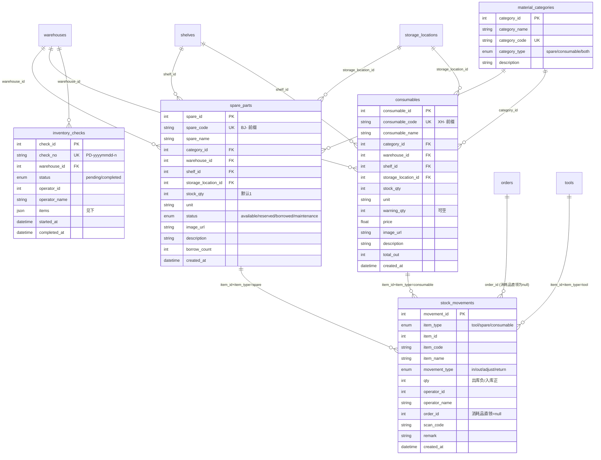
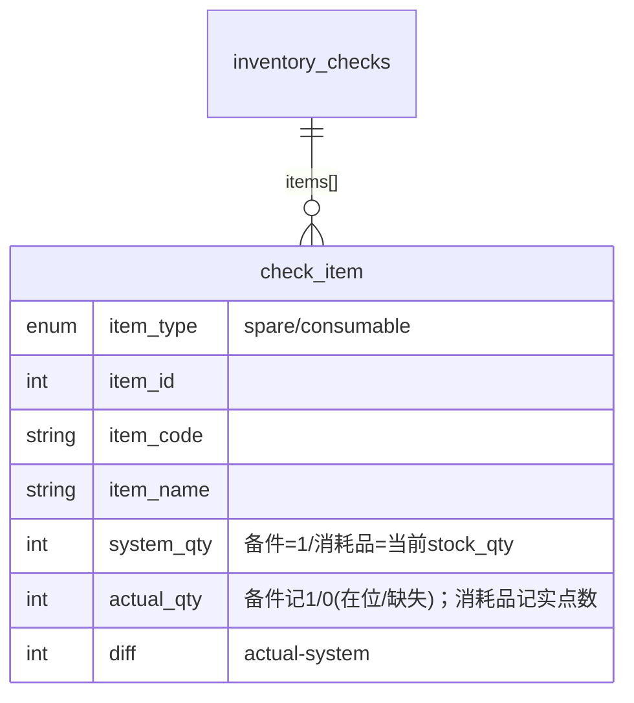
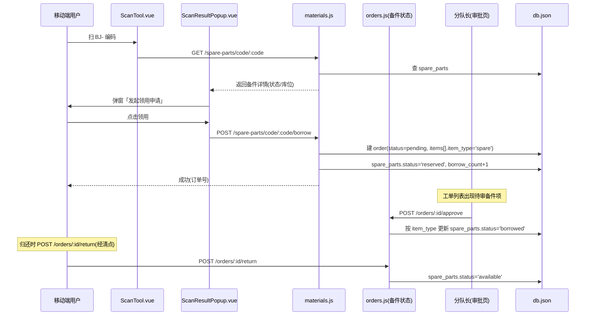
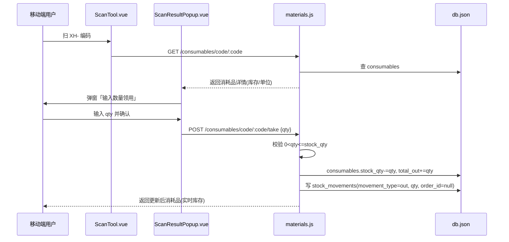
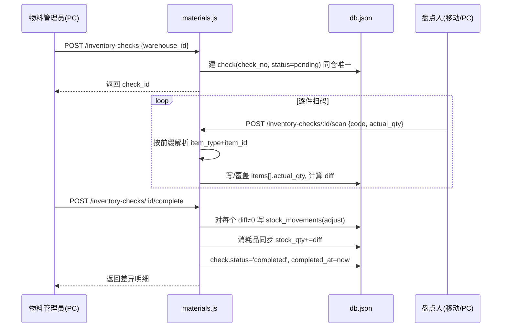

# 物料管理系统 v3.0.0 增量架构设计 + 任务分解

> 版本：v3.0.0 增量架构设计
> 编制：架构师 高见远（Gao）
> 日期：2026-07-11
> 主输入：`material-system-v3-prd.md`（许清楚）、`material-system-upgrade-plan-v3.0.md`（齐活林）
> 代码蓝本：`backend/`、`vue-frontend/`、`mobile-frontend/`（现有 v2.0.0 工器具系统）
> 目标读者：工程师（寇豆码）直接照此批量写代码

---

## 〇、设计原则（贯穿全文）

| 原则 | 说明 |
|------|------|
| **沿用技术栈** | 不引入新框架。后端 Node+Express+JSON 文件库（`db.json`）；PC 端 Vue3+ElementPlus；移动端 Vue3+Vant4+html5-qrcode。 |
| **仿写工具模块** | 备件/消耗品/分类/流水/盘库全部以 `backend/routes/tools.js`、`admin.js`、`orders.js` 为蓝本仿写，字段命名与交互对齐工具。 |
| **最小变更** | 现有 `tools`/`toolkits`/`categories`/`orders` 逻辑不重写、不迁移；仅扩展（订单加 `item_type`、菜单加分组、扫码加前缀分支）。 |
| **复用既有能力** | 鉴权复用 `requireMaterialManager`；图片上传复用 `multer+sharp` 的 `compressImage`；扫码复用 `useScanner` 与 JsBarcode；错误响应统一 `{message}` 格式。 |
| **路由模块合并** | 5 张新表的后端接口**合并为单个 `backend/routes/materials.js`**（见 §2 说明），避免 5 个文件重复 `compressImage`/校验/库位归属链逻辑。 |

---

## 一、实现方案 + 框架选型

### 1.1 为什么不再引入新框架

- 现有系统已有完整的 Express 路由分层（`auth/users/tools/orders/admin`）、JWT 鉴权中间件、multer+sharp 图片压缩、JSON 文件库读写（`readDB/writeDB/migrateDB/nextId/nowCST`），全部可直接复用。
- 物料模块与工具模块业务同构（CRUD + 按编码查 + 扫码 + 库存/状态变动 + 工单），**新框架不会减少工作量，只会增加联调与回归风险**。
- 移动端 html5-qrcode 扫码引擎已封装为 `useScanner.ts`，JsBarcode 已在 PC 条码页使用，均无新增依赖。
- 结论：**零新框架、零新依赖**，仅「仿写 + 扩展现有文件」。

### 1.2 分层与模块映射

```
接入层   PC(Vue3+ElementPlus)  ·  移动端(Vue3+Vant4+html5-qrcode)
   ↓
业务层   工具(精简) │ 备件 │ 消耗品 │ 物料分类 │ 出入库流水 │ 盘库 │ 工单(扩展item_type) │ 仪表盘(扩展)
   ↓
基础服务  JWT鉴权 + requireMaterialManager │ 图片上传(multer+sharp) │ 扫码引擎(前缀分发) │ 编码生成
   ↓
数据层   db.json（11 张老表 + 5 张新表 = 16 张）
```

### 1.3 关于「5 个路由模块」的取舍（与规划 §4 的差异说明）

规划 §4 列出 5 个独立路由文件。本设计**合并为 1 个 `materials.js`**，理由：

1. `compressImage`（图片压缩）、`upload` multer 实例、`validate` 校验器、仓库/货架/货位归属链校验在 5 组接口中高度复用，拆分会产生 5 份重复代码。
2. 单文件便于工程师一次性实现、一次性 review、一次性联调。
3. 若团队坚持拆分，可等分为 `spare-parts.js / consumables.js / material-categories.js / stock-movements.js / inventory-checks.js`，接口路径与字段完全一致，仅文件边界不同——本设计任务清单以「单文件」为准，拆分不阻塞。

---

## 二、文件列表及相对路径

> 图例：**【新】**=新增文件　**【改】**=修改现有文件
> 范围：`C:\Users\yan\WorkBuddy\2026-05-10-task-6\` 为仓库根，下表路径相对该根目录。

### 2.1 后端（4 个文件：1 新 + 3 改）

| 文件 | 类型 | 改动要点 |
|------|------|----------|
| `backend/routes/materials.js` | 【新】 | 单文件承载 5 类接口（备件/消耗品/分类/流水/盘库），内置 `validate`、复用 `compressImage`（从 tools.js 拷贝）、`upload` multer 实例、库位归属链校验；仿 `tools.js` 写所有 CRUD + `code/:code` 查询 + 领用/直领 |
| `backend/routes/db.js` | 【改】 | `initDB()` 的 `initialDB` 增加 5 张空数组表；`migrateDB()` 对存量 `db.json` 补充 5 张表（若不存在），幂等 |
| `backend/server.js` | 【改】 | ① `app.use('/api', require('./routes/materials'))` 挂载；② `/api/health` 的 `version` `'2.0.0'`→`'3.0.0'`；③ 启动 log 文案「工器具」→「物料」；④（P1）`/api/dashboard` 增加物料统计字段 |
| `backend/routes/orders.js` | 【改】 | 订单支持 `item_type`：① `createOrder` 解析 `spare` 类目并置备件 `reserved`；② `approve/reject/return` 按 `item_type` 更新 `tools` 或 `spare_parts` 状态；③ `checklist` 清点复用（备件同工具） |

### 2.2 PC 前端（16 个文件：5 新 + 11 改）

| 文件 | 类型 | 改动要点 |
|------|------|----------|
| `vue-frontend/src/views/SparePartManagement.vue` | 【新】 | `/spare-parts` 备件管理页，仿 `ToolManagement.vue`，去工具箱列，列=图片/编码/名称/分类/状态/仓库/货位/借次，操作=编辑/上传/条码/加入领用篮/删除 |
| `vue-frontend/src/views/ConsumableManagement.vue` | 【新】 | `/consumables` 消耗品管理页，列增「库存/单位/低库存预警」，操作增「出库（弹窗输量，调 BE8）」 |
| `vue-frontend/src/views/MaterialCategoryManagement.vue` | 【新】 | `/material-categories` 物料分类页，`category_type` 下拉（备件/消耗品/通用） |
| `vue-frontend/src/views/StockMovement.vue` | 【新】 | `/stock-movements` 出入库流水页，筛选 item_type/时间/操作人 |
| `vue-frontend/src/views/InventoryCheck.vue` | 【新】 | `/inventory-checks` 盘库管理页，新建盘库单/详情扫码录数/完成差异 |
| `vue-frontend/src/views/BarcodeList.vue` | 【改】 | 模式增加「备件」「消耗品」（PC6，P1），复用 JsBarcode 按前缀打印 |
| `vue-frontend/src/router/index.ts` | 【改】 | 新增 5 条路由（`/spare-parts`、`/consumables`、`/material-categories`、`/stock-movements`、`/inventory-checks`） |
| `vue-frontend/src/layouts/MainLayout.vue` | 【改】 | ① logo「工器具管理系统」→「物料管理系统」；② 菜单重组：新增「物料管理」分组（备件/消耗品/分类/流水/盘库），原工具/工具箱/工具分类归入「工具管理」分组 |
| `vue-frontend/src/api/index.ts` | 【改】 | 新增物料相关 API 函数（见 §4 接口签名） |
| `vue-frontend/src/types/index.ts` | 【改】 | 新增 `SparePart`/`Consumable`/`MaterialCategory`/`StockMovement`/`InventoryCheck`/`OrderItem` 扩展类型 |
| `vue-frontend/src/views/Dashboard.vue` | 【改】 | （P1）新增物料统计卡片：备件总数/消耗品库存/低库存预警 |
| `vue-frontend/src/store/cart.ts` | 【改】 | 购物车项增加 `item_type`（`tool`/`spare`），支持加入备件（ORD2） |
| `vue-frontend/src/views/OrderManagement.vue` | 【改】 | 工单列表/详情按 `item_type` 展示备件项，审批/归还流程对备件生效（ORD1） |
| `vue-frontend/src/views/ShoppingCart.vue` | 【改】 | 生成工单时携带 `item_type`，区分工具/备件（ORD2） |
| `vue-frontend/src/views/Login.vue` | 【改】 | 登录页标题「工器具」→「物料管理系统」（REN1） |
| `vue-frontend/index.html` | 【改】 | `<title>`「工器具管理系统」→「物料管理系统」（REN1） |

### 2.3 移动端（11 个文件：2 新 + 9 改）

| 文件 | 类型 | 改动要点 |
|------|------|----------|
| `mobile-frontend/src/views/SparePartList.vue` | 【新】 | `/spare-parts` 备件列表+详情，支持「领用」→ 生成工单（MOB1） |
| `mobile-frontend/src/views/ConsumableList.vue` | 【新】 | `/consumables` 消耗品列表+详情+「领用」弹窗输量（MOB2） |
| `mobile-frontend/src/views/ScanTool.vue` | 【改】 | `onCodeDetected` 按前缀分发：`G-`工具/`BX-`工具箱（保留）、`BJ-`→`getSpareByCode`/`XH-`→`getConsumableByCode`（SCAN1/SCAN3）；底部 `van-tabbar` 增「物料」Tab（MOB3，P1） |
| `mobile-frontend/src/components/ScanResultPopup.vue` | 【改】 | 支持渲染备件（「发起领用申请」→ 调 BE4）/消耗品（「输入数量领用」→ 调 BE8）详情与动作（SCAN2） |
| `mobile-frontend/src/router/index.ts` | 【改】 | 新增 `/spare-parts`、`/consumables` 路由；（P1）可选新增 `/material` 聚合入口 |
| `mobile-frontend/src/api/index.ts` | 【改】 | 新增物料 API（备件/消耗品/分类/流水/盘库/扫码查询/领用/直领） |
| `mobile-frontend/src/types/index.ts` | 【改】 | 新增 `SparePart`/`Consumable`/`MaterialCategory`/`StockMovement`/`InventoryCheck` 类型 |
| `mobile-frontend/src/store/cart.ts` | 【改】 | `CartItem` 增加 `item_type`，支持备件入篮 |
| `mobile-frontend/src/views/OrderManagement.vue` | 【改】 | 工单展示 `item_type` 备件项；审批/归还对备件生效 |
| `mobile-frontend/src/views/Login.vue` | 【改】 | 标题「工器具」→「物料管理系统」（REN2） |
| `mobile-frontend/src/components/AppTabbar.vue` + 各页面 tabbar 替换 | 【改】 | （P1，MOB3）建议抽出共享 `AppTabbar.vue`（含 物料 Tab），替换各页内联 `van-tabbar`（当前见 ScanTool.vue 内联）；若求最小变更则直接在各页 tabbar 加「物料」项 |

> 说明：移动端底部 TabBar 目前以**各页面内联 `van-tabbar`** 形式存在（如 `ScanTool.vue` 第 95–101 行）。MOB3 为 P1，推荐先抽共享组件 `components/AppTabbar.vue` 再统一替换，避免多页面重复改；若时间紧，直接逐页加 Tab 亦可。

### 2.4 改名涉及文案汇总（REN1–REN4）

| 位置 | 旧文案 | 新文案 |
|------|--------|--------|
| `vue-frontend/index.html` `<title>` | 工器具管理系统 | 物料管理系统 |
| `MainLayout.vue` `.logo` | 工器具管理系统 | 物料管理系统 |
| `MainLayout.vue` 菜单 | 工器具管理 / 工具箱管理 / 工具分类 | 归入「工具管理」分组；新增「物料管理」分组 |
| `vue-frontend/src/views/Login.vue` | 工器具管理系统 | 物料管理系统 |
| `mobile-frontend/src/views/Login.vue` | 工器具 | 物料管理系统 |
| `mobile-frontend/src/router/index.ts` meta.title `/tools` | 工器具 | 物料（或保留「工具」+ 新增「物料」） |
| `backend/server.js` 启动 log + `/api/health` version | 工器具 / 2.0.0 | 物料管理 / 3.0.0 |

---

## 三、数据结构与接口（ER 图）

### 3.1 数据模型（5 张新表 + 与老表关系）



`inventory_checks.items[]` 元素结构：



### 3.2 接口清单（统一前缀 `/api`，写操作 `requireMaterialManager` 标注 MM）

#### 备件 `materials.js`（前缀 `/spare-parts`）

| 方法 | 路径 | 权限 | 说明 |
|------|------|------|------|
| GET | `/spare-parts` | 登录 | 备件列表（注入分类名/仓库名/货位名） |
| POST | `/spare-parts` | MM | 新增（校验库位归属链、编码唯一，`stock_qty` 默认 1） |
| PUT | `/spare-parts/:id` | MM | 更新 |
| DELETE | `/spare-parts/:id` | MM | 删除 |
| GET | `/spare-parts/code/:code` | 登录 | 按 `spare_code` 查详情+库位名 |
| POST | `/spare-parts/code/:code/borrow` | 登录 | 扫码领用→生成 `pending` 工单（items[].item_type='spare'），状态置 `reserved`，`borrow_count+1` |
| POST | `/spare-parts/:id/upload-image` | MM | 图片上传（复用 `compressImage`） |

#### 消耗品 `materials.js`（前缀 `/consumables`）

| 方法 | 路径 | 权限 | 说明 |
|------|------|------|------|
| GET | `/consumables` | 登录 | 列表 |
| POST | `/consumables` | MM | 新增（编码唯一） |
| PUT | `/consumables/:id` | MM | 更新 |
| DELETE | `/consumables/:id` | MM | 删除 |
| GET | `/consumables/code/:code` | 登录 | 按 `consumable_code` 查 |
| POST | `/consumables/code/:code/take` | 登录 | 直领 `body{qty}`：校验 `0<qty<=stock_qty`，扣 `stock_qty`、累加 `total_out`，写 `stock_movements(out,order_id=null)` |
| POST | `/consumables/:id/upload-image` | MM | 图片上传 |
| GET | `/consumables/low-stock` | 登录 | `stock_qty<=warning_qty` 列表（P1，BE9） |

#### 物料分类 `materials.js`（前缀 `/material-categories`）

| 方法 | 路径 | 权限 | 说明 |
|------|------|------|------|
| GET | `/material-categories` | 登录 | 列表 |
| POST | `/material-categories` | MM | 新增（`category_code` 唯一） |
| PUT | `/material-categories/:id` | MM | 更新 |
| DELETE | `/material-categories/:id` | MM | 删除前校验无关联备件/消耗品（仿 `tool-categories` 删除保护） |

#### 出入库流水 `materials.js`（前缀 `/stock-movements`）

| 方法 | 路径 | 权限 | 说明 |
|------|------|------|------|
| GET | `/stock-movements` | 登录 | 列表（筛选 `item_type`/时间/操作人，分页） |
| POST | `/stock-movements` | MM/AD | 手动登记（`in/out/adjust`）：写流水并同步主表（消耗品改 `stock_qty`；备件/工具改状态） |

#### 盘库 `materials.js`（前缀 `/inventory-checks`）

| 方法 | 路径 | 权限 | 说明 |
|------|------|------|------|
| GET | `/inventory-checks` | 登录 | 列表 |
| POST | `/inventory-checks` | MM | 新建单仓库盘库单（`check_no` 生成；同仓库仅一个 `pending`） |
| GET | `/inventory-checks/:id` | 登录 | 详情（含 `items[]`） |
| POST | `/inventory-checks/:id/scan` | 登录 | 提交实际数量：按 `code` 前缀解析→命中则写/覆盖 `actual_qty`，计算 `diff`（未命中则追加） |
| POST | `/inventory-checks/:id/complete` | MM | 完成：对每个 `diff≠0` 项写 `adjust` 流水并落账（消耗品更新 `stock_qty`），置 `completed`+`completed_at` |

#### 工单扩展（修改 `orders.js`）

| 方法 | 路径 | 权限 | 说明 |
|------|------|------|------|
| POST | `/orders` | 登录 | 支持购物车含 `item_type='spare'` 项，生成工单（备件项置 `reserved`） |
| POST | `/orders/:id/approve` | 审批 | 按 `item_type` 更新 `tools` 或 `spare_parts` 状态→`borrowed` |
| POST | `/orders/:id/reject` | 审批 | 按 `item_type` 还原 `available` |
| POST | `/orders/:id/return` | 登录 | 按 `item_type` 还原 `available`（备件复用 checklist 清点） |
| GET/POST | `/orders/:id/checklist` | 登录 | 备件现场清点（同工具，`item_type` 路由到 `spare_parts`） |

> 错误响应统一格式：`{ "message": "说明文字" }`，状态码 400（参数/校验） / 404（未找到） / 403（权限） / 413（图片过大）。

---

## 四、程序调用流程（时序图）

### 4.1 备件扫码领用（生成工单 pending → 审批 → 借出）



### 4.2 消耗品扫码直领（扣库存 + 写流水）



### 4.3 盘库扫码（建单 → 逐件扫码 → 完成写调整流水）



---

## 五、任务列表（有序、含依赖、按阶段）

> 阶段标记：**【后端】→【PC】→【移动端】→【联调】**。依赖以「依赖：<任务ID>」标注。
> 颗粒度到单文件/单接口。P1 项标注（不影响主流程闭环，可后置）。

### Stage 1 · 后端（先建表+接口，前端依赖此）

- **T-B01**【后端】`backend/routes/db.js`：在 `initialDB` 增 5 张空表；`migrateDB` 幂等补充 5 张表。**无依赖**。
- **T-B02**【后端】`backend/routes/materials.js`（建文件骨架）：引入 `express/multer/sharp/express-validator`、复用 `readDB/writeDB/nextId/nowCST`、拷贝 `tools.js` 的 `compressImage` 与 `upload` 实例、定义 `validate`。**依赖：T-B01**。
- **T-B03**【后端】`materials.js`·物料分类：实现 `/material-categories` 的 GET/POST/PUT/DELETE + 删除保护。**依赖：T-B02**。
- **T-B04**【后端】`materials.js`·备件 CRUD + 图片 + `code/:code` 查询：仿 `tools.js`，含库位归属链校验、`spare_code` 唯一。`**依赖：T-B03**（category_id 关联）**。
- **T-B05**【后端】`materials.js`·消耗品 CRUD + 图片 + `code/:code` 查询 + `low-stock`。**依赖：T-B03**。
- **T-B06**【后端】`materials.js`·消耗品直领 `POST /consumables/code/:code/take`：校验 `qty`、扣库存、写 `stock_movements`。**依赖：T-B05**。
- **T-B07**【后端】`materials.js`·备件领用 `POST /spare-parts/code/:code/borrow`：生成 `pending` 工单（`item_type='spare'`）、置 `reserved`。**依赖：T-B04**。
- **T-B08**【后端】`materials.js`·出入库流水：`GET /stock-movements`（筛选/分页）+ `POST /stock-movements`（手动登记，同步主表）。**依赖：T-B04、T-B05**。
- **T-B09**【后端】`materials.js`·盘库：建单/详情/`scan`/`complete`（含 `adjust` 落账）。**依赖：T-B01**。
- **T-B10**【后端】`backend/routes/orders.js` 扩展 `item_type`：`createOrder`/`approve`/`reject`/`return`/`checklist` 按 `item_type` 路由到 `tools` 或 `spare_parts`。**依赖：T-B07**。
- **T-B11**【后端】`backend/server.js`：挂载 `materials.js`；`/api/health` 版本→3.0.0；启动 log 改名。**依赖：T-B02~T-B09**。
- **T-B12**【后端·P1】`server.js` `/api/dashboard` 增 `spare_total/consumable_total/consumable_low_stock`。**依赖：T-B04、T-B05**。

### Stage 2 · PC 前端（依赖后端接口就绪）

- **T-P01**【PC】`types/index.ts`：增 `SparePart`/`Consumable`/`MaterialCategory`/`StockMovement`/`InventoryCheck` 类型。**无依赖**。
- **T-P02**【PC】`api/index.ts`：增物料 API 函数（对应 §3.2 全部接口）。**依赖：T-P01**。
- **T-P03**【PC】`router/index.ts`：增 5 条路由。**依赖：T-P02**。
- **T-P04**【PC】`SparePartManagement.vue`（新）：备件列表/增改/筛选/上传/条码/加入领用篮/删除。**依赖：T-P02、T-B04**。
- **T-P05**【PC】`ConsumableManagement.vue`（新）：列表/增改/出库弹窗（调 BE8）/预警红标。**依赖：T-P02、T-B05、T-B06**。
- **T-P06**【PC】`MaterialCategoryManagement.vue`（新）。**依赖：T-P02、T-B03**。
- **T-P07**【PC】`StockMovement.vue`（新）。**依赖：T-P02、T-B08**。
- **T-P08**【PC】`InventoryCheck.vue`（新）：建单/扫码录数/完成差异。**依赖：T-P02、T-B09**。
- **T-P09**【PC】`store/cart.ts`：购物车项加 `item_type`，支持备件入篮（ORD2）。**依赖：T-P01**。
- **T-P10**【PC】`ShoppingCart.vue` + `OrderManagement.vue`：生成/展示含 `item_type` 工单（ORD1/ORD2）。**依赖：T-P09、T-B10**。
- **T-P11**【PC】`MainLayout.vue` + `Login.vue` + `index.html`：改名 + 菜单重组（物料管理/工具管理分组）。**无依赖（改名可随时）**。
- **T-P12**【PC·P1】`BarcodeList.vue`：增备件/消耗品条码模式（PC6）。**依赖：T-P02**。
- **T-P13**【PC·P1】`Dashboard.vue`：物料统计卡片（DASH1）。**依赖：T-B12**。

### Stage 3 · 移动端（依赖后端接口）

- **T-M01**【移动】`types/index.ts` + `api/index.ts`：增物料类型与 API。**无依赖**。
- **T-M02**【移动】`store/cart.ts`：`CartItem` 加 `item_type`，支持备件。**依赖：T-M01**。
- **T-M03**【移动】`ScanTool.vue`：`onCodeDetected` 前缀分发 `BJ-`/`XH-`（SCAN1/SCAN3）；（P1）tabbar 增「物料」。**依赖：T-M01、T-B04、T-B05**。
- **T-M04**【移动】`ScanResultPopup.vue`：渲染备件（发起领用→BE4）/消耗品（输量→BE8）动作（SCAN2）。**依赖：T-M01、T-B06、T-B07**。
- **T-M05**【移动】`SparePartList.vue`（新）：列表+详情+领用。**依赖：T-M01、T-B04**。
- **T-M06**【移动】`ConsumableList.vue`（新）：列表+详情+输量领用。**依赖：T-M01、T-B05、T-B06**。
- **T-M07**【移动】`router/index.ts`：增 `/spare-parts`、`/consumables`。**依赖：T-M05、T-M06**。
- **T-M08**【移动】`OrderManagement.vue`：展示 `item_type` 备件项、审批/归还。**依赖：T-B10**。
- **T-M09**【移动】`Login.vue` + `App.vue`/各页 tabbar：改名 +（P1）物料 Tab（MOB3）。**无依赖**。

### Stage 4 · 联调与回归

- **T-I01**【联调】备件端到端：移动扫码领用→PC/移动审批→借出→归还清点。（依赖：T-B10、T-M04、T-M08）
- **T-I02**【联调】消耗品端到端：移动扫码输量直领→库存扣减→流水可查。（依赖：T-B06、T-M04、T-M06）
- **T-I03**【联调】盘库端到端：建单→扫码录数→完成差异→流水。（依赖：T-B09、T-P08）
- **T-I04**【联调·回归】工具模块零回归：现有 `tools` 功能/接口/数据不受影响（SC5）。（依赖：全部）
- **T-I05**【联调】改名 grep 校验：双端源码无「工器具」残留（SC3）。（依赖：T-P11、T-M09）

> 任务总数：**后端 12（含 P1×1） + PC 13（含 P1×2） + 移动 9（含 P1×3） + 联调 5 = 39 条**。

---

## 六、依赖包列表

**无新增依赖。**

| 既有依赖（沿用，不新增） | 用途 | 已在 |
|------|------|------|
| `express` / `multer` / `sharp` / `express-validator` / `bcryptjs` / `jsonwebtoken` | 后端 | `backend`（package.json 已有） |
| `jsbarcode` | 条码打印（PC6 复用） | `vue-frontend` 已用 |
| `html5-qrcode` | 扫码引擎 | `mobile-frontend` 已用 |
| `pinia` / `axios` / `vue-router` / `element-plus` / `vant` | 前端 | 双端已用 |

> 说明：新模块全部复用既有依赖；图片压缩 `compressImage` 直接从 `tools.js` 拷贝进 `materials.js`（或抽公共模块，但为最小变更直接拷贝）。

---

## 七、共享知识（跨文件约定）

### 7.1 编码生成规则

| 类型 | 前缀 | 生成方式 | 唯一性 |
|------|------|----------|--------|
| 工具 | `G-` | 已有 | 已有 |
| 工具箱 | `BX-` | 已有（`BX-{id}`） | 已有 |
| **备件** | **`BJ-`** | 新增：`BJ-{nextId(spare_parts,'spare_id')}`，允许用户自定义（`BJ-xxx`），自定义需唯一校验 | `spare_code` 唯一约束 |
| **消耗品** | **`XH-`** | 新增：`XH-{nextId(consumables,'consumable_id')}`，允许用户自定义，需唯一校验 | `consumable_code` 唯一约束 |

> 备件与消耗品编码空间隔离（不同前缀 + 不同表），不会冲突（覆盖 Q5）。

### 7.2 状态枚举

- **备件 `spare_parts.status`**：`available`（可用）→ `reserved`（工单 pending 中）→ `borrowed`（已批准借出）→ `available`（归还）；另有 `maintenance`（维修中）。与工具状态机完全一致。
- **消耗品**：**无状态枚举**，以 `stock_qty`（当前库存）+ `warning_qty`（预警阈值，可空）表达；`stock_qty <= warning_qty` 即低库存。

### 7.3 扫码前缀分发约定（移动端 `onCodeDetected`）

```
G-  → GET /tools/code/:code          （工具，保留）
BX- → GET /toolkits/code/:code        （工具箱，保留）
BJ- → GET /spare-parts/code/:code     （备件，新增）
XH- → GET /consumables/code/:code     （消耗品，新增）
其他 → Toast「无法识别的编码」
```
> 手动输入编码与扫码走同一分发（SCAN3）。

### 7.4 图片上传复用约定

- 复用 `tools.js` 的 `multer({ storage: memoryStorage, limits: 10MB })` + `compressImage`（≤2MB、最长边 2048、透明垫白底、JPEG）。
- 落盘路径 `backend/uploads/`，URL `/uploads/{spare|consumable}_{id}_{ts}{ext}`；删除旧图逻辑同工具。
- 字段名统一 `file`。

### 7.5 错误响应统一格式

```json
{ "message": "人类可读说明" }
```
状态码：`400` 参数/校验失败、`404` 未找到、`403` 权限不足、`413` 图片过大。前端 `api` 拦截器已统一处理 401。

### 7.6 工单 `item_type` 约定（跨 tools/orders/materials）

- `orders.items[].item_type`：`'tool'`（默认，向后兼容）| `'spare'`。
- 工具项字段：`tool_id / tool_code / tool_name / item_status`；备件项字段：`spare_id / spare_code / spare_name / item_status`。
- `orders.js` 所有状态变更按 `item_type` 路由到 `db.tools` 或 `db.spare_parts`。

### 7.7 盘库 `actual_qty` 语义约定（见 §8 待明确）

- 备件（一物一码）：`actual_qty` 记 **1/0**（在位 / 缺失）；`system_qty`=1。
- 消耗品：`actual_qty` 记**实点数**；`system_qty`=当前 `stock_qty`。
- `diff = actual_qty - system_qty`；`complete` 时仅对 `diff≠0` 写 `adjust` 流水，消耗品同步 `stock_qty += diff`。

---

## 八、待明确事项（本期必须拍板 / 顺延）

> 已确认决策已覆盖 PRD 12 问中的绝大多数（D1–D7）。以下按「是否阻塞编码」分级。

### 8.1 必须本期拍板（否则返工）

| 编号 | 问题 | 建议默认（不阻塞即可按此实现） | 返工风险 |
|------|------|------|----------|
| **Q11** | 备件盘点 `actual_qty` 语义：1/0（在位/缺失）还是件数？ | **备件记 1/0，消耗品记实点数**（见 §7.7） | 高——影响 `inventory_checks.items[]` 处理与 `complete` 落账逻辑，必须在 T-B09 前定 |

> 其余 11 问均有默认决策或属 P1，不阻塞主流程。

### 8.2 按默认决策执行，v3.1 再细化（不阻塞）

| 编号 | 问题 | 本期默认处理 |
|------|------|--------------|
| Q1 | 盘库按仓库全量 vs 局部 | 按仓库全量（D6），开放货架/分类筛选为 v3.1 |
| Q2 | 物料是否挂现有仓库/货位 | 共用（D7、Q2 默认）—已落地 |
| Q3 | 备件归还是否现场清点 | 复用工具 checklist 清点（ORD3 默认） |
| Q4 | 消耗品补货/入库流程 | PC 消耗品「入库」按钮 → `POST /stock-movements(in)` 同步 `stock_qty`（BE11） |
| Q5 | 编码前缀/全局唯一 | 前缀固定 `G-/BJ-/XH-/BX-`，空间隔离（§7.1） |
| Q6 | material_manager 是否启用账号 | 角色已存在；UAT 前由管理员分配一个 `material_manager` 账号即可（非代码阻塞） |
| Q7 | 备件是否复用领用篮 | 复用（ORD2，T-P09/T-M02） |
| Q8 | 低库存主动通知 | 列表/红标展示（P1，BE9+PC2）；消息推送顺延 v3.1 |
| Q9 | 移动端 Tab 结构 | 保留「工具」Tab + 新增「物料」聚合（MOB3，P1） |
| Q10 | 工单是否按 item_type 分视图 | 混合展示，卡片标注类型（ORD1） |
| Q12 | 条码打印/仪表盘卡片是否纳入 v3.0 | 均列为 P1（PC6/DASH1），本期尽量做，不做则 v3.1 |

---

## 九、风险与回归保障

1. **工具零回归（SC5）**：`tools`/`toolkits`/`categories`/`orders` 老接口不动；`orders.js` 仅扩展 `item_type` 分支，老 `tool` 项走默认分支，行为不变。
2. **数据不迁移（D7）**：`db.json` 仅追加 5 张新表，`migrateDB` 幂等，旧数据原样保留。
3. **编码空间隔离**：备件/消耗品独立表 + 独立前缀，无冲突。
4. **图片/扫码/鉴权全复用**：无新依赖，降低联调成本。

---

> 本设计可直接交给工程师按 §五 任务清单批量实现。任何实现期疑问回到 §七 共享约定；唯一需主理人拍板项见 §8.1（Q11）。
