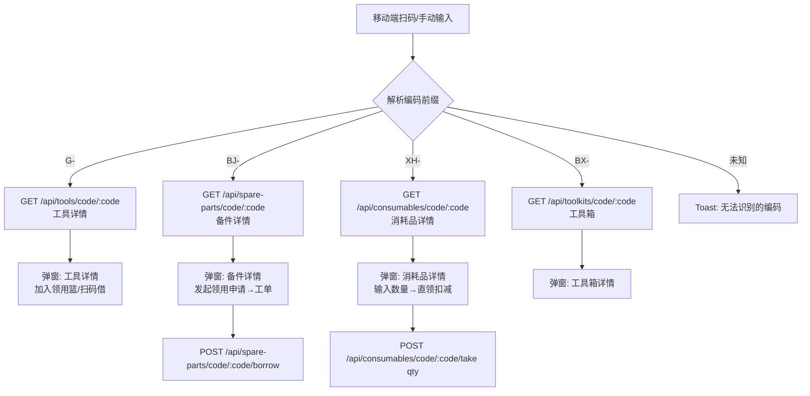

# 物料管理系统 v3.0.0 增量 PRD（简单 PRD）

> 版本：v3.0.0 增量 PRD
> 编制：产品经理 许清楚（Xu）
> 日期：2026-07-11
> 关联规划：`deliverables/material-system-upgrade-plan-v3.0.md`
> 适用 SOP：PRD → 架构设计（高见远）→ 工程实现（寇豆码）→ QA（严过关）

---

## 〇、前置约束（已拍板，必须严格遵循）

| 编号 | 决策 | 状态 | 对 PRD 的约束 |
|------|------|------|---------------|
| D1 | 备件**一物一码**（每个备件独立编码、独立状态，仿工具） | ✅ 已拍板 | 备件主表按件管理，`stock_qty` 默认 1，不走品类库存 |
| D2 | 消耗品扫码领用**弹窗输入实际消耗数量**扣减 | ✅ 已拍板 | 直领接口必须接收 `qty` 并校验，非固定扣 1 |
| D3 | 工具管理「精简」= **保持现有全部功能不变**（含工具箱），不新增 | ✅ 已拍板 | 仅降级为子模块，PRD 不为工具模块新增需求 |
| D4 | 线上版本核对 / 旧代码找回 | ⛔ 暂不做 | v3.0.0 不纳入，顺延 v3.1.0 |
| D5 | 物料分类备件/消耗品**共用** `material_categories`，用 `category_type`(spare/consumable/both) 区分 | ✅ 已拍板 | 不复用 `categories`（工具分类） |
| D6 | 盘库范围**按仓库全量盘点**，扫码逐件录入实际数量 | 🟡 默认（待确认） | 见「待确认问题」Q1 |
| D7 | 现有 `tools` 表数据**保持独立**，工具与物料并行，不迁移 | 🟡 默认（待确认） | 见「待确认问题」Q2 |

> 角色模型沿用现有四角色：`admin` / `staff` / `team_leader` / `material_manager`（后端 `middleware/auth.js` 的 `requireMaterialManager` 已存在，直接复用，不新增角色）。

---

## 一、产品目标

**一句话目标**：将「工器具管理系统 v2.0.0」升级为「物料管理系统 v3.0.0」，在保留工具管理能力的前提下，新增**备件管理**（一物一码、走工单审批）与**消耗品管理**（扫码直领、按量扣减）两大物料模块，并以二维码贯通出入库、盘库、领用全流程。

### 成功标准（可度量）
| 编号 | 标准 | 度量方式 |
|------|------|----------|
| SC1 | 备件与消耗品均可独立完成「增删改查 + 二维码扫码」全流程 | 端到端走通：创建→贴码→扫码出入/领/盘 |
| SC2 | 备件领用 100% 走工单审批（同工具），消耗品领用 0 工单、按量扣减 | 抽查 100 条物料领用记录，类型与工单流向一致 |
| SC3 | 系统名称、Logo、登录页、移动端在 PC+移动双端全量改为「物料管理系统」 | grep 双端源码无残留「工器具」字面 |
| SC4 | 盘库可在单仓库内扫码生成盘库单与差异明细 | 至少 1 个仓库完成一次模拟盘库 |
| SC5 | 现有工具模块与 `tools` 数据零回归（功能、接口、数据均不受影响） | 升级前后工具模块冒烟测试 100% 通过 |

---

## 二、用户故事（覆盖 4 角色，共 12 条）

> 角色缩写：AD=admin，MM=material_manager（物料管理员），TL=team_leader（分队长），ST=staff（普通员工）

### 物料管理员 MM（主数据维护者）
| US# | As a… | I want… | so that… |
|-----|-------|---------|----------|
| US1 | 物料管理员 | 在 PC 端按「一物一码」新增/编辑备件（编码、名称、物料分类、库位、图片） | 每个备件有唯一二维码，扫码即可定位与领用 |
| US2 | 物料管理员 | 在 PC 端维护消耗品主数据（编码、名称、分类、单位、库存、低库存阈值、单价） | 消耗品库存可视、可预警、可被扫码扣减 |
| US3 | 物料管理员 | 统一管理一套物料分类（用 `category_type` 标记备件/消耗品/通用） | 备件与消耗品共享分类体系，避免重复建设 |
| US4 | 物料管理员 | 在 PC 端手动登记入库/出库流水（含盘库调整） | 非扫码场景（如采购到货、盘亏）也能留痕 |

### 分队长 TL（审批人）
| US# | As a… | I want… | so that… |
|-----|-------|---------|----------|
| US5 | 分队长 | 在工单列表看到备件领用申请并审批/拒绝 | 备件与工具一样受管控，防止资产流失 |
| US6 | 分队长 | 在盘库完成后查看盘库差异明细（系统账 vs 实盘） | 及时发现盘亏盘盈并追责/补账 |

### 普通员工 ST（使用者）
| US# | As a… | I want… | so that… |
|-----|-------|---------|----------|
| US7 | 普通员工 | 用移动端扫备件码发起领用申请（生成 pending 工单） | 像借工具一样借备件，无需回 PC 操作 |
| US8 | 普通员工 | 用移动端扫消耗品码，在弹窗输入实际用量后完成领用 | 用多少扣多少，账实一致 |
| US9 | 普通员工 | 在移动端查看物料（备件/消耗品）列表与详情 | 现场快速核对物料信息 |
| US10 | 普通员工 | 用移动端扫码完成盘库（逐件确认/录数） | 仓库现场边走边盘，不必手抄 |

### 管理员 AD（系统 owner）
| US# | As a… | I want… | so that… |
|-----|-------|---------|----------|
| US11 | 管理员 | 在仪表盘看到物料统计卡片（备件总数/消耗品库存/低库存预警） | 一眼掌握物料整体状况 |
| US12 | 管理员 | 系统全量改名为「物料管理系统」且工具模块降级为子模块 | 对外呈现统一的物料管理平台，工具能力不丢 |

---

## 三、需求池（按 P0/P1/P2 分级）

> 优先级定义：**P0**=v3.0.0 核心必做；**P1**=v3.0.0 强烈建议做（影响主流程闭环）；**P2**=可顺延 v3.1+。
> 编号规则：`BE`=后端接口，`DB`=数据模型，`PC`=PC 前端，`MOB`=移动端，`SCAN`=扫码引擎，`REN`=系统改名，`ORD`=工单扩展，`DASH`=仪表盘。

### 3.1 数据模型（DB，全部 P0）

| 编号 | 模块 | 描述 | 优先级 | 验收标准 |
|------|------|------|--------|----------|
| DB1 | 备件表 `spare_parts` | 新增 5 字段主表（见规划 §3.1）：`spare_id, spare_code(唯一), spare_name, category_id, warehouse_id, shelf_id, storage_location_id, stock_qty(默认1), unit, status(available/borrowed/maintenance), image_url, description, borrow_count, created_at` | P0 | 表结构与规划一致；`spare_code` 唯一约束生效；`stock_qty` 默认 1 |
| DB2 | 消耗品表 `consumables` | 新增主表（规划 §3.2）：含 `consumable_code(唯一), consumable_name, category_id, 库位三件套, stock_qty, unit, warning_qty, price, image_url, description, total_out, created_at` | P0 | `consumable_code` 唯一；`warning_qty` 缺省可空；`stock_qty` 可 >1 |
| DB3 | 物料分类 `material_categories` | 新增（规划 §3.3）：`category_id, category_name, category_code, category_type(spare/consumable/both), description` | P0 | 与工具分类 `categories` 物理隔离；`category_code` 唯一 |
| DB4 | 出入库流水 `stock_movements` | 新增（规划 §3.4）：`movement_id, item_type(tool/spare/consumable), item_id, item_code, item_name, movement_type(in/out/adjust/return), qty, operator_id, operator_name, order_id, scan_code, remark, created_at` | P0 | 任一物料变动均落一条流水；`qty` 正负语义文档化 |
| DB5 | 盘库记录 `inventory_checks` | 新增（规划 §3.5）：`check_id, check_no, warehouse_id, status(pending/completed), operator_id, operator_name, items[], started_at, completed_at` | P0 | `items[]` 结构含 `system_qty/actual_qty/diff`；同一仓库仅允许一个 `pending` 盘库单 |
| DB6 | 工单扩展 `orders.items[]` | 每项增加 `item_type('tool'\|'spare', 默认 'tool')` 与 `item_code` 冗余字段 | P0 | 历史 `orders` 向后兼容（缺省 `tool`）；备件领用写入 `spare` |

### 3.2 后端接口（BE）

| 编号 | 模块 | 描述 | 优先级 | 验收标准 |
|------|------|------|--------|----------|
| BE1 | 备件 CRUD | `GET/POST/PUT/DELETE /api/spare-parts`（写操作 `requireMaterialManager`） | P0 | 增改时校验仓库/货架/货位归属链（复用 tools 校验逻辑）；编码唯一 |
| BE2 | 备件图片 | `POST /api/spare-parts/:id/upload-image`（multer+sharp 压缩，复用 tools 逻辑） | P0 | 与工具图片一致：≤10MB 原始、压缩至 ≤2MB、自动删旧图 |
| BE3 | 备件扫码查询 | `GET /api/spare-parts/code/:code` | P0 | 命中返回备件详情+库位名；未命中 404 明确提示 |
| BE4 | 备件扫码领用 | `POST /api/spare-parts/code/:code/borrow`（仿 `tools/code/:code/borrow`） | P0 | 生成 `pending` 工单（`items[].item_type='spare'`）；状态置 `reserved`；不可领用状态拦截 |
| BE5 | 消耗品 CRUD | `GET/POST/PUT/DELETE /api/consumables` | P0 | 同 BE1 校验链；编码唯一 |
| BE6 | 消耗品图片 | `POST /api/consumables/:id/upload-image` | P0 | 同 BE2 |
| BE7 | 消耗品扫码查询 | `GET /api/consumables/code/:code` | P0 | 同 BE3 |
| BE8 | 消耗品直领 | `POST /api/consumables/code/:code/take`，body `{ qty }`（D2） | P0 | 校验 `qty>0` 且 `qty<=stock_qty`；扣减 `stock_qty`、累加 `total_out`；写 `stock_movements`(`movement_type=out`, `order_id=null`)；无工单 |
| BE9 | 消耗品低库存 | `GET /api/consumables/low-stock`（`stock_qty<=warning_qty`） | P1 | 返回低于阈值的消耗品列表；`warning_qty` 为空者不计入 |
| BE10 | 物料分类 CRUD | `GET/POST/PUT/DELETE /api/material-categories`（写 `requireMaterialManager`） | P0 | `category_code` 唯一；删除前校验无关联备件/消耗品（仿 `tool-categories` 删除保护） |
| BE11 | 出入库流水 | `GET /api/stock-movements`（筛选 `item_type`/时间/操作人）+ `POST /api/stock-movements`（手动登记 in/out/adjust） | P0 | 列表分页/筛选可用；手动登记仅 MM/AD，写流水并同步主表数量（消耗品）或状态（备件/工具） |
| BE12 | 盘库 CRUD | `GET /api/inventory-checks`、`POST`（新建单仓库盘库）、`GET /:id`、`POST /:id/scan`（提交实际数量）、`POST /:id/complete`（写 adjust 流水+更新差异） | P0 | 同一仓库仅一个 `pending`；`/scan` 累加/覆盖 actual_qty；`/complete` 后 status=completed 且差异落账 |
| BE13 | 路由挂载 | `server.js` 新增 `app.use('/api', require('./routes/spare-parts'))` 等 5 个路由模块 | P0 | 启动无报错；`/api/health` 版本号升至 3.0.0 |

### 3.3 PC 前端（PC）

| 编号 | 模块 | 描述 | 优先级 | 验收标准 |
|------|------|------|--------|----------|
| PC1 | 备件管理页 | 仿 `ToolManagement.vue` 新建 `SparePartManagement.vue`（`/spare-parts`）：表格列=图片/编码/名称/物料分类/状态/仓库/货位/借次；操作=编辑/上传/条码/加入领用篮/删除；筛选=状态/分类/仓库/货架/货位/关键词；导出 Excel | P0 | 不含工具箱列；新增走「领用篮→工单」；筛选与工具页一致 |
| PC2 | 消耗品管理页 | 新建 `ConsumableManagement.vue`（`/consumables`）：表格列增「库存」「单位」「低库存预警」标识；操作增「出库/领用」（弹窗输入数量，D2）、编辑/上传/条码/删除 | P0 | 「出库」弹窗校验数量并调用 BE8；低于 `warning_qty` 行红色标识 |
| PC3 | 物料分类页 | 新建 `MaterialCategoryManagement.vue`（`/material-categories`）：表格+增改删，`category_type` 用下拉（备件/消耗品/通用） | P0 | 增改删调 BE10；类型切换即时生效 |
| PC4 | 出入库流水页 | 新建 `StockMovement.vue`（`/stock-movements`）：表格=时间/类型/物料(类型+名称+编码)/数量/操作人/关联工单；筛选 item_type/时间/操作人 | P0 | 数据来自 BE11；类型以中文标签呈现 |
| PC5 | 盘库管理页 | 新建 `InventoryCheck.vue`（`/inventory-checks`）：列表+「新建盘库单」(选仓库)；详情=扫码录入实际数量/逐件确认；完成后展示差异 | P0 | 调用 BE12；支持扫码枪/手动录入 |
| PC6 | 条码打印扩展 | `BarcodeList.vue` 支持工具/备件/消耗品三类条码生成打印 | P1 | 备件、消耗品码可独立/批量打印（编码前缀区分） |
| PC7 | 侧边栏重组 | 菜单分「物料管理(备件/消耗品/分类/流水/盘库)」「工具管理(工具/工具箱/工具分类)」「工单」「系统管理」「条码打印」 | P0 | 工具相关入口归入「工具管理」分组，不新增工具功能 |

### 3.4 移动端（MOB）

| 编号 | 模块 | 描述 | 优先级 | 验收标准 |
|------|------|------|--------|----------|
| MOB1 | 备件列表页 | 新建 `SparePartList.vue`（`/spare-parts`）：列表+详情，支持发起领用申请（生成工单） | P0 | 仿 `ToolManagement` 移动版；领用走 BE4 |
| MOB2 | 消耗品列表页 | 新建 `ConsumableList.vue`（`/consumables`）：列表+详情+「领用」按钮（弹窗输数量，D2） | P0 | 调 BE8；库存实时刷新 |
| MOB3 | 物料入口/Tab | 移动端新增「物料」Tab 或在首页聚合物料入口；原「工具」Tab 保留（工具降级子模块，见 D3） | P1 | 物料页可达；工具页功能不丢 |
| MOB4 | 盘库移动端 | 在扫码/物料页提供「盘库」模式，逐件扫码录入实际数量 | P1 | 调 BE12 `/scan`；离线容错非必需 |

### 3.5 扫码引擎扩展（SCAN）

| 编号 | 模块 | 描述 | 优先级 | 验收标准 |
|------|------|------|--------|----------|
| SCAN1 | 编码前缀分发 | 移动端 `ScanTool` 按前缀路由：`G-`→工具，`BJ-`→备件，`XH-`→消耗品，`BX-`→工具箱 | P0 | 单码识别后正确调用对应 `getXxxByCode`；未知前缀给出提示 |
| SCAN2 | 扫码结果弹窗扩展 | `ScanResultPopup` 支持渲染备件/消耗品详情与对应动作（领用申请 / 输量直领） | P0 | 备件弹窗含「发起领用」；消耗品弹窗含「输入数量领用」 |
| SCAN3 | 手动输入兼容 | 手动输入编码同样走前缀分发 | P0 | 与扫码一致 |

### 3.6 工单扩展（ORD）

| 编号 | 模块 | 描述 | 优先级 | 验收标准 |
|------|------|------|--------|----------|
| ORD1 | 工单支持备件 | `OrderManagement.vue`（PC）与移动端工单列表展示 `item_type`，备件项走审批/借出/归还流程（同工具） | P0 | 备件领用出现在待审列表；审批后状态变 borrowed；归还后 available |
| ORD2 | 领用篮扩展 | `ShoppingCart`/cart store 支持加入备件并生成含 `item_type='spare'` 工单 | P0 | PC 备件「加入领用篮」→ 工单创建成功 |
| ORD3 | 备件归还清点 | 复用工具 `checklist` 现场清点头（备件借出归还需清点） | P1 | 与工具清点逻辑一致（或明确决定免清点，见 Q3） |

### 3.7 仪表盘（DASH）

| 编号 | 模块 | 描述 | 优先级 | 验收标准 |
|------|------|------|--------|----------|
| DASH1 | 物料统计卡片 | `/api/dashboard` 增加 `spare_total / consumable_total / consumable_low_stock` 等；PC 仪表盘渲染卡片 | P1 | 数据正确；与工具卡片并列 |

### 3.8 系统改名（REN，全部 P0）

| 编号 | 位置 | 描述 | 验收标准 |
|------|------|------|----------|
| REN1 | PC `index.html`/登录页/顶栏 | 「工器具管理系统」→「物料管理系统」 | 无残留「工器具」字面 |
| REN2 | 移动端 登录页/App 标题 | 同步改名 | 无残留 |
| REN3 | 后端 `server.js` | 启动 log + `/api/health` 版本 `2.0.0`→`3.0.0` | health 返回 3.0.0 |
| REN4 | 菜单文案 | 「工具管理」分组标注为子模块，新增「物料管理」分组 | 见 PC7 |

---

## 四、UI 设计稿（新增页面布局）

### 4.1 备件管理页（PC，`SparePartManagement.vue`）— 仿工具页，去工具箱列
```
┌──────────────────────────────────────────────────────────────┐
│ 备件管理                                              [+新增备件]│
├──────────────────────────────────────────────────────────────┤
│ [搜索名称/编码] [状态▾] [物料分类▾] [仓库▾] [货架▾] [货位▾] [导出]│
├────┬──────┬──────┬──────┬─────┬──────┬─────┬─────┬──────────┤
│图片│编码  │名称  │分类  │状态 │仓库  │货位 │借次 │操作      │
├────┼──────┼──────┼──────┼─────┼──────┼─────┼─────┼──────────┤
│ 🖼 │BJ-001│轴承  │机械  │可用 │A库  │A-1 │12  │编辑 上传│
│    │      │      │      │     │      │     │     │条码 领用 删│
└────┴──────┴──────┴──────┴─────┴──────┴─────┴─────┴──────────┘
  新增/编辑弹窗：名称/编码/物料分类/仓库→货架→货位/单位/状态/图片/说明
```

### 4.2 消耗品管理页（PC，`ConsumableManagement.vue`）
```
┌──────────────────────────────────────────────────────────────┐
│ 消耗品管理                                            [+新增]   │
├──────────────────────────────────────────────────────────────┤
│ [搜索] [分类▾] [仓库▾] [仅看低库存☑]                            │
├────┬──────┬──────┬──────┬──────┬─────┬──────┬────────────────┤
│图片│编码  │名称  │分类  │库存  │单位 │预警  │操作            │
├────┼──────┼──────┼──────┼──────┼─────┼──────┼────────────────┤
│ 🖼 │XH-001│螺丝  │紧固  │⚠8   │个  │10   │编辑 上传 条码 出库│
└────┴──────┴──────┴──────┴──────┴─────┴──────┴────────────────┘
  「出库」弹窗（D2）：
   当前库存：8   请输入领用数量：[____]  [确认领用]
   → 校验 1..8，调用 BE8，库存→扣减，写流水
```

### 4.3 物料分类页（PC，`MaterialCategoryManagement.vue`）
```
┌──────────────────────────────────────────────────┐
│ 物料分类                                  [+新增分类]│
├────────┬──────────┬────────────┬────────┬──────┤
│分类名称│分类编码  │类型        │描述    │操作  │
├────────┼──────────┼────────────┼────────┼──────┤
│机械备件│BJ-JX     │备件(spare) │        │编辑删│
│紧固件  │XH-JG     │消耗品      │        │编辑删│
│通用    │ALL       │通用(both)  │        │编辑删│
└────────┴──────────┴────────────┴────────┴──────┘
```

### 4.4 出入库流水页（PC，`StockMovement.vue`）
```
┌──────────────────────────────────────────────────────────────┐
│ 出入库流水  [类型▾ 全部/入/出/调整/归还] [物料类型▾] [时间▾] [操作人▾]│
├──────┬────────┬────────────┬─────┬──────┬────────┬────────┤
│时间  │类型    │物料         │数量 │操作人│关联工单│备注    │
├──────┼────────┼────────────┼─────┼──────┼────────┼────────┤
│07-11│出库(out)│消耗品 螺丝  │-3  │张三  │(无)    │现场领用│
│07-11│领用(borrow)│备件 轴承│-1  │李四  │ORDxxx  │扫码领用│
└──────┴────────┴────────────┴─────┴──────┴────────┴────────┘
```

### 4.5 盘库管理页（PC，`InventoryCheck.vue`）
```
┌──────────────────────────────────────────────────────────────┐
│ 盘库管理                                      [+新建盘库单]     │
├────────┬────────┬────────┬────────┬────────┬────────┤
│单号    │仓库    │状态    │盘点人  │开始    │完成    │
├────────┼────────┼────────┼────────┼────────┼────────┤
│PD-001 │A库    │盘点中  │王五    │07-11   │—      │
└────────┴────────┴────────┴────────┴────────┴────────┘
 点击「盘点中」→ 详情：
   [扫码录入 / 手动录入]  扫码命中逐件确认：
   备件 BJ-001 系统1 实盘[1/0]✓   消耗品 XH-001 系统8 实盘[__]
   [完成盘库] → 生成差异：盘亏/盘盈 → 写 adjust 流水
```

### 4.6 移动端物料页（`SparePartList.vue` / `ConsumableList.vue`）
```
┌─────────┐
│ 物料     │  (Tab: 首页/物料/扫码/工单/我的)
├─────────┤
│ [备件|消耗品] 切换 │
│ 🔍 搜索          │
│ ┌─────────────┐ │
│ │ BJ-001 轴承  │ │
│ │ A库/A-1 可用 │ │
│ │        [领用]│ │   ← 备件：生成工单
│ ├─────────────┤ │
│ │ XH-001 螺丝  │ │
│ │ 库存 8 个    │ │
│ │    [领用输量]│ │   ← 消耗品：弹窗输量
│ └─────────────┘ │
└─────────┘
```

### 4.7 扫码引擎扩展交互流（SCAN1/SCAN2/SCAN3）


---

## 五、待确认问题（需用户/主理人后续拍板）

### 来自「默认」决策（D6、D7）
- **Q1（对应 D6）**：盘库范围为「按仓库全量」。对消耗品（同一编码代表一堆、数量可能很大）逐件扫码录入实际数量是否可行？是否允许**按货架/按分类局部盘点**或**批量录入**以提升效率？建议默认全量，但开放货架级筛选。
- **Q2（对应 D7）**：现有 `tools` 数据保持独立、不迁移已确认。但**工具与物料是否共用同一套仓库/货架/货位**（`warehouses/shelves/storage_locations`）？规划默认共用，请确认物料是否可挂到现有仓库货位。

### 分析中新发现的疑问
- **Q3**：备件归还是否需要像工具一样做**现场清点头（checklist）**？还是简化为「扫码即还」？影响 ORD3 工作量。
- **Q4**：消耗品**补货/入库**流程如何入账？消耗品无工单，初始靠创建，后续到货补货是否走 `POST /api/stock-movements`(in) 手动登记，还是提供专用「入库」页？建议提供 PC 端消耗品「入库」按钮（输数量→in 流水）。
- **Q5**：**编码前缀规则**是否固定为 `G-/BJ-/XH-/BX-`？是否需要全局唯一性防冲突校验（如备件与消耗品编码空间隔离）？
- **Q6**：**物料管理员（material_manager）** 角色在现有四角色中是否已实际启用/分配？若尚未启用，v3.0.0 是否需要先建账号？
- **Q7**：PC 端备件领用是否**复用现有「领用篮/购物车」**流程（与工具一致）？建议复用以保证体验一致（ORD2）。
- **Q8**：消耗品**低库存预警**本次仅做「列表/红标展示」（P1，BE9+PC2），还是需做**主动通知**（消息推送）？主动通知建议顺延 v3.1.0（D4 相关）。
- **Q9**：移动端 Tab 结构调整——「工具」Tab 是否**保留并重命名为物料相关**，还是新增独立「物料」Tab 而「工具」Tab 继续存在？建议保留「工具」Tab（D3 工具不砍）+ 新增「物料」聚合入口。
- **Q10**：工单列表/审批页是否需要**按 `item_type` 筛选**（工具/备件分离视图）？还是混合展示？
- **Q11**：盘库 `inventory_checks.items[]` 中**备件（一物一码）的实际数量**语义——是「是否在位(1/0)」还是「件数」？建议备件记 1/0（在位/缺失），消耗品记实点数。
- **Q12**：条形码打印（PC6）与仪表盘物料卡片（DASH1）是否纳入 v3.0.0 范围，还是顺延？本 PRD 已列为 P1，请确认。

---

## 六、范围边界（明确不做）
- ❌ 工具模块任何新功能（D3）。
- ❌ 现有 `tools` 数据迁移至物料体系（D7）。
- ❌ 线上版本核对 / 旧代码找回（D4，顺延 v3.1.0）。
- ❌ 消耗品价格分析、报表导出、盘库差异报告等增强（顺延 v3.2.0）。
- ❌ 新增用户角色（沿用四角色）。

---

## 七、需求条目优先级分布（摘要）

| 优先级 | 条目数 | 覆盖 |
|--------|--------|------|
| P0 | 35 | DB×6, BE×12, PC×6, MOB×2, SCAN×3, ORD×2, REN×4 |
| P1 | 6  | BE9, PC6, MOB3, MOB4, ORD3, DASH1 |
| P2 | 0  | 增强项顺延 v3.1/v3.2，不纳入本 PRD 估算 |

> 合计 **41 条可估算需求**（P0 占主体，确保 v3.0.0 主流程闭环；P1 为强建议项；P2 暂无，增强需求见规划 §六版本路线）。
>
> 分项明细：数据模型 DB1–DB6(6)｜后端 BE1–BE13(12×P0 + BE9×P1)｜PC 前端 PC1–PC7(6×P0 + PC6×P1)｜移动端 MOB1–MOB4(2×P0 + MOB3/4×P1)｜扫码引擎 SCAN1–SCAN3(3)｜工单扩展 ORD1–ORD3(2×P0 + ORD3×P1)｜仪表盘 DASH1(1×P1)｜系统改名 REN1–REN4(4)。
