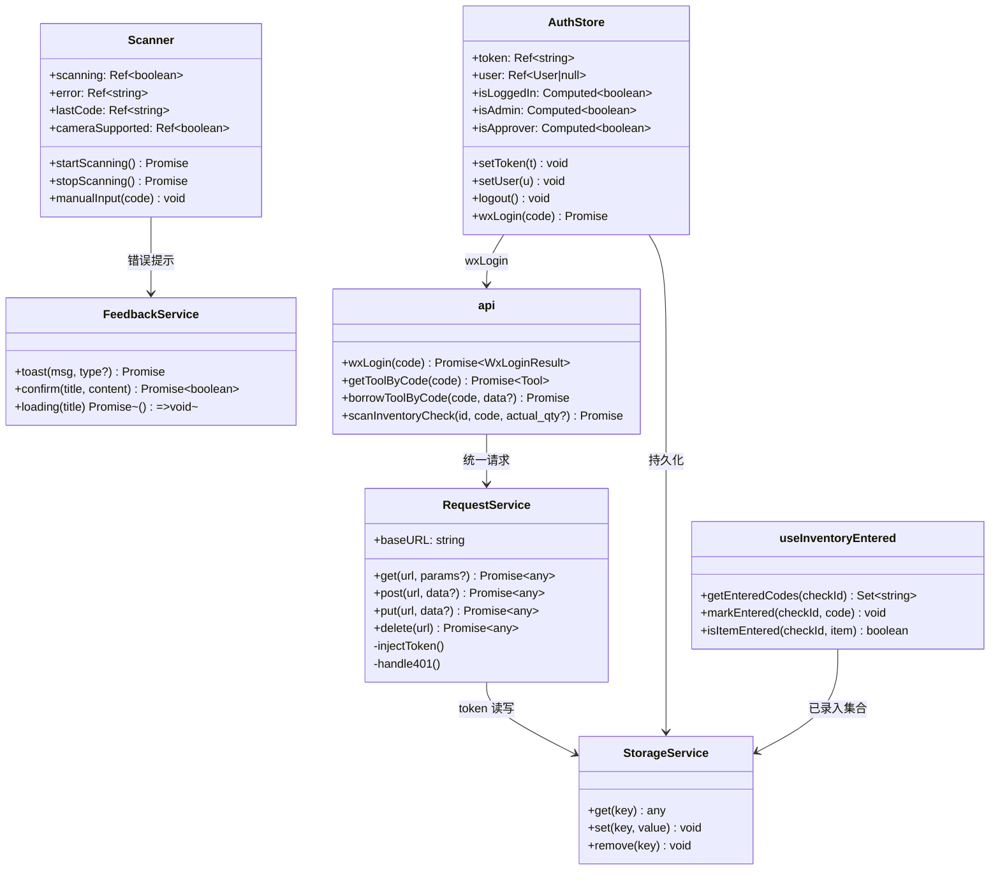
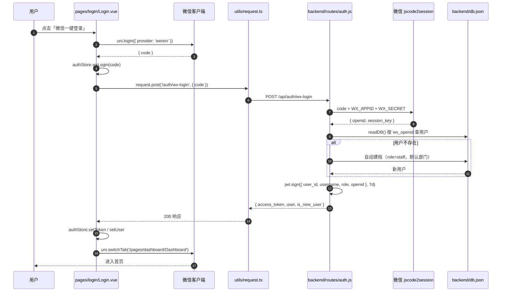
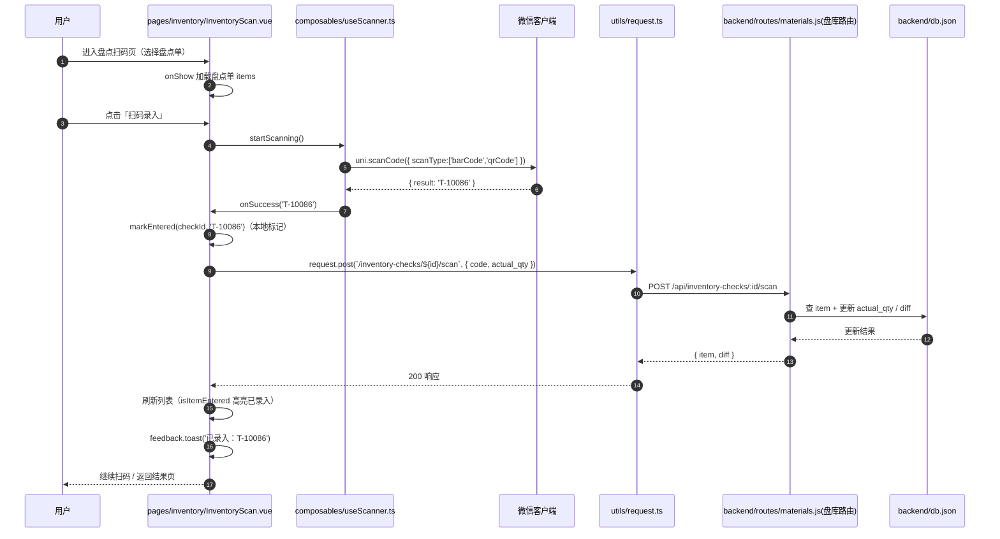
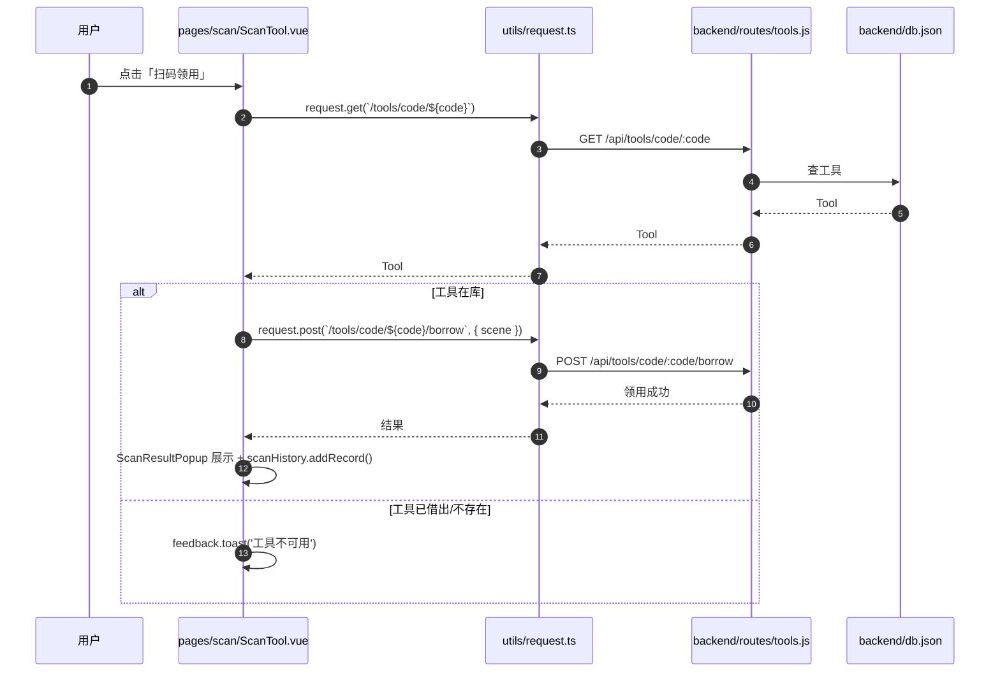
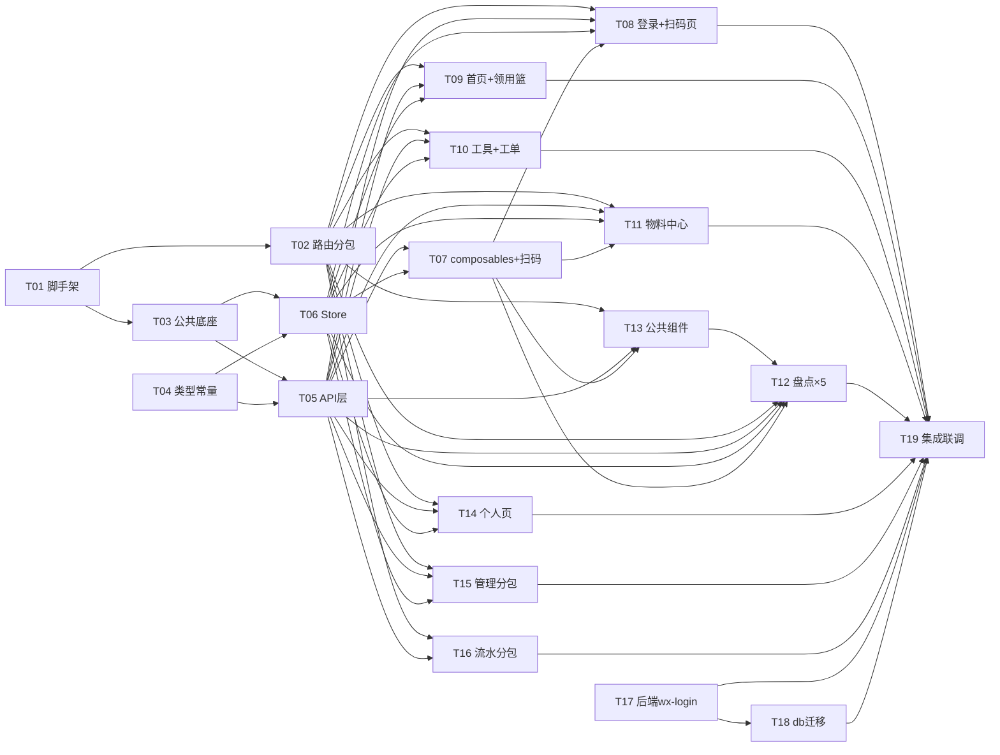

# 微信小程序版工器具管理系统 — 架构设计与任务分解

> 作者：高见远（Architect）｜版本：v1.0｜日期：2026-08-06
> 上游输入：产品经理 PRD 摘要 + 用户原始需求规格 + 现有仓库（`tools-management`）源码勘察
> 范围：在仓库根目录新建 `miniapp/` 独立小程序工程，后端仅新增微信登录路由与 db 迁移，其余 26+ 路由零改动。

---

## 1. 实现方案

### 1.1 总体架构思路

```
┌─────────────────────────────────────────────────────────────┐
│                        微信小程序 (miniapp/)                  │
│  ┌───────────────┐  ┌───────────────┐  ┌──────────────────┐  │
│  │ 主包 pages     │  │ 分包 pagesAdmin│  │ 分包 pagesStock   │  │
│  │ tabBar5+核心页 │  │ 管理×6         │  │ 流水×3           │  │
│  └───────┬───────┘  └───────┬───────┘  └────────┬─────────┘  │
│          └──────────────────┼────────────────────┘           │
│  ┌──────────────────────────▼─────────────────────────────┐  │
│  │ 公共层：utils(request/storage/feedback/stock)           │  │
│  │        api/ · store/ · composables/ · components/       │  │
│  │        types/ · constants/                              │  │
│  └──────────────────────────┬─────────────────────────────┘  │
└─────────────────────────────┼───────────────────────────────┘
                              │ HTTPS (wx.request) + Bearer JWT
┌─────────────────────────────▼───────────────────────────────┐
│ 后端 backend/（Node.js + Express，零破坏扩展）               │
│  routes/auth.js 新增 POST /api/auth/wx-login                │
│  routes/db.js   migrateDB() 幂等补 wx_* 字段                │
│  db.json（JSON 文件存储，与 H5/PC 共享同一份数据）           │
└─────────────────────────────────────────────────────────────┘
```

**核心原则：零冲突并行。** `miniapp/` 是全新独立工程目录，与 `mobile-frontend/`（Vue3+Vant4 H5）、`vue-frontend/`（PC）**不共享任何源码文件、不共享构建产物**。代码复用采用「拷贝 + 适配」而非「抽公共包/软链」，理由：

1. 小程序运行时无 DOM/window/localStorage/navigator，`html5-qrcode`、`useBrightness`、`vue-router` 等无法运行，必须换用 `uni.*` API；
2. 两端各自独立发版、独立编译，避免 H5 端改动反向破坏小程序端；
3. `types/`、`constants/`、`utils/stock.ts` 等纯 TS 文件可零修改直接拷贝，保持两端类型/口径完全一致。

### 1.2 代码复用策略（H5 → 小程序）

| 复用层 | H5 现状 | 小程序处理 | 适配点 |
|---|---|---|---|
| types/index.ts | 纯类型 | **拷贝不修改**（仅追加 wx 字段） | 新增 `wx_openid/wx_nickname/wx_avatar` 可选字段 |
| constants/material.ts | 纯常量 | **拷贝不修改** | 无 |
| utils/stock.ts | 纯函数 | **拷贝不修改** | 三态口径两端镜像（改一处必须改另一处） |
| api/index.ts、api/material.ts | axios 实例 | **拷贝并修改** | `axios.create` → `utils/request.ts`；新增 `wxLogin()` |
| store/auth、cart、scanHistory | Pinia + localStorage | **拷贝并修改** | `localStorage` → `utils/storage.ts` |
| composables/useScanner.ts | html5-qrcode 摄像头 | **重写** | `uni.scanCode` + 手动输入兜底；**删除** useBrightness |
| composables/useAutoLogout | vue-router + DOM 事件 | **拷贝并修改** | 去 vue-router → `uni.reLaunch`；DOM 事件 → 小程序生命周期 |
| composables/useMaterialList、useInventoryEntered | 组合式函数 | **拷贝并修改** | storage 层替换 |
| 页面 .vue ×24 | Vant4 | **拷贝并修改** | vant→uni-ui 映射 + 路由改 pages.json |

### 1.3 小程序适配的关键改造

- **路由**：`vue-router` → `pages.json`（tabBar + subPackages）；页面跳转统一 `uni.navigateTo / uni.switchTab / uni.reLaunch`。
- **存储**：`localStorage` → `uni.getStorageSync`，统一收口到 `utils/storage.ts`，禁止页面直用 `uni.*`。
- **请求**：`axios` → `utils/request.ts`（`uni.request` Promise 化，baseURL 由环境变量注入，401 统一跳登录）。
- **扫码**：`html5-qrcode`（浏览器摄像头）→ `uni.scanCode`（原生扫码，Code128 条形码 + 二维码），保留「手动输入编码」兜底入口；**不支持 torch/弱光增强**，`useBrightness.ts` 直接不迁移。
- **UI**：Vant4 → uni-ui（官方），映射表见 §8 共享知识。
- **分包**：管理页 ×6、库存流水 ×3 放 subPackages，保证主包 < 2MB。

### 1.4 后端扩展（零破坏）

- `backend/routes/auth.js` 新增 `POST /auth/wx-login`（现有 auth router 已挂载在 `/api` 下，无需改 server.js）：`wx.login` code → `jscode2session` → `openid` → 按 `wx_openid` 查/建用户 → 签发与现有登录**完全同构**的 JWT（payload 含 `user_id/username/role`）。
- `backend/routes/db.js` 的 `migrateDB()` 增加幂等迁移：为 `users` 数组内每个对象补 `wx_openid: null / wx_nickname: '' / wx_avatar: ''`。
- 新增环境变量 `WX_APPID`、`WX_SECRET`（backend/.env.example 同步）。

---

## 2. 框架选型

| 项 | 选型 | 说明 |
|---|---|---|
| 跨端框架 | **uni-app 3.x（Vue3 + Vite + TS）** | 官方 CLI 工程（`uni-preset-vue#vite-ts` 模板），`npm run dev:mp-weixin` 编译到微信小程序 |
| 组件库 | **@dcloudio/uni-ui** | 官方组件库，vant→uni-ui 映射（uni-nav-bar/uni-search-bar/uni-number-box/uni-data-checkbox/uni-popup/uni-badge/uni-tag/uni-grid/uni-list/uni-icons/uni-easyinput 等） |
| 状态管理 | **pinia@^2.1** | 与 H5 端一致，`store/*` 可直接拷贝 |
| 路由 | **pages.json 原生** | 不引入 vue-router（小程序不支持 history 路由） |
| 请求 | **uni.request 自封装** | 不引入 axios（小程序无 XHR），`utils/request.ts` 保持与 axios 相似的 Promise 签名 |
| 构建链 | **Vite 5 + @dcloudio/vite-plugin-uni + vue-tsc + TypeScript 5** | 类型检查走 `vue-tsc --noEmit` |
| 样式 | **scss（uni.scss 主题变量）** | 主色 `#1989fa` 对齐现有 vant 主色 |
| 开发者工具 | **微信开发者工具** | 打开 `miniapp/dist/dev/mp-weixin`；根目录 `project.config.json` 可指向该目录 |

**依赖清单（npm）**：

```
dependencies:
- @dcloudio/uni-app@^3.0.0-4030620241128001（Vue3 版）
- @dcloudio/uni-ui@^1.5.0
- @dcloudio/uni-mp-weixin@^3.0.0-4030620241128001（小程序平台编译器）
- vue@^3.4.21
- pinia@^2.1.7

devDependencies:
- @dcloudio/vite-plugin-uni@^3.0.0-4030620241128001
- @dcloudio/types@^3.4.8（uni 全局类型）
- typescript@^5.4.0
- vite@^5.2.8
- vue-tsc@^2.0.0
- sass@^1.77.0（uni.scss 编译）
```

> 版本以 `@dcloudio` 官方 npm 最新 3.0.0-4xxx 为准（uni-app 3.x 要求同版本号对齐）。**明确不引入**：axios、html5-qrcode、vant、vue-router。

---

## 3. 文件列表

### 3.1 工程根配置（新建）

| 相对路径 | 操作 | 说明 |
|---|---|---|
| `miniapp/package.json` | 新建 | 依赖与 scripts（dev/build:mp-weixin 等） |
| `miniapp/vite.config.ts` | 新建 | uni 插件 + `@` 别名 → src |
| `miniapp/tsconfig.json` | 新建 | TS 配置（paths @/* → src/*） |
| `miniapp/index.html` | 新建 | H5 调试入口（模板自带） |
| `miniapp/project.config.json` | 新建 | 微信开发者工具配置（miniprogramRoot=dist/dev/mp-weixin） |
| `miniapp/.env.development` | 新建 | `VITE_API_BASE_URL=http://127.0.0.1:3000/api` |
| `miniapp/.env.production` | 新建 | `VITE_API_BASE_URL=https://<域名>/api` |
| `miniapp/.gitignore` | 新建 | 忽略 `dist/ node_modules/` |
| `miniapp/src/manifest.json` | 新建 | appid、mp-weixin 配置、`requiredPrivateInfos: ["scanCode"]`、权限声明 |
| `miniapp/src/pages.json` | 新建 | 5 tabBar + 主包 pages + subPackages（admin×6、stock×3） |
| `miniapp/src/uni.scss` | 新建 | 主题变量（$primary-color:#1989fa 等） |
| `miniapp/src/main.ts` | 新建 | `createSSRApp` + pinia 挂载 |
| `miniapp/src/App.vue` | 新建 | 全局样式；onLaunch 检查登录态 |
| `miniapp/src/static/tabbar/*.png`（10 张） | 新建 | tabBar 图标资源（正常 + 选中各 5） |

### 3.2 公共能力层（新建/拷贝）

| 相对路径 | 操作 | 说明 |
|---|---|---|
| `miniapp/src/utils/request.ts` | **新建** | uni.request 封装：baseURL、token 注入、401 跳登录、Promise 化 |
| `miniapp/src/utils/storage.ts` | **新建** | `get/set/remove` 抹平 localStorage→uni.getStorageSync |
| `miniapp/src/utils/feedback.ts` | **新建** | showToast/showModal/loading Promise 化 |
| `miniapp/src/types/index.ts` | 拷贝并修改 | 自 `mobile-frontend/src/types/index.ts`；追加 wx 字段 |
| `miniapp/src/constants/material.ts` | 拷贝不修改 | 自 `mobile-frontend/src/constants/material.ts` |
| `miniapp/src/utils/stock.ts` | 拷贝不修改 | 自 `mobile-frontend/src/utils/stock.ts`（镜像口径） |
| `miniapp/src/api/index.ts` | 拷贝并修改 | axios→request.ts；新增 `wxLogin()` |
| `miniapp/src/api/material.ts` | 拷贝并修改 | axios→request.ts |
| `miniapp/src/store/auth.ts` | 拷贝并修改 | localStorage→storage.ts；新增 wxLogin 动作 |
| `miniapp/src/store/cart.ts` | 拷贝不修改 | 纯内存，无平台 API（仅 import 路径微调） |
| `miniapp/src/store/scanHistory.ts` | 拷贝并修改 | localStorage→storage.ts |
| `miniapp/src/composables/useScanner.ts` | **重写** | uni.scanCode + 手动输入兜底；保持接口形状 |
| `miniapp/src/composables/useAutoLogout.ts` | 拷贝并修改 | 去 vue-router/DOM 事件 → uni 生命周期 |
| `miniapp/src/composables/useMaterialList.ts` | 拷贝不修改 | 纯逻辑（仅 import 路径微调） |
| `miniapp/src/composables/useInventoryEntered.ts` | 拷贝并修改 | localStorage→storage.ts |
| `miniapp/src/composables/useBrightness.ts` | **删除（不迁移）** | 小程序不支持 torch/亮度增强 |

### 3.3 公共组件（拷贝并修改）

| 相对路径 | 操作 | 说明 |
|---|---|---|
| `miniapp/src/components/MaterialCard.vue` | 拷贝并修改 | vant→uni-ui，改约 80% |
| `miniapp/src/components/ScanResultPopup.vue` | 拷贝并修改 | van-popup→uni-popup，改约 85% |
| `miniapp/src/components/InventoryScannerPopup.vue` | 拷贝并修改 | 扫码区改接 useScanner（重写 60%） |

### 3.4 主包页面（拷贝并修改，自 mobile-frontend/src/views）

| 相对路径（miniapp/src/pages/） | 源文件 | 改造比例 | 说明 |
|---|---|---|---|
| `login/Login.vue` | views/Login.vue | 重写 30% | 微信一键授权（wx.login）+ 手机号兜底 |
| `dashboard/Dashboard.vue` | views/Dashboard.vue | 改 70% | tabBar 首页，van-grid→uni-grid |
| `tools/ToolManagement.vue` | views/ToolManagement.vue | 改 75% | 工具管理（列表/搜索/扫码入口） |
| `material/MaterialCenter.vue` | views/MaterialCenter.vue | 改 80% | 物料中心（备件/消耗品/盘点入口） |
| `orders/OrderManagement.vue` | views/OrderManagement.vue | 改 80% | 工单流转 |
| `profile/Profile.vue` | views/Profile.vue | 改 85% | 个人页（含管理入口，权限控制） |
| `scan/ScanTool.vue` | views/ScanTool.vue | 重写 40% | 接入 useScanner |
| `cart/ShoppingCart.vue` | views/ShoppingCart.vue | 改 85% | 领用篮 |
| `material/SparePartList.vue` | views/SparePartList.vue | 改 80% | 备件列表 |
| `material/ConsumableList.vue` | views/ConsumableList.vue | 改 80% | 消耗品列表 |
| `material/MaterialDispense.vue` | views/MaterialDispense.vue | 改 80% | 物料领用 |
| `inventory/Inventory.vue` | views/Inventory.vue | 改 55% | 盘点列表 |
| `inventory/InventoryCreate.vue` | views/inventory/InventoryCreate.vue | 改 75% | 新建盘点 |
| `inventory/InventoryScan.vue` | views/inventory/InventoryScan.vue | 改 70% | 扫码录入 |
| `inventory/InventoryResult.vue` | views/inventory/InventoryResult.vue | 改 85% | 盘点结果 |
| `inventory/InventoryShelf.vue` | views/inventory/InventoryShelf.vue | 改 80% | 货架导航盘点 |

### 3.5 分包页面（拷贝并修改）

| 相对路径 | 源文件 | 改造比例 | 分包 |
|---|---|---|---|
| `miniapp/src/pagesAdmin/CategoryManagement.vue` | views/CategoryManagement.vue | 改 80% | pagesAdmin |
| `miniapp/src/pagesAdmin/DeptManagement.vue` | views/DeptManagement.vue | 改 80% | pagesAdmin |
| `miniapp/src/pagesAdmin/LocationManagement.vue` | views/LocationManagement.vue | 改 80% | pagesAdmin |
| `miniapp/src/pagesAdmin/ShelfManagement.vue` | views/ShelfManagement.vue | 改 80% | pagesAdmin |
| `miniapp/src/pagesAdmin/UserManagement.vue` | views/UserManagement.vue | 改 80% | pagesAdmin |
| `miniapp/src/pagesAdmin/WarehouseManagement.vue` | views/WarehouseManagement.vue | 改 80% | pagesAdmin |
| `miniapp/src/pagesStock/StockMovement.vue` | views/StockMovement.vue | 改 85% | pagesStock |
| `miniapp/src/pagesStock/stock/StockCell.vue` | views/stock/StockCell.vue | 改 85% | pagesStock |
| `miniapp/src/pagesStock/stock/StockFilter.vue` | views/stock/StockFilter.vue | 改 85% | pagesStock |

### 3.6 后端修改（仅修改，零新建路由文件）

| 相对路径 | 操作 | 说明 |
|---|---|---|
| `backend/routes/auth.js` | 仅修改 | 新增 `POST /auth/wx-login`（jscode2session→openid→JWT） |
| `backend/routes/db.js` | 仅修改 | `migrateDB()` 幂等补 `wx_openid/wx_nickname/wx_avatar` |
| `backend/.env.example`、`.env` | 仅修改 | 追加 `WX_APPID`、`WX_SECRET` 说明/示例 |

> 其余 26+ 路由（tools/orders/materials/admin/users/db 等）**零改动**；`server.js` 无需改动（auth router 已挂载 `/api`）。

---

## 4. 数据结构和接口

### 4.1 微信登录接口契约

**`POST /api/auth/wx-login`**

请求体：
```json
{
  "code": "wx.login() 返回的临时 code（5 分钟有效）",
  "nickname": "选填，用户昵称（首次建档时用）",
  "avatar": "选填，头像 URL"
}
```

后端流程：`code + WX_APPID + WX_SECRET → https://api.weixin.qq.com/sns/jscode2session` → 换取 `openid`（+`session_key`）→ `readDB()` 按 `wx_openid` 查用户 → 不存在则自动建档（默认 `role: 'staff'`、`role_id: 2`、`dept_id: 2`、`username: 'wx_' + openid 尾 8 位`）→ 签发 JWT → 返回。

响应（与 `/auth/login` 完全同构，前端 store 零改动接入）：
```json
{
  "access_token": "<JWT>",
  "user": {
    "user_id": 10,
    "username": "wx_8f3a2b1c",
    "real_name": "微信用户8f3a2b1c",
    "dept_id": 2,
    "role": "staff",
    "role_id": 2,
    "role_name": "普通员工",
    "is_active": true,
    "phone": null,
    "wx_openid": "oXXXX...",
    "wx_nickname": "张三",
    "wx_avatar": "https://..."
  },
  "is_new_user": true
}
```

错误响应（与现有风格一致）：
```json
{ "message": "微信登录失败：code 无效或已过期" }   // 401/400/500
```

**JWT payload（与现有登录一致，向后兼容）**：
```json
{
  "user_id": 10,
  "username": "wx_8f3a2b1c",
  "role": "staff",
  "openid": "oXXXX...",
  "iat": 1754460000,
  "exp": 1755064800
}
```
`expiresIn: '7d'`；`authenticate` 中间件只读 `user_id/role`，新增 `openid` 字段不影响现有鉴权。

### 4.2 DB 迁移（幂等）

`migrateDB()` 追加逻辑：遍历 `db.users`，为缺失 `wx_openid/wx_nickname/wx_avatar` 的对象补默认值（`null/''/''`）；不重建表、不影响既有数据；重复执行无副作用。

### 4.3 类型扩展

```ts
// miniapp/src/types/index.ts 追加（保持与 H5 端字段兼容）
export interface User {
  // ...既有字段
  wx_openid?: string | null
  wx_nickname?: string
  wx_avatar?: string
}

export interface WxLoginResult {
  access_token: string
  user: User
  is_new_user?: boolean
}
```

### 4.4 核心模块类图



---

## 5. 程序调用流程（Mermaid 时序图）

### 5.1 微信登录流程



### 5.2 扫码盘点流程



### 5.3 扫码领用流程（复用）



---

## 6. 任务列表（按 Sprint，含依赖与工作量）

> 说明：任务粒度按 team-lead 要求细化到可执行单元；依赖关系保证「先底座、后页面、后端并行」。

### S1 工程初始化（1.5 人日）

| 任务 | 名称 | 涉及文件 | 依赖 | 工作量 |
|---|---|---|---|---|
| **T01** | 工程脚手架与构建配置 | miniapp/package.json、vite.config.ts、tsconfig.json、index.html、project.config.json、.env.development、.env.production、.gitignore、src/manifest.json、src/uni.scss、src/main.ts、src/App.vue | — | 0.5 人日 |
| **T02** | 路由与分包骨架 | src/pages.json（5 tabBar + 主包 16 页 + subPackages admin×6/stock×3）、src/static/tabbar/*.png、全部页面空壳 .vue | T01 | 0.5 人日 |
| **T03** | 公共底座 | src/utils/request.ts、storage.ts、feedback.ts | T01 | 0.5 人日 |

### S2 数据层与公共能力（2.0 人日）

| 任务 | 名称 | 涉及文件 | 依赖 | 工作量 |
|---|---|---|---|---|
| **T04** | 类型与常量拷贝 | src/types/index.ts（+wx 字段）、constants/material.ts、utils/stock.ts | T01 | 0.3 人日 |
| **T05** | API 层适配 | src/api/index.ts（axios→request.ts + wxLogin）、src/api/material.ts | T03、T04 | 0.5 人日 |
| **T06** | Store 适配 | src/store/auth.ts、cart.ts、scanHistory.ts | T03、T04 | 0.4 人日 |
| **T07** | Composables 适配 + 扫码重写 | src/composables/useScanner.ts（重写）、useAutoLogout.ts、useMaterialList.ts、useInventoryEntered.ts；**不创建** useBrightness.ts | T03、T05、T06 | 0.8 人日 |

### S3 核心业务页面（5.0 人日）

| 任务 | 名称 | 涉及文件 | 依赖 | 工作量 |
|---|---|---|---|---|
| **T08** | 登录页 + 扫码页 | pages/login/Login.vue、pages/scan/ScanTool.vue | T02、T05、T06、T07 | 0.8 人日 |
| **T09** | 首页 + 领用篮 | pages/dashboard/Dashboard.vue、pages/cart/ShoppingCart.vue | T02、T05、T06 | 0.5 人日 |
| **T10** | 工具 + 工单 | pages/tools/ToolManagement.vue、pages/orders/OrderManagement.vue | T02、T05、T06 | 1.0 人日 |
| **T11** | 物料中心 ×4 | pages/material/MaterialCenter.vue、SparePartList.vue、ConsumableList.vue、MaterialDispense.vue | T02、T05、T06、T07 | 1.0 人日 |
| **T13** | 公共组件 | components/MaterialCard.vue、ScanResultPopup.vue、InventoryScannerPopup.vue | T02、T05、T07 | 0.4 人日 |
| **T12** | 盘点 ×5 | pages/inventory/Inventory.vue、InventoryCreate.vue、InventoryScan.vue、InventoryResult.vue、InventoryShelf.vue | T02、T05、T06、T07、T13 | 1.3 人日 |

### S4 辅助页与管理分包（1.5 人日）

| 任务 | 名称 | 涉及文件 | 依赖 | 工作量 |
|---|---|---|---|---|
| **T14** | 个人页 | pages/profile/Profile.vue | T02、T05、T06 | 0.3 人日 |
| **T15** | 管理分包 ×6 | pagesAdmin/CategoryManagement.vue、DeptManagement.vue、LocationManagement.vue、ShelfManagement.vue、UserManagement.vue、WarehouseManagement.vue | T02、T05、T06 | 0.7 人日 |
| **T16** | 流水分包 ×3 | pagesStock/StockMovement.vue、stock/StockCell.vue、stock/StockFilter.vue | T02、T05 | 0.5 人日 |

### S5 微信登录 + 集成调试（2.0 人日）

| 任务 | 名称 | 涉及文件 | 依赖 | 工作量 |
|---|---|---|---|---|
| **T17** | 后端 wx-login 路由 | backend/routes/auth.js | —（可与 S2/S3 并行） | 0.7 人日 |
| **T18** | 后端 db 迁移 + 环境变量 | backend/routes/db.js、backend/.env.example | T17 | 0.3 人日 |
| **T19** | 集成联调与回归 | miniapp 全工程 + 微信开发者工具 | T08~T16、T17、T18 | 1.0 人日 |

### 任务依赖图



**并行建议**：T17/T18（后端）与 T02~T16（前端）完全解耦可并行；T19 必须等两端就绪。S3 内部 T09/T10/T11/T13 可并行。

---

## 7. 依赖包列表

```
# miniapp/package.json
dependencies:
- @dcloudio/uni-app@^3.0.0-4030620241128001   # Vue3 版 uni-app 运行时
- @dcloudio/uni-ui@^1.5.0                       # 官方组件库（vant 替代）
- @dcloudio/uni-mp-weixin@^3.0.0-4030620241128001 # 微信小程序平台编译器
- vue@^3.4.21
- pinia@^2.1.7

devDependencies:
- @dcloudio/vite-plugin-uni@^3.0.0-4030620241128001
- @dcloudio/types@^3.4.8
- typescript@^5.4.0
- vite@^5.2.8
- vue-tsc@^2.0.0
- sass@^1.77.0
```

后端（无新增 npm 依赖，微信登录用 Node 内置 https 模块调用 jscode2session；`jsonwebtoken` 已在用）。

---

## 8. 共享知识（跨文件约定）

1. **存储 key 统一**：`token`、`user`、`scan_history`、`inventory_entered_<checkId>`。所有读写**必须**经 `utils/storage.ts`，禁止页面直接 `uni.getStorageSync`。
2. **baseURL 配置**：前端走 `VITE_API_BASE_URL`（.env.development/.env.production），`request.ts` 统一拼接，页面/API 层只写相对路径 `/auth/wx-login`。
3. **环境变量命名**：前端 `VITE_*` 前缀（Vite 约定）；后端 `WX_APPID` / `WX_SECRET`（新）、既有 `JWT_SECRET` 等不变。
4. **API 返回格式**：现有后端为**裸 JSON**（非 `{code,data,message}` 包裹），`request.ts` 约定：成功直接 resolve 业务数据；失败 reject `{ statusCode, message }`。**禁止**在 miniapp 端自造统一包裹层。
5. **鉴权**：`Authorization: Bearer <token>`；收到 401 → 清 token/user → `uni.reLaunch('/pages/login/Login')`，由 `request.ts` 统一处理。
6. **组件映射规范**（团队约定，vant→uni-ui）：`van-button→button/uni-button`、`van-tag→uni-tag`、`van-cell/van-cell-group→自绘 cell（uni-list 或 view）`、`van-field→uni-easyinput`、`van-icon→uni-icons`、`van-tabbar→pages.json 原生 tabBar`、`van-nav-bar→uni-nav-bar`、`van-search→uni-search-bar`、`van-popup/van-dialog→uni-popup/uni.showModal`、`van-toast→uni.showToast`、`van-stepper→uni-number-box`、`van-checkbox/radio→uni-data-checkbox`、`van-grid→uni-grid`、`van-tabs→uni 自绘或 uni-segmented-control`、`van-pull-refresh/van-list→scroll-view 下拉刷新/触底加载`。
7. **禁止平台 API**：miniapp 内禁止 `window/document/localStorage/navigator`；一律 `uni.*`。
8. **stock.ts 三态口径**：与 `vue-frontend/src/utils/stock.ts` 为镜像实现，**改一处必须改另一处**（normal/low/out）。
9. **时间格式**：ISO 8601 UTC（沿用后端 `nowCST` 风格兼容）。
10. **路径别名**：`@` → `miniapp/src`，与 H5 端 `@/api` 等 import 写法保持一致，降低拷贝成本。
11. **扫码约束**：`manifest.json` 需声明 `requiredPrivateInfos: ["scanCode"]`；生产环境 `wx.request` 域名必须加入微信后台「request 合法域名」白名单（HTTPS）。
12. **tabBar 限制**：tabBar 页面必须位于主包 pages 首层；分包页面不能作为 tabBar 页。

---

## 9. 待明确事项（风险与假设）

| # | 事项 | 影响 | 建议 |
|---|---|---|---|
| 1 | **微信 AppID/Secret 是否已申请**：jscode2session 依赖真实小程序 AppID；本地联调需测试号 | 阻塞 T17/T19 | 需主理人/产品确认提供；未到位前 T17 可用 mock 模式先行 |
| 2 | **新用户建档默认值**：微信静默登录自动建档的 role（建议 staff）、部门（建议 dept_id=2）、real_name 生成规则 | 影响登录契约 | 需产品确认；架构已按建议值实现 |
| 3 | **手机号绑定**：`getPhoneNumber` 需企业认证且为收费能力；当前方案仅 openid 静默登录，不绑手机号 | 影响用户识别/多端互通 | 首版不实现，P2 评估 |
| 4 | **主包体积风险**：16 个主包页面 + uni-ui + pinia 约 1.2-1.8MB；若超 2MB | 阻塞发布 | 备选方案：盘点 5 页整体拆入新分包 `pagesInventory` |
| 5 | **CORS/域名**：小程序 wx.request 不受浏览器 CORS 限制，但生产需 HTTPS 合法域名 | 影响上线 | 部署时同步微信后台白名单（可参考 docs/miniapp-tencent-deploy-plan.md） |
| 6 | **自动退出策略**：H5 的 document 事件不可用，小程序改用 `onHide/onShow` + 时间戳比对 | 影响 useAutoLogout 行为 | 已按此设计；细节在 T07 实现时确认 |
| 7 | **上传图片**：`uploadToolImage` 依赖 FormData/multipart，小程序需 `uni.uploadFile` 适配；工具图片上传是否为小程序 P0 范围 | 影响 API 层 | 首版保留接口但 UI 可暂缓（P2） |
| 8 | **uni-ui 覆盖度**：下拉刷新/触底加载、tabs 等 uni-ui 无官方组件 | 影响部分页面实现 | 用 scroll-view + 自绘，不引入第三方组件库（保持主包体积） |
| 9 | **盘点「已录入」多端一致性**：`inventory_entered_` 为本地标记，小程序与 H5 不共享 | 已知限制（决策 #D 接受） | 文档标注即可 |
| 10 | **manifest.json appid**：正式 appid 未定，先用测试号/占位 | 影响真机预览 | T01 用占位，T19 前替换 |

---

*（文档结束）*
