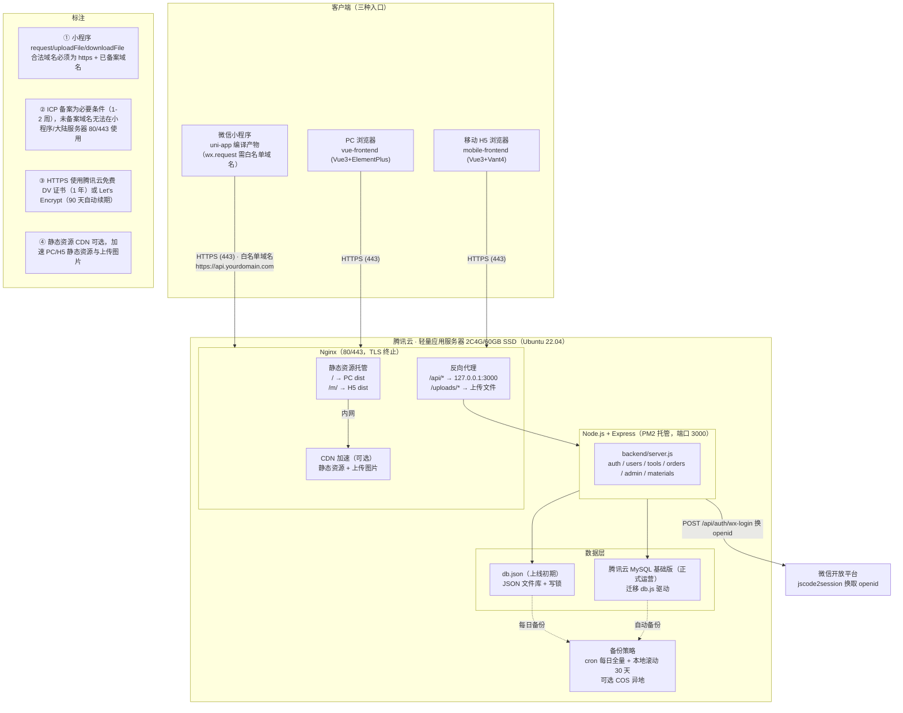
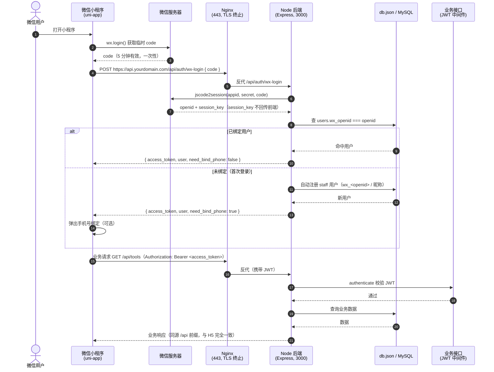

# 工器具管理系统 · 微信小程序 + 腾讯云部署落地文档

> 版本：v1.0（方案咨询）
> 作者：高见远（架构师）
> 日期：2026-08-05
> 适用范围：将现有 Node.js + Express（JSON 文件库）工器具管理系统上微信小程序，并部署至腾讯云轻量应用服务器
> 文档状态：**待评审**（方案咨询，不包含代码实现）

---

## 0. 现状核实摘要（已读取仓库确认）

| 项 | 核实结果 | 说明 |
|---|---|---|
| 仓库根 | `C:/Users/yan/WorkBuddy/2026-05-10-task-6`（git 仓库） | `tools-management/` 为 untracked 旧拷贝，**本方案忽略** |
| 后端 | `backend/`，Express 5 + JSON 文件库 `backend/db.json`（约 95KB） | 无数据库；`db.js` 提供 `readDB/writeDB/nextId/nowCST`，写库带同步自旋锁 |
| 认证 | JWT（`middleware/auth.js`），`POST /api/auth/login` 手机号免密直登，token 7d | 登录接口见 `backend/routes/auth.js` |
| PM2 配置 | **根目录 `ecosystem.config.js`**（dev 3 进程）+ **`deploy/production/ecosystem.config.js`**（生产仅托管 backend，端口 3000） | ⚠️ 注意：并非 `backend/ecosystem.config.js`，部署时以 `deploy/production/ecosystem.config.js` 为准 |
| 部署脚本 | `deploy/production/`：`deploy.sh`、`setup-server.sh`、`setup-domain.sh`、`nginx.conf`、`nginx-domain.conf`、README | 已具备 IP 直连 + 自签名证书 + 域名 HTTPS（certbot）两套模板 |
| 移动端 H5 | `mobile-frontend/`，Vue3 + TS + Vant4 + Pinia + vue-router(hash) + html5-qrcode | dev 3200，build base `/m/`；约 24 个页面 + 3 组件 + 6 composables + 3 store |
| 后端 API | 前缀 `/api`，含 auth/users/tools/orders/admin/materials 五大路由，约 26+ 接口 | 移动端已覆盖登录/首页/工具/物料/领用归还/盘点/库存流水 |
| 移动端已交付功能 | 扫码（弱光增强/手电筒/曝光 ISO）、货架导航盘点（步进器）、领用篮、物料领用 | 详见 §3 |

---

# Part A 系统设计

## A1. 总体部署架构



## A2. uni-app 小程序请求链路时序图



---

# Part B 分步实施清单

> 原则：**备案（A）与服务器/代码部署（B/C/D）可并行**；小程序白名单与正式发布（E/G）必须在备案通过后。

## 阶段 A：资源准备（并行启动，约 1-3 周）

| 步骤 | 操作要点 | 预计耗时 |
|---|---|---|
| A1 注册域名 | 腾讯云域名注册，.com 约 ¥55-70/年；建议 `api.yourdomain.com` 与主域名一起规划 | 1 天 |
| A2 域名实名认证 | 个人：身份证；企业：营业执照+法人身份证 | 1-3 工作日 |
| A3 ICP 备案 | 腾讯云「网站备案」小程序，人脸核验；**与 B/C/D 并行进行** | 7-20 工作日（通常 7-15） |
| A4 购买轻量服务器 | 腾讯云轻量应用服务器 2C4G/60GB SSD，选 **Ubuntu 22.04 + Node.js 应用镜像**（自带 nginx/node） | 即时 |
| A5 注册小程序 | mp.weixin.qq.com；个人主体免费 / 企业主体认证 ¥300/年 | 即时（认证 1-3 天） |
| A6（可选）购买 MySQL | 腾讯云 MySQL 基础版 1C1G，用于正式运营 | 即时 |

**关键决策**：备案通过前，可继续用「服务器 IP + 自签名证书」调试 PC/H5（现有 deploy.sh 已支持）；但**小程序 request 合法域名强制要求 https + 备案域名**，因此小程序体验版联调必须等 E 阶段完成。

## 阶段 B：服务器初始化（约 0.5-1 天）

```bash
# B1 安全组/防火墙（腾讯云轻量控制台 → 防火墙）
#   放行: 22(SSH)、80(HTTP)、443(HTTPS)；3000 不对外开放（仅内网反代）

# B2 登录服务器，确认环境
ssh root@<服务器IP>
node -v   # ≥ 18（推荐 20 LTS）
nginx -v  # Node.js 镜像自带
git --version

# B3 安装/确认 PM2
npm install -g pm2

# B4 创建项目目录并拉取代码
mkdir -p /opt/tools-management
cd /opt/tools-management
git clone <你的仓库地址> .

# B5 安装后端依赖
cd /opt/tools-management/backend
npm install --production
```

**操作要点**：SSH 建议改用密钥登录并禁用密码登录；设置 `ufw allow 22,80,443`；如镜像未带 Node 20 用 `nvm` 安装。

## 阶段 C：后端部署 + 备份（约 0.5 天）

```bash
# C1 生成生产环境变量（重要：JWT_SECRET 必须随机）
cd /opt/tools-management/backend
cat > .env << 'EOF'
NODE_ENV=production
PORT=3000
CORS_ORIGIN=https://yourdomain.com,https://api.yourdomain.com
JWT_SECRET=$(openssl rand -hex 32)
WX_APPID=你的小程序AppID
WX_SECRET=你的小程序AppSecret
DEFAULT_ADMIN_PASSWORD=ChangeMe123!
DEFAULT_USER_PASSWORD=UserPwd123!
EOF

# C2 PM2 启动（生产配置：仅托管 backend，fork 单实例）
cd /opt/tools-management
pm2 start deploy/production/ecosystem.config.js --update-env
pm2 save
pm2 startup systemd   # 按输出执行 sudo 命令，开机自启

# C3 验证
curl http://127.0.0.1:3000/api/health   # {"status":"ok",...}

# C4 定时备份 cron（每日 03:00 全量 + 保留 30 天）
mkdir -p /opt/tools-management/backups
crontab -e
# 追加：
# 0 3 * * * cd /opt/tools-management && cp backend/db.json backups/db-$(date +\%Y\%m\%d-\%H\%M\%S).json && find backups -name 'db-*.json' -mtime +30 -delete
```

**操作要点**：⚠️ `CORS_ORIGIN` 生产必填，否则前端请求被拒；上线初期 `db.json` 保留 + 每日备份（见 §5 风险）；PM2 `instances: 1` 不要改成 cluster（JSON 文件库并发写不安全）。

## 阶段 D：前端部署（PC/H5 静态托管，约 0.5 天）

```bash
# D1 构建 PC 端
cd /opt/tools-management/vue-frontend
npm install --include=dev
npm run build          # 产物 dist/

# D2 构建移动端 H5
cd /opt/tools-management/mobile-frontend
npm install --include=dev
npm run build:prod     # 产物 dist/（base /m/）

# D3 应用 Nginx 配置（沿用 deploy/production/nginx.conf 模板）
cp /opt/tools-management/deploy/production/nginx.conf /etc/nginx/sites-available/tools
ln -sf /etc/nginx/sites-available/tools /etc/nginx/sites-enabled/
rm -f /etc/nginx/sites-enabled/default
nginx -t && systemctl reload nginx

# D4 验证（备案前用 IP）
curl -I http://<服务器IP>/           # PC
curl -I http://<服务器IP>/m/         # H5
curl http://<服务器IP>/api/health    # API
```

**操作要点**：已有 `deploy.sh` 一键完成 C+D（拉代码→装依赖→构建→重启 PM2→reload nginx→导入工具数据），后续日常更新直接 `bash deploy/production/deploy.sh`。

## 阶段 E：HTTPS + 小程序白名单（备案通过后，约 0.5-1 天）

```bash
# E1 DNS 解析（腾讯云 DNSPod）
#   A    @        → 服务器公网IP
#   A    api      → 服务器公网IP   （小程序 API 域名）
#   A    www      → 服务器公网IP

# E2 申请免费 SSL（二选一）
#   方案一（推荐）：腾讯云 SSL 证书 → 免费 DV 证书（TrustAsia，1 年，到期手动续）
#   方案二：certbot（Let's Encrypt，90 天，自动续期）
sudo bash /opt/tools-management/deploy/production/setup-domain.sh yourdomain.com

# E3 检查证书续期（certbot 方案）
certbot renew --dry-run
```

**小程序后台配置（mp.weixin.qq.com → 开发管理 → 开发设置 → 服务器域名）**：

| 配置项 | 值 | 说明 |
|---|---|---|
| request 合法域名 | `https://api.yourdomain.com` | 业务 API |
| uploadFile 合法域名 | `https://api.yourdomain.com` | 工具图片上传 |
| downloadFile 合法域名 | `https://api.yourdomain.com` | 图片回显（uploads） |
| socket 合法域名 | 不适用 | 本项目无 WebSocket |

**操作要点**：域名变更/新增白名单一般即时生效，个别情况需重新编译或等待 5-10 分钟；`nginx-domain.conf` 已内置 HTTP→HTTPS 301 跳转与 `proxy_set_header X-Forwarded-Proto`。

## 阶段 F：小程序开发调试（约 1-2 周，与 A-E 并行）

1. 按 §3 完成 uni-app 迁移开发（`miniapp/` 新目录）。
2. 微信开发者工具导入 `miniapp/dist/dev/mp-weixin`，配置 AppID。
3. 在 mp 后台「成员管理」把开发者/体验成员加入，上传「体验版」。
4. 真机扫码验证：登录（微信授权）、扫码领用、盘点货架导航、图片上传。
5. 配置「用户隐私保护指引」（声明：手机号、摄像头、相册），否则审核被拒。

## 阶段 G：提审发布（1-7 天）

1. 类目选择：**「工具 > 办公/管理」或「商业服务 > 企业管理」**（与审核员沟通确认）。
2. 准备：隐私协议页面、测试账号、功能截图。
3. 提交审核 → 通过后「发布」。

---

# Part C uni-app 迁移方案

## C1. 路线对比与推荐

| 维度 | 方案一：uni-app 迁移（推荐） | 方案二：web-view 套壳（应急） |
|---|---|---|
| 本质 | 用 uni-app(Vue3) 重写移动端，编译为微信小程序原生 | 小程序 web-view 内嵌现有 H5（https://yourdomain.com/m/） |
| 后端 API | 零改动复用（wx.request 直连 https://api.../api） | 零改动复用 |
| 开发成本 | 高（模板/组件替换，约 8-12 人日） | 低（仅做壳页面 + 域名配置） |
| 体验 | 原生小程序体验，扫码用系统相机，可发布 | 受限：web-view 域名需业务域名白名单且**不能跳转任意网页**；H5 内 localStorage 在小程序 web-view 可用但受缓存策略影响；支付/相机/扫码能力受限 |
| 审核风险 | 常规审核 | web-view 类目审核更严，部分行业需额外资质 |
| 长期 | 可发布正式版、可复用多端（App/其他小程序） | 应急过渡，不建议长期 |

**结论**：推荐 **uni-app 迁移**；web-view 仅在「必须 2 周内上线演示」时作为过渡，且需将 H5 域名加入 web-view 业务域名白名单。

## C2. 工程初始化（uni-app Vue3 + Vite）

- 采用 `vue3` 分支官方模板：`npx degit dcloudio/uni-preset-vue#vite`（Vue3 + Vite + TS）。
- 新增仓库目录 `miniapp/`（与 mobile-frontend 平级），不污染现有 H5。
- 关键配置：`manifest.json`（appid、权限声明）、`pages.json`（页面路由 + tabBar）、`vite.config.ts`（`@` 别名、`/api` 代理 dev）。
- 状态管理：uni-app 支持 Pinia（`@dcloudio/uni-app` 兼容），**store/auth.ts、cart.ts、scanHistory.ts 纯逻辑可整体复用**，仅把 `localStorage` 换成 `uni.getStorageSync/setStorageSync`（或封装 `utils/storage.ts` 抹平差异）。

## C3. 组件替换映射表（Vant4 → uni-app）

> 原则：以 **uni-ui（DCloud 官方）** + 原生组件为主，少量自封装；不引入 vant-weapp（WXML 组件库，与 Vue3 组合式开发割裂，维护成本高）。

| Vant4 组件（现有） | uni-app 替换 | 类型 | 备注 |
|---|---|---|---|
| `van-button` | 原生 `button` + 全局样式 | 替换 | 简单场景用原生；复杂按钮可自封装 |
| `van-cell` / `van-cell-group` | `uni-list` / `uni-list-item`（或自封装 cell） | 替换 | uni-ui 自带 |
| `van-field` / `van-form` | `uni-forms` / `uni-easyinput` | 替换 | 表单校验 API 不同，需适配 |
| `van-stepper`（盘点步进器） | `uni-number-box` | 替换 | 货架导航盘点页核心交互，逻辑保留 |
| `van-tag` | 自封装 `AppTag`（几行 CSS） | 自封装 | 三态库存标签，见 `utils/stock.ts` 映射 |
| `van-dialog`（表单弹窗） | `uni-popup` + 表单 | 替换 | 管理页大量使用，注意 confirm 回调改 Promise/事件 |
| `van-popup` | `uni-popup` | 替换 | |
| `van-tabbar` / `van-tabbar-item` | **pages.json 原生 tabBar** | 替换 | 原生 tabBar 体验更佳；首页/工具/物料/工单/我的 |
| `van-nav-bar` | `uni-nav-bar`（或自定义导航栏） | 替换 | |
| `van-search` | `uni-search-bar` | 替换 | |
| `van-list` / `van-pull-refresh` | 页面生命周期 `onReachBottom` / `onPullDownRefresh` | 重写 | 小程序原生滚动分页 |
| `van-action-sheet` | `uni.showActionSheet` 或 `uni-popup` | 替换 | 命令式 |
| `van-dropdown-menu` / `van-dropdown-item` | `uview-plus u-dropdown` 或自封装 | 替换 | 工单/用户管理筛选；工作量小 |
| `van-checkbox` | `uni-data-checkbox` 或原生 `checkbox` | 替换 | 工单现场清点 |
| `van-switch` | 原生 `switch` | 替换 | |
| `van-icon` | `uni-icons` | 替换 | 图标名映射需逐个核对 |
| `van-image` | `uni-image` / 原生 `image` | 替换 | 图片域名需加入 downloadFile 白名单 |
| `van-loading` | 原生 loading / `uni-load-more` | 替换 | |
| `van-config-provider` | `page` 级 CSS 变量 | 重写 | 主题由 JS 改 CSS |
| `showToast/showSuccessToast/showFailToast/showLoadingToast/closeToast` | **统一封装 `utils/feedback.ts`** → `uni.showToast/uni.showLoading/uni.hideLoading` | 封装 | 命令式 API 差异最大的点 |
| `showConfirmDialog` | 封装 → `uni.showModal` | 封装 | Promise 化需适配（uni.showModal 用 success/fail 回调） |
| `showNotify`（useAutoLogout） | `uni.showToast` 替代 | 替换 | |

## C4. 页面迁移清单（现有 views → uni-app 目标页）

| 现有 H5 页面 | 文件 | uni-app 目标页 | 复用度 | 主要工作 |
|---|---|---|---|---|
| 登录 | `views/Login.vue` | `pages/login/index` | 30% | 重写：加微信授权登录（wx.login → wx-login） |
| 仪表盘 | `views/Dashboard.vue` | `pages/dashboard/index` | 85% | 模板换 uni 组件 |
| 工器具 | `views/ToolManagement.vue`（1075 行，最大） | `pages/tools/index` | 75% | 模板换 uni 组件；筛选/操作弹窗改 uni-popup；工作量最大 |
| 扫码 | `views/ScanTool.vue`（604 行） | `pages/scan/index` | 40% | **重写**：html5-qrcode → `uni.scanCode`（见 C6） |
| 领用工单 | `views/OrderManagement.vue` | `pages/orders/index` | 80% | 现场清点 checkbox 替换 |
| 领用篮 | `views/ShoppingCart.vue` | `pages/cart/index` | 85% | |
| 我的 | `views/Profile.vue` | `pages/profile/index` | 85% | |
| 备件 | `views/SparePartList.vue` | `pages/materials/spare` | 80% | |
| 消耗品 | `views/ConsumableList.vue` | `pages/materials/consumable` | 80% | 数量输入改 uni-number-box |
| 物料中心 | `views/MaterialCenter.vue` | `pages/materials/index` | 85% | |
| 物料领用 | `views/MaterialDispense.vue` | `pages/materials/dispense` | 85% | |
| 盘点列表 | `views/Inventory.vue` | `pages/inventory/index` | 85% | |
| 创建盘库单 | `views/inventory/InventoryCreate.vue` | `pages/inventory/create` | 85% | |
| 盘点扫码 | `views/inventory/InventoryScan.vue` | `pages/inventory/scan` | 55% | **扫码重写**；录入逻辑保留 |
| 盘点结果 | `views/inventory/InventoryResult.vue` | `pages/inventory/result` | 85% | |
| **货架导航盘点** | `views/inventory/InventoryShelf.vue` | `pages/inventory/shelf` | 70% | 步进器→uni-number-box；**货架→货位两级导航逻辑保留** |
| 出入库流水 | `views/StockMovement.vue` | `pages/stock/movements` | 85% | |
| 库存单元格/筛选 | `views/stock/StockCell.vue`、`StockFilter.vue` | `pages/stock/...` | 85% | |
| 管理页 ×6 | `Category/Dept/Location/Shelf/User/Warehouse Management.vue` | `pages/admin/*`（建议分包） | 80% | 弹窗表单改 uni-popup；可打包进「管理分包」 |
| 组件 | `components/InventoryScannerPopup.vue` | `components/ScannerPopup` | 50% | 扫码逻辑重写 |
| 组件 | `components/ScanResultPopup.vue` | `components/ScanResultPopup` | 80% | 模板替换 |
| 组件 | `components/MaterialCard.vue` | `components/MaterialCard` | 85% | |

## C5. API 层复用（核心优势：后端零改动）

- 现有 `src/api/index.ts` + `src/api/material.ts` 的**函数签名与业务逻辑全部保留**，仅替换底层请求对象：
  - `axios.create({ baseURL: '/api' })` → `utils/request.ts` 基于 `uni.request` 封装（`baseURL` 由 `process.env.NODE_ENV` 区分：dev 代理 / prod `https://api.yourdomain.com`）。
  - 请求拦截器：`localStorage.getItem('token')` → `uni.getStorageSync('token')`，注入 `Authorization: Bearer <token>`。
  - 响应拦截器：401 清 token 跳登录；错误提示走 `utils/feedback.ts`。
- **复用清单（纯逻辑，几乎零改动）**：全部 API 函数、`store/*`（auth/cart/scanHistory）、`types/index.ts`、`constants/material.ts`、`utils/stock.ts`、`composables/useAutoLogout.ts`、`composables/useMaterialList.ts`、`composables/useInventoryEntered.ts`。
- **需重写清单**：`composables/useScanner.ts` + `useBrightness.ts`（浏览器 getUserMedia → 小程序扫码，见 C6）。

## C6. 扫码能力改造

| 能力 | H5（html5-qrcode） | 小程序（uni.scanCode） | 影响 |
|---|---|---|---|
| 扫码触发 | getUserMedia + 视频流解析 | `uni.scanCode`（调系统相机） | 重写 |
| 条码类型 | CODE_128/EAN_13/CODE_39 | `scanType: ['barCode']`（默认全支持） | 简化 |
| 弱光增强 | 手电筒/曝光/ISO 约束 | **系统相机自动对焦，无 torch/曝光 API** | 降级：弱光依赖系统相机，无需自研 |
| 连续扫码 | 停止→清理 DOM→重启 | 每次 `uni.scanCode` 一次回调，循环调用即可 | 更简单 |
| 权限 | 浏览器授权弹窗 + HTTPS 要求 | 微信授权（首次弹窗），**无需 HTTPS 即可用** | 更简单 |
| 手动输入降级 | 已有 | 保留（扫码失败弹输入框） | 保留 |

**结论**：小程序端扫码反而更简单可靠；`ScanTool.vue`、`InventoryScan.vue`、`InventoryScannerPopup.vue` 三处扫码入口统一改为 `uni.scanCode` + 手动输入降级。

## C7. 微信登录接口对接（新增后端接口）

### 接口设计：`POST /api/auth/wx-login`

**请求**：
```json
{ "code": "wx.login 获取的临时 code（5 分钟有效）", "nickname": "可选", "avatar": "可选" }
```

**处理流程**：
1. 校验 `code` 非空。
2. 后端调用微信 `jscode2session`（`appid`/`secret` 来自环境变量 `WX_APPID`/`WX_SECRET`）换取 `openid`（+ 可选 `session_key`/`unionid`）。
3. 按 `openid` 查 `users`：
   - **已绑定** → 签发 JWT（与现有 `/auth/login` 完全一致，7d）→ `{ access_token, user, need_bind_phone: false }`。
   - **未绑定** → 自动注册（`role=staff`、`username=wx_<openid前8位>`、`real_name=昵称或'微信用户'`、`is_active=true`）→ 签发 JWT → `{ access_token, user, need_bind_phone: true }`。
4. `session_key` **绝不返回前端**（安全要求）。

**配套接口（可选）**：`POST /api/auth/wx-bind-phone` `{ phone }`（携带 JWT）→ 校验手机号已存在 → 将 `wx_openid` 绑定到该用户 → 返回更新后 user。用于「首次微信登录自动注册 + 引导绑定手机号」以关联现有账户体系。

**数据层变更**：`users` 元素新增 `wx_openid`、`wx_unionid`、`wx_nickname`、`wx_avatar` 字段（`db.js` 的 `migrateDB()` 幂等补字段，兼容旧 db.json；MySQL 迁移时建唯一索引 `wx_openid`）。

**安全**：`code` 一次性（微信侧保证）；登录限流复用现有 `loginLimiter`；建议 WX_SECRET 只存服务器环境变量。

## C8. uni-app 迁移任务拆分（按依赖顺序，5 个任务）

| 任务 | 名称 | 覆盖文件（miniapp/ 下） | 依赖 | 预估 |
|---|---|---|---|---|
| **U01** | 工程初始化与基础设施 | `package.json`、`vite.config.ts`、`tsconfig.json`、`manifest.json`、`pages.json`（路由+tabBar）、`main.ts`、`App.vue`、`utils/request.ts`、`utils/storage.ts`、`utils/feedback.ts`、`types/index.ts`、全局样式 | 无 | 1.5 人日 |
| **U02** | 数据层与公共能力 | `api/index.ts`、`api/material.ts`、`store/auth.ts`、`store/cart.ts`、`store/scanHistory.ts`、`constants/material.ts`、`utils/stock.ts`、`composables/useAutoLogout.ts`、`composables/useMaterialList.ts`、`composables/useInventoryEntered.ts`、`composables/useScanner.ts`（重写为 uni.scanCode） | U01 | 2 人日 |
| **U03** | 核心业务页面 | `pages/login/index`、`pages/dashboard/index`、`pages/tools/index`、`pages/scan/index`、`pages/orders/index`、`pages/cart/index`、`pages/materials/*`、`pages/inventory/*`（含货架导航）、`pages/stock/*`、`components/ScannerPopup`、`components/ScanResultPopup`、`components/MaterialCard` | U02 | 4-5 人日 |
| **U04** | 辅助页面与管理分包 | `pages/profile/index`、`pages/admin/*`（6 个管理页）、分包 `subpackages.json` 配置、页面骨架/加载态样式收尾 | U03 | 1.5 人日 |
| **U05** | 微信登录对接 + 集成调试 | 后端 `routes/auth.js`（wx-login/wx-bind-phone）、`routes/db.js`（wx 字段迁移）、登录页微信授权流程、体验版联调、真机扫码/相机验证、包体积优化 | U03 | 2 人日 |

> 合计约 **11-12 人日**（1 名前端 + 后端联调 0.5 人日）。若并行 2 人，约 6-8 个自然日。

---

# Part D 成本表（腾讯云，2026 年市场价区间）

## D1. 两档配置

| 项目 | 最低成本档（个人/试用） | 推荐稳定档（企业正式运营） |
|---|---|---|
| 轻量应用服务器 2C4G/60GB SSD | 月付活动价 **¥60-75/月**（新用户首年常有 ¥50-60/月特惠） | 包年 **¥800-1100/年**（约 ¥70-90/月） |
| 域名（.com） | ¥55-70/年 | ¥70-100/年（选好记短域名） |
| ICP 备案 | 免费 | 免费 |
| SSL 证书 | 免费（腾讯云 DV / Let's Encrypt） | 免费（同左） |
| 小程序主体 | 个人免费（类目受限，无支付） | 企业认证 **¥300/年**（可开支付、类目全） |
| MySQL 基础版 1C1G | **不启用**（db.json + 每日备份） | **¥35-60/月**（基础版） |
| CDN（可选） | 不启用 | ¥10-50/月（按流量，静态资源加速） |

## D2. 合计

| 档位 | 首年一次性/年付 | 后续每月（含年费均摊） |
|---|---|---|
| **最低成本档** | 约 **¥850-1050**（服务器月付 ×12 + 域名 + 个人小程序免费） | 约 **¥60-100/月** |
| **推荐稳定档** | 约 **¥1600-2200**（服务器包年 + 域名 + 企业认证 + MySQL 首年） | 约 **¥110-170/月**（服务器均摊 + MySQL + CDN 可选） |

> 注：价格为市场区间估算，以腾讯云控制台实时报价为准；轻量服务器常有新用户/活动价，实际以购买页为准。

---

# Part E 风险与待明确事项

## E1. 风险清单

| # | 风险 | 等级 | 缓解措施 |
|---|---|---|---|
| R1 | **备案周期**：7-20 工作日，且国内服务器未备案 80/443 被拦截；小程序发布必须备案 | 高 | 备案与开发并行；备案期间用 IP+自签名证书调试 PC/H5；小程序开发/体验版联调放在备案后 |
| R2 | **db.json 并发写丢失**：`readDB→修改→writeDB` 非原子，多请求并发会丢更新；进程崩溃丢数据 | 高 | PM2 保持 `instances:1`；每日 cron 全量备份 + 保留 30 天；写库加串行队列（现状自旋锁是单写者但 read-modify-write 仍竞态）；**正式运营迁 MySQL**（§E2） |
| R3 | **小程序审核被拒**：类目不符 / 隐私协议缺失 / 体验版有测试数据 | 中 | 类目选「工具>办公/管理」或「商业服务>企业管理」；配置「用户隐私保护指引」（手机号/摄像头/相册）；提交前清理测试数据 |
| R4 | **HTTPS 证书续期**：腾讯云免费 DV 证书 1 年需手动续期；Let's Encrypt 90 天自动续期依赖 cron | 中 | 推荐 certbot 自动续期并设 `renew --dry-run` 告警；或购买腾讯云证书后设日历提醒 |
| R5 | **小程序域名白名单**：修改 request 合法域名生效有延迟（个别情况需重新编译/5-10 分钟） | 低 | 上线前提前配置并验证；白名单域名必须 https+备案，与后端域名一致 |
| R6 | **uni-app 迁移适配**：Vant4 命令式 API（showToast/showDialog/showConfirmDialog/showLoadingToast）与 uni API 回调风格不同；组件属性/插槽差异多 | 中 | 统一 `utils/feedback.ts` 封装；组件映射按 §C3 逐个核对；模板先行、逻辑复用 |
| R7 | **扫码/相机差异**：小程序 `uni.scanCode` 无 torch/曝光/ISO 控制，弱光增强能力降级 | 低 | 系统相机自带对焦/补光；产品侧说明弱光体验变化；保留手动输入降级 |
| R8 | **小程序包体积**：uni-app 主包 2MB 限制，管理页等低频页面需分包 | 中 | 管理页/库存流水放分包（§C4 已规划 `pages/admin/*` 分包） |
| R9 | **图片上传**：`/uploads` 需加入 downloadFile 白名单；小程序端 `uni.uploadFile` 与 axios FormData 行为不同 | 中 | API 层 upload 函数单独封装 `uni.uploadFile`；域名白名单配全 |

## E2. db.json → MySQL 迁移方案（正式运营建议）

| 阶段 | 动作 | 风险 |
|---|---|---|
| 1. 上线初期 | 保留 db.json + cron 每日备份（本地 30 天 + 可选 COS 异地） | 低 |
| 2. 运营 1-3 个月后 | 购买腾讯云 MySQL 基础版；将 `db.js` 的 `readDB/writeDB/nextId` 替换为 `mysql2` 驱动（接口签名保持一致，路由层**零改动**）；按 db.json 现有表结构建 15 张表（users/departments/roles/warehouses/shelves/storage_locations/tools/categories/toolkits/toolkit_items/orders/spare_parts/consumables/material_categories/stock_movements/inventory_checks）；`migrateDB()` 改为 SQL 迁移脚本 | 中：需编写数据导入脚本、事务改写（现路由多处 read-modify-write 需包事务） |
| 3. 平滑切换 | 双写过渡（写 MySQL + 同步写 db.json 备份）→ 验证 → 只写 MySQL | 中 |

## E3. 待明确事项（需主理人/业务方决策）

1. **微信登录策略**：允许任何微信用户「自动注册为普通员工」？还是「仅限管理员后台预绑定手机号后才能登录」？（影响 wx-login 实现与安全边界）
2. **小程序主体**：个人还是企业？企业需营业执照，且影响类目/支付能力。
3. **是否需要手机号绑定流程**：首次微信登录是否强制绑定手机号（关联现有账户体系），还是独立微信账号即可。
4. **MySQL 迁移时间点**：上线即迁，还是先 db.json+备份运营 1-3 个月再迁（推荐后者）。
5. **CDN 是否启用**：当前规模（单台轻量）CDN 收益有限，建议暂缓。
6. **域名选择**：主域名 + `api.` 子域名规划（需与备案主体一致）。
7. **扫码弱光体验**：小程序端系统相机弱光能力优于多数浏览器，但无法复刻 H5 的曝光/ISO 微调，是否接受降级。

---

# 附录：关键文件对照

| 现有文件 | 迁移/部署去向 | 动作 |
|---|---|---|
| `backend/server.js`、`backend/routes/*` | 服务器 `/opt/tools-management/backend/` | 原样部署（仅新增 wx-login 路由） |
| `backend/db.js` | 保留（上线初期）；正式运营替换为 mysql2 驱动 | 适配 |
| `backend/.env`（生产） | 服务器生成：JWT_SECRET/WX_APPID/WX_SECRET/CORS_ORIGIN | 新建 |
| `ecosystem.config.js`（根，dev） | 仅本地开发用 | 不动 |
| `deploy/production/ecosystem.config.js` | 服务器 PM2 生产配置 | 原样 |
| `deploy/production/nginx.conf` / `nginx-domain.conf` | 服务器 `/etc/nginx/sites-available/tools` | 备案后用 domain 版 |
| `deploy/production/deploy.sh` | 日常一键更新 | 原样（新增 miniapp 构建步骤可选） |
| `mobile-frontend/`（H5） | 继续作为移动 H5 入口（`/m/`），不删除 | 不动 |
| `miniapp/`（新增） | uni-app 源码 → 编译 `dist/build/mp-weixin` 上传微信 | 新建 |
