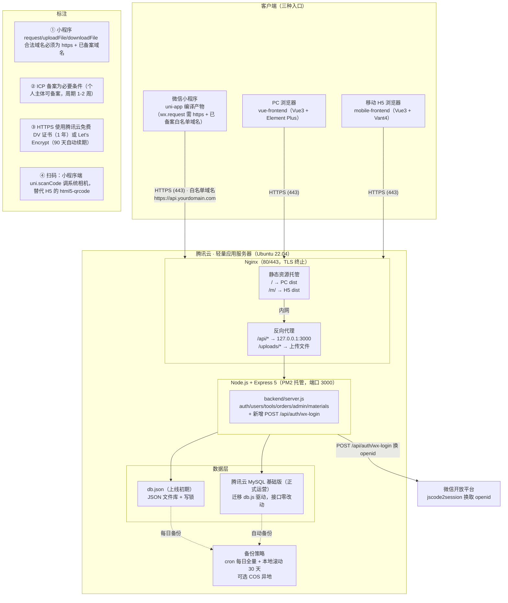
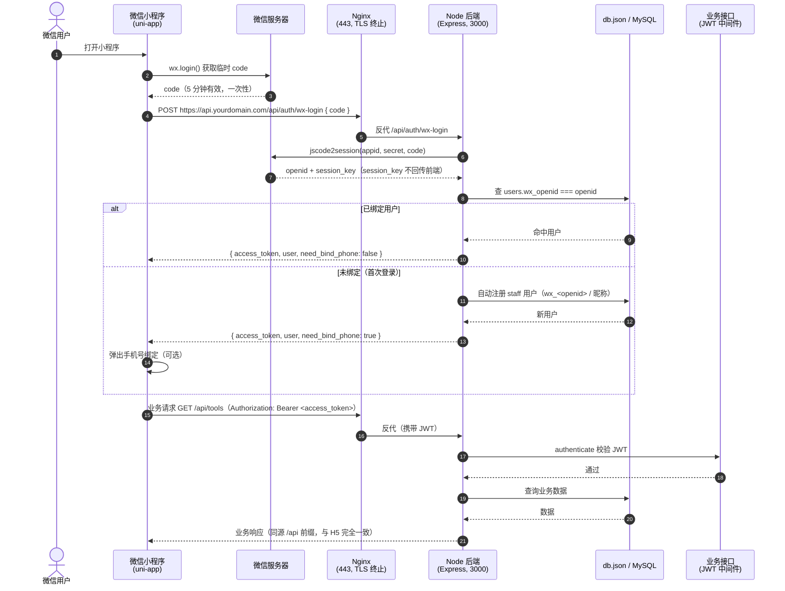

# 工器具管理系统
# 微信小程序 + 腾讯云部署方案报告

---

| 项目要素 | 内容 |
|---|---|
| 报告名称 | 工器具管理系统 · 微信小程序 + 腾讯云部署方案报告 |
| 报告性质 | 方案咨询 + 费用报价（供决策） |
| 编制人 | 高见远（架构师） |
| 版本 | v1.0 |
| 日期 | 2026-08-05 |
| 适用范围 | 将现有 Node.js + Express（JSON 文件库）工器具管理系统上微信小程序，并部署至腾讯云轻量应用服务器 |
| 参考依据 | 《docs/miniapp-tencent-deploy-plan.md》（v1.0 落地文档） |
| 费用口径 | 人民币；价格以腾讯云官网实时报价为准，本报告为市场价区间估算 |

---

## 摘要（读者结论）

本报告针对现有「PC 端 Vue3 + Element Plus、移动端 H5 Vue3 + Vant4、后端 Node.js + Express + db.json」的工器具管理系统，给出**上微信小程序 + 部署腾讯云**的完整方案与三档费用报价。

**核心结论如下：**

1. **技术路线**：推荐 **uni-app 迁移**移动端（后端零改动，仅新增 1 个登录接口），web-view 套壳仅作应急备选。
2. **时间**：迁移开发 **11-12 人日**（1-2 人并行约 6-8 个自然日），叠加 ICP 备案（1-2 周，关键路径）与收尾联调提审（3-5 天），**项目总周期约 2-4 个自然周**。
3. **人力费用**：按人日单价 ¥1,000-1,500 折算，迁移人力费用约 **¥11,000-18,000**。
4. **三档报价（首年总费用）**：
   - 最低要求档（2C2G/40GB）：约 **¥560-770**
   - 性价比档（2C4G/60GB，推荐）：约 **¥860-1,170**（个人主体起步，不含可选 MySQL/CDN）
   - 性能较好档（4C8G/80GB，企业主体）：约 **¥2,180-2,890**（含企业认证 + MySQL）
5. **主体与合规**：小程序采用**个人主体**（注册免费、可做「工具 > 办公/管理」类目、但无法开通微信支付）；域名采用 **.com**（个人主体可 ICP 备案，周期 1-2 周）；扫码直接使用微信原生 **uni.scanCode**，替代 H5 的 html5-qrcode。

---

## 目录

- 一、项目概述与目标
- 二、整体方案
- 三、服务器容量建议与费用
- 四、迁移时间与费用对比
- 五、三档费用报价总表（核心交付）
- 六、风险与建议
- 附录：关键文件对照

---

## 一、项目概述与目标

### 1.1 项目现状

经对仓库 `C:/Users/yan/WorkBuddy/2026-05-10-task-6` 核实，当前系统构成如下：

| 模块 | 技术栈 | 说明 |
|---|---|---|
| 后端 | Node.js + Express 5 + JWT | `backend/`，JSON 文件库 `backend/db.json`（约 95KB）；`db.js` 提供 `readDB/writeDB/nextId/nowCST`，写库带同步自旋锁；API 前缀 `/api`，含 auth/users/tools/orders/admin/materials 五大路由，约 26+ 接口 |
| PC 端 | Vue3 + Element Plus + Pinia + vue-router | `vue-frontend/`，管理后台，含条码生成（jsbarcode）、Excel 导入导出（xlsx） |
| 移动端 H5 | Vue3 + Vant4 + Pinia + vue-router(hash) + html5-qrcode | `mobile-frontend/`，约 24 个页面 + 3 组件 + 6 composables + 3 store；已交付登录/首页/工具/物料/领用归还/盘点（含货架导航）/库存流水/扫码（弱光增强）等能力 |
| 部署资产 | PM2 + Nginx + 部署脚本 | 根目录 `ecosystem.config.js`（dev）与 `deploy/production/`（生产：deploy.sh、setup-server.sh、setup-domain.sh、nginx 模板、README）；已具备 IP 直连 + 自签名 + 域名 HTTPS（certbot）两套模板 |

### 1.2 项目目标

1. **上线微信小程序**：将移动端 H5 能力迁移为微信小程序（原生体验、微信生态入口），扫码改用微信原生能力。
2. **部署至腾讯云**：小程序、PC、H5 三端统一由腾讯云轻量应用服务器托管，Nginx 提供 TLS 与反向代理，PM2 托管后端进程。
3. **控制成本与合规**：采用个人主体小程序 + .com 备案域名，以最低合规成本完成上线；预留企业主体升级路径。

### 1.3 读者结论摘要

| 读者 | 关注点 | 结论 |
|---|---|---|
| 业务决策人 | 多少钱、多久 | 三档首年费用 ¥560-2,890；周期 2-4 周；推荐性价比档 |
| 技术负责人 | 怎么改、风险 | uni-app 迁移 11-12 人日，后端零改动 + 1 个新接口；关键风险为备案周期与 db.json 并发写 |
| 运维/财务 | 月度成本 | 最低约 ¥50-65/月；推荐档约 ¥75-95/月（不含可选 MySQL/CDN） |

---

## 二、整体方案

### 2.1 总体部署架构

### 2.2 小程序登录与业务请求时序

### 2.3 关键决策说明

#### 2.3.1 小程序主体：个人

| 维度 | 个人主体小程序 | 企业主体小程序（升级路径） |
|---|---|---|
| 注册费用 | **免费**（mp.weixin.qq.com 注册即用） | 认证费 **¥300/年**（需营业执照 + 对公/法人验证，1-3 天） |
| 类目 | 可做「工具 > 办公/管理」等类目 | 类目更全 |
| 微信支付 | **无法开通**（个人主体不支持） | 可开通（需商户号，另有费率） |
| 部分能力 | 部分接口/组件受限（如支付类、部分开放能力） | 全部能力 |
| 结论 | 本项目**当前选个人主体**：业务为内部工器具管理，无支付需求，成本最低 | 如后续需对外收款、开放更多能力，再升级企业主体，**认证费 ¥300/年**，账户主体变更需重新提审 |

#### 2.3.2 域名与 ICP 备案

- **域名**：选用 **.com**（¥55-70/年首年注册价，续费约 ¥70-90/年）。个人主体可正常完成 .com 域名实名认证与 ICP 备案。
- **备案流程**（腾讯云「网站备案」小程序，全程线上，免费）：
  1. 域名实名认证（身份证，1-3 个工作日）；
  2. 提交 ICP 备案申请（主体信息 + 人脸核验 + 幕布/电子核验）；
  3. 管局审核（**通常 7-15 个工作日，即 1-2 周**）；
  4. 备案通过后，服务器 80/443 方可对外服务、小程序合法域名方可配置。
- **关键约束**：小程序 `request` 合法域名强制要求 **https + 已备案域名**，因此**备案是上线关键路径**，建议与开发并行。

#### 2.3.3 扫码能力：微信原生扫码

| 能力 | H5（html5-qrcode） | 小程序（uni.scanCode / wx.scanCode） |
|---|---|---|
| 实现 | getUserMedia + 视频流解析 | **调起系统相机**，微信原生扫码 |
| 弱光 | 需手电筒/曝光/ISO 自研增强 | **系统相机自动对焦/补光，无弱光降级问题** |
| 条码类型 | 需显式声明 | `scanType: ['barCode']`，默认全支持 |
| 连续扫码 | 停止→清理 DOM→重启 | 每次回调一次，循环调用即可 |
| 权限 | 浏览器授权 + HTTPS 要求 | 微信首次授权弹窗，无需 HTTPS 即可调用 |

**结论**：迁移时扫码模块（`ScanTool.vue`、`InventoryScan.vue`、`InventoryScannerPopup.vue` 三处入口）**重写为 `uni.scanCode`**，保留手动输入降级；小程序端扫码更简单可靠。

#### 2.3.4 白名单域名

小程序后台（mp.weixin.qq.com → 开发管理 → 开发设置 → 服务器域名）需配置：

| 配置项 | 值 | 说明 |
|---|---|---|
| request 合法域名 | `https://api.yourdomain.com` | 业务 API |
| uploadFile 合法域名 | `https://api.yourdomain.com` | 工具图片上传 |
| downloadFile 合法域名 | `https://api.yourdomain.com` | 图片回显（uploads） |
| socket 合法域名 | 不适用 | 本项目无 WebSocket |

> 前提：域名必须**已 ICP 备案**且证书有效；白名单修改一般即时生效，个别情况需重新编译或等待 5-10 分钟。

### 2.4 技术路线对比与推荐

| 维度 | 方案一：uni-app 迁移（推荐） | 方案二：web-view 套壳（应急） |
|---|---|---|
| 本质 | 用 uni-app（Vue3）重写移动端，编译为微信小程序原生 | 小程序 web-view 内嵌现有 H5（https://yourdomain.com/m/） |
| 后端 API | 零改动复用（wx.request 直连 https://api.../api） | 零改动复用 |
| 开发成本 | 高（模板/组件替换，约 11-12 人日） | 低（仅壳页面 + 域名配置，1-3 天） |
| 体验 | 原生小程序体验，扫码用系统相机，可发布正式版 | 受限：web-view 域名需业务域名白名单且**不能跳转任意网页**；支付/相机/扫码能力受限；审核更严 |
| 长期 | 可复用多端（App/其他小程序） | 应急过渡，不建议长期 |

**推荐结论**：正式路线采用 **uni-app 迁移**；web-view 仅在「必须 2 周内上线演示」时作为过渡备选。

---

## 三、服务器容量建议与费用

### 3.1 容量测算依据

- 系统为**单机轻量应用**（1 台服务器托管静态 + API + 数据），用户量为工器具管理场景（内部/小团队），非高并发互联网应用。
- 估算口径：Node 单实例（PM2 fork 单实例，db.json 阶段**不得**开启 cluster）约可支撑数百并发；按「并发请求数 / 在线用户数」给出三档区间。
- 磁盘：db.json 仅约 95KB，磁盘主要消耗为上传图片（工具/物料图片）与系统备份，40-80GB SSD 均充足。

### 3.2 三档服务器配置与费用（腾讯云轻量应用服务器）

> 价格区间参考腾讯云公开活动价/包年价，**以腾讯云官网实时报价为准**。

| 档位 | 配置 | 包月区间 | 包年区间 | 适用场景（并发/在线估算） |
|---|---|---|---|---|
| **最低要求档** | 2C2G / 40GB SSD | ¥45-60/月 | ¥500-700/年 | 内部试用、演示、个人/极小型团队；并发 < 30、在线 < 100 |
| **性价比档（推荐）** | 2C4G / 60GB SSD | ¥60-75/月 | ¥800-1,100/年 | 正式上线标准选择；并发 50-150、在线 100-300 |
| **性能较好档** | 4C8G / 80GB SSD | ¥120-160/月 | ¥1,400-1,800/年 | 较大团队、图片/扫码频繁；并发 200+、在线 500+ |

> 说明：腾讯云轻量服务器常有大促/新用户特惠（首年低至 ¥50-60/月档），实际以购买页为准；建议正式上线**按年购买**（性价比更高），试用期可按月购买随时升配。

### 3.3 服务器外费用明细表

| 费用项 | 金额区间 | 说明 |
|---|---|---|
| .com 域名年费 | **¥55-70/年**（首年）；续费约 ¥70-90/年 | 腾讯云域名注册，需实名认证 |
| ICP 备案 | **¥0** | 腾讯云免费代办，周期 1-2 周 |
| SSL 证书 | **¥0** | 腾讯云免费 DV 证书（1 年，到期手动续）或 Let's Encrypt（90 天自动续期） |
| 小程序注册 | **¥0**（个人主体） | mp.weixin.qq.com 注册即用 |
| 可选：企业认证 | **¥300/年** | 升级企业主体：类目更全、可开微信支付 |
| 可选：MySQL 基础版 1C1G | **¥35-60/月** | 正式运营建议启用（替代 db.json 并发写风险） |
| 可选：CDN | **¥10-50/月**（按流量） | 静态资源 + 上传图片加速；当前单机规模收益有限，建议暂缓 |
| 备份存储 | **¥0-10/月**（按量） | 默认本地磁盘滚动 30 天（已含在服务器费用内）；可选 COS 异地备份按量计费（db.json 备份量极小，可忽略） |

---

## 四、迁移时间与费用对比

### 4.1 uni-app 迁移工作量（U01-U05）

| 任务 | 名称 | 覆盖范围（miniapp/ 下） | 依赖 | 预估 |
|---|---|---|---|---|
| U01 | 工程初始化与基础设施 | package.json、vite.config.ts、tsconfig.json、manifest.json、pages.json（路由+tabBar）、main.ts、App.vue、utils/request.ts、utils/storage.ts、utils/feedback.ts、types/index.ts、全局样式 | 无 | 1.5 人日 |
| U02 | 数据层与公共能力 | api/index.ts、api/material.ts、store/auth.ts、store/cart.ts、store/scanHistory.ts、constants/material.ts、utils/stock.ts、composables/*（useScanner 重写为 uni.scanCode） | U01 | 2 人日 |
| U03 | 核心业务页面 | pages/login、dashboard、tools、scan、orders、cart、materials/*、inventory/*（含货架导航）、stock/*、components/ScannerPopup、ScanResultPopup、MaterialCard | U02 | 4-5 人日 |
| U04 | 辅助页面与管理分包 | pages/profile、pages/admin/*（6 个管理页）、分包配置、样式收尾 | U03 | 1.5 人日 |
| U05 | 微信登录对接 + 集成调试 | 后端 routes/auth.js（wx-login/wx-bind-phone）、routes/db.js（wx 字段迁移）、登录页微信授权、体验版联调、真机验证、包体积优化 | U03 | 2 人日 |

**合计：约 11-12 人日**（1 名前端 + 后端联调 0.5 人日）。若并行 2 人，约 6-8 个自然日。

**人力费用折算**：11-12 人日 × ¥1,000-1,500/人日 = **约 ¥11,000-18,000**（可按实际人力/外包单价调整）。

### 4.2 部署实施与提审时间

| 阶段 | 内容 | 预计耗时 | 是否与备案并行 |
|---|---|---|---|
| A 资源准备 | 域名注册/实名、购买服务器、注册小程序 | 1-3 天 | 是 |
| **A3 ICP 备案** | 腾讯云备案 + 管局审核 | **7-20 工作日（通常 7-15，即 1-2 周）** | **关键路径，不可压缩** |
| B 服务器初始化 | 安全组、环境、PM2 | 0.5-1 天 | 是 |
| C 后端部署 + 备份 | .env、PM2 启动、cron 备份 | 0.5 天 | 是 |
| D 前端部署 | PC/H5 构建 + Nginx 静态托管 | 0.5 天 | 是 |
| E HTTPS + 白名单 | DNS、SSL、小程序合法域名 | 0.5-1 天 | 备案通过后 |
| F 小程序联调 | 体验版真机联调（登录/扫码/上传） | 2-3 天 | 备案通过后 |
| G 提审发布 | 类目/隐私/截图 → 审核 → 发布 | 3-5 天（审核 1-7 天） | 备案通过后 |

### 4.3 总时间线与费用区间

| 维度 | 估算 |
|---|---|
| **总自然周** | **约 2-4 周**（关键路径 = 备案 1-2 周 + 备案后收尾联调提审 0.5-1 周；迁移开发与部署全程与备案并行） |
| **迁移人力费用** | 约 **¥11,000-18,000**（11-12 人日 × ¥1,000-1,500） |
| **资源费用（性价比档，个人主体）** | 首年约 **¥860-1,170**（服务器包年 + 域名 + 个人小程序免费，不含可选 MySQL/CDN） |
| **项目总投入（性价比档）** | 约 **¥11,900-19,200**（人力 + 首年资源） |

> 若严格串行（先开发后备案），总周期约 4-6 周；强烈建议**备案与开发部署并行**，将总周期压缩至 2-4 周。

### 4.4 web-view 套壳快速方案（备选）

| 维度 | web-view 套壳 |
|---|---|
| 时间 | **1-3 天**（壳页面 + web-view 业务域名白名单 + 审核） |
| 费用 | **极少**（仅资源费，无迁移人力；沿用性价比档首年约 ¥860-1,170） |
| 前置条件 | H5 域名加入小程序 **web-view 业务域名白名单**（https + 已备案） |
| 局限 | 不能跳转任意网页；支付/相机/扫码能力受限；审核更严、体验差；仅应急过渡 |

**推荐**：正式上线采用 **uni-app 迁移**；如出现「必须 2 周内演示」的硬约束，可先用 web-view 套壳过渡，同时并行推进 uni-app 迁移。

---

## 五、三档费用报价总表（核心交付）

> 价格为人民币市场区间估算，**以腾讯云官网实时报价为准**；「首年总费用」按包年购买口径，「次年起每月费用」为月度口径（含年费均摊）。

| 报价档位 | 服务器配置与月费 | 域名年费 | SSL | 小程序费用 | 可选 MySQL / CDN | **首年总费用** | **次年起每月费用** | 推荐理由与适用场景 |
|---|---|---|---|---|---|---|---|---|
| **性价比高（推荐）** | 轻量 2C4G / 60GB SSD，包月 ¥60-75（包年 ¥800-1,100） | ¥55-70 | 免费 | 个人 ¥0（升级企业 +¥300/年） | MySQL 基础版 ¥35-60/月（可选，正式运营建议）；CDN ¥10-50/月（可选，暂缓） | **约 ¥860-1,170**（个人主体、不含可选）；含企业认证 + MySQL 约 **¥1,580-2,190** | **约 ¥75-95**（不含可选）；含 MySQL/CDN 约 **¥115-205** | 正式上线标准选择；预算与性能均衡，并发 50-150、在线 100-300；**绝大多数场景推荐此档** |
| **最低要求** | 轻量 2C2G / 40GB SSD，包月 ¥45-60（包年 ¥500-700） | ¥55-70 | 免费 | 个人 ¥0 | 不启用（db.json + 每日备份） | **约 ¥560-770** | **约 ¥50-65** | 内部试用/演示、极小型团队；并发 < 30、在线 < 100；**成本最低**，后期可一键升配 |
| **性能较好** | 轻量 4C8G / 80GB SSD，包月 ¥120-160（包年 ¥1,400-1,800） | ¥55-70 | 免费 | 企业认证 ¥300/年（建议，可开支付/类目全） | MySQL 基础版 ¥35-60/月（正式运营必选）；CDN ¥10-50/月（图片多建议启用） | **约 ¥2,180-2,890**（含企业认证 + MySQL，不含 CDN）；含 CDN 约 **¥2,300-3,490** | **约 ¥190-290**（含企业认证 + MySQL + CDN） | 较大团队、图片/扫码频繁、需企业能力（支付等）；并发 200+、在线 500+；**性能与扩展性优先** |

**各档选择建议：**

1. **性价比高（推荐）**：2C4G/60GB 是 Node 单实例 + Nginx + 备份的黄金配置，处理本项目（几十到一两百并发、图片上传、盘点扫码）游刃有余；首年仅需千元级，适合正式上线。
2. **最低要求**：仅建议用于验证可行性/内部演示；一旦正式多人使用，CPU/内存易触顶，且 db.json 并发写风险随使用量上升——上线后尽快升配。
3. **性能较好**：适合团队规模大、图片/扫码高频、以及计划启用企业主体 + MySQL + CDN 的正式运营场景；也为后续功能扩展（如多仓库、报表统计）预留余量。

---

## 六、风险与建议

### 6.1 关键风险与应对（提炼自原方案 R1-R9）

| # | 风险 | 等级 | 应对措施 |
|---|---|---|---|
| R1 | **备案周期**：1-2 周（7-20 工作日），未备案域名无法用于小程序/大陆服务器 80/443 | 高 | **备案与开发部署并行**；备案期间用 IP + 自签名证书调试 PC/H5；小程序联调放备案后 |
| R2 | **db.json 并发写丢失**：read-modify-write 非原子，多请求并发丢更新；进程崩溃丢数据 | 高 | PM2 保持 `instances:1`；每日 cron 全量备份 + 滚动 30 天；**正式运营迁 MySQL**（§6.3） |
| R3 | **小程序审核被拒**：类目不符 / 隐私协议缺失 / 体验版有测试数据 | 中 | 类目选「工具 > 办公/管理」或「商业服务 > 企业管理」；配置「用户隐私保护指引」（手机号/摄像头/相册）；提交前清理测试数据 |
| R4 | **HTTPS 证书续期**：腾讯云免费 DV 证书 1 年需手动续；Let's Encrypt 90 天自动续期依赖 cron | 中 | 推荐 certbot 自动续期 + `renew --dry-run` 告警；或购买证书后设日历提醒 |
| R5 | **个人主体限制**：无法开通微信支付、部分能力受限 | 低（本项目无支付需求） | 当前业务为内部工器具管理，**个人主体可接受**；后续对外收款再升级企业主体（¥300/年 + 重新提审） |
| R6 | **白名单域名**：修改 request 合法域名生效有延迟 | 低 | 上线前提前配置并验证；域名必须 https + 已备案，与后端域名一致 |
| R7 | **uni-app 适配**：Vant4 命令式 API 与 uni 回调风格差异大 | 中 | 统一 `utils/feedback.ts` 封装；组件映射按原方案 C3 逐个核对；模板先行、逻辑复用 |
| R8 | **小程序包体积**：主包 2MB 限制 | 中 | 管理页/库存流水放分包（`pages/admin/*`） |
| R9 | **图片上传**：`/uploads` 需加入 downloadFile 白名单；uni.uploadFile 与 axios FormData 行为不同 | 中 | API 层 upload 函数单独封装 `uni.uploadFile`；域名白名单配全 |

### 6.2 每档升级路径

| 当前档位 | 升级路径 | 触发条件 |
|---|---|---|
| 最低要求档 | → 性价比档：控制台**一键升配**至 2C4G（数据保留，需短暂重启）；启用 MySQL | 并发 > 30、在线 > 100、或出现写冲突告警 |
| 性价比档 | → 性能较好档：升配至 4C8G；启用 MySQL + CDN；必要时升级企业主体 | 团队扩大、图片/扫码高频、需支付等企业能力 |
| 性能较好档 | 纵深优化：MySQL 升规格/读写分离、图片迁 COS + CDN、多机部署（Nginx 负载均衡 + PM2 cluster + Redis 会话） | 在线 > 500、并发 > 200、或需要高可用 |

### 6.3 数据层演进建议（db.json → MySQL）

| 阶段 | 动作 | 风险 |
|---|---|---|
| 1. 上线初期 | 保留 db.json + cron 每日备份（本地 30 天 + 可选 COS 异地） | 低 |
| 2. 运营 1-3 个月后 | 购买腾讯云 MySQL 基础版；将 `db.js` 的 `readDB/writeDB/nextId` 替换为 `mysql2` 驱动（接口签名保持一致，**路由层零改动**）；按 db.json 结构建表（users/departments/roles/warehouses/shelves/storage_locations/tools/categories/toolkits/toolkit_items/orders/spare_parts/consumables/material_categories/stock_movements/inventory_checks） | 中：需写数据导入脚本、read-modify-write 包事务 |
| 3. 平滑切换 | 双写过渡（写 MySQL + 同步写 db.json 备份）→ 验证 → 只写 MySQL | 中 |

### 6.4 总体建议

1. **路线**：采用 uni-app 迁移（正式）+ web-view 套壳（应急备选）。
2. **预算**：正式上线推荐**性价比档**（首年约 ¥860-1,170，个人主体起步）；人力投入约 ¥11,000-18,000。
3. **节奏**：立即并行启动「域名注册/实名 → ICP 备案」与「uni-app 迁移开发」，备案通过后 1 周内完成 HTTPS、白名单、联调、提审。
4. **合规**：小程序后台配置「用户隐私保护指引」；个人主体阶段不涉及支付；预留企业升级路径。

---

## 附录：关键文件对照

| 现有文件 | 迁移/部署去向 | 动作 |
|---|---|---|
| `backend/server.js`、`backend/routes/*` | 服务器 `/opt/tools-management/backend/` | 原样部署（仅新增 wx-login 路由） |
| `backend/db.js` | 保留（上线初期）；正式运营替换为 mysql2 驱动 | 适配 |
| `backend/.env`（生产） | 服务器生成：JWT_SECRET/WX_APPID/WX_SECRET/CORS_ORIGIN | 新建 |
| `ecosystem.config.js`（根，dev） | 仅本地开发用 | 不动 |
| `deploy/production/ecosystem.config.js` | 服务器 PM2 生产配置 | 原样 |
| `deploy/production/nginx.conf` / `nginx-domain.conf` | 服务器 `/etc/nginx/sites-available/tools` | 备案后用 domain 版 |
| `deploy/production/deploy.sh` | 日常一键更新 | 原样（新增 miniapp 构建步骤可选） |
| `mobile-frontend/`（H5） | 继续作为移动 H5 入口（`/m/`），不删除 | 不动 |
| `miniapp/`（新增） | uni-app 源码 → 编译 `dist/build/mp-weixin` 上传微信 | 新建 |

---

*本报告基于仓库现状与腾讯云公开价区间编制，价格为估算区间，最终以腾讯云官网实时报价为准。*
