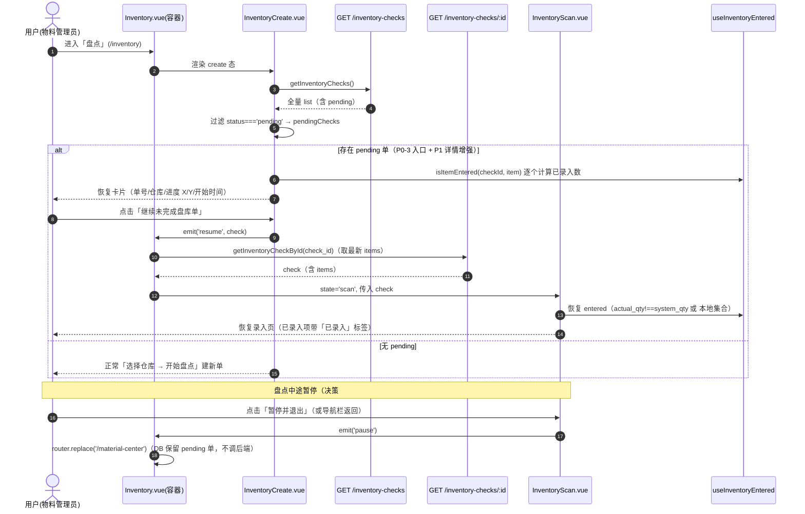
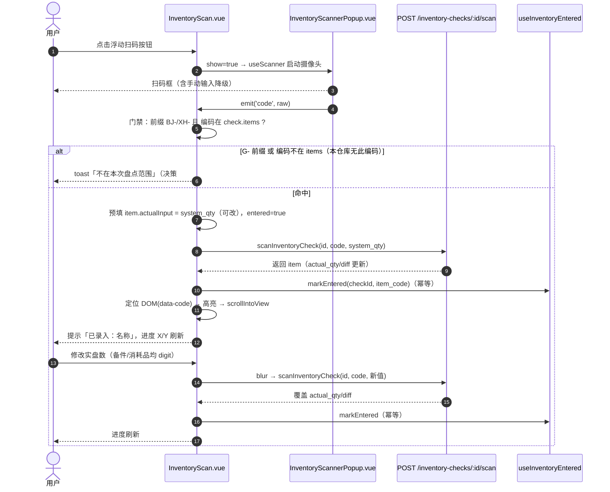
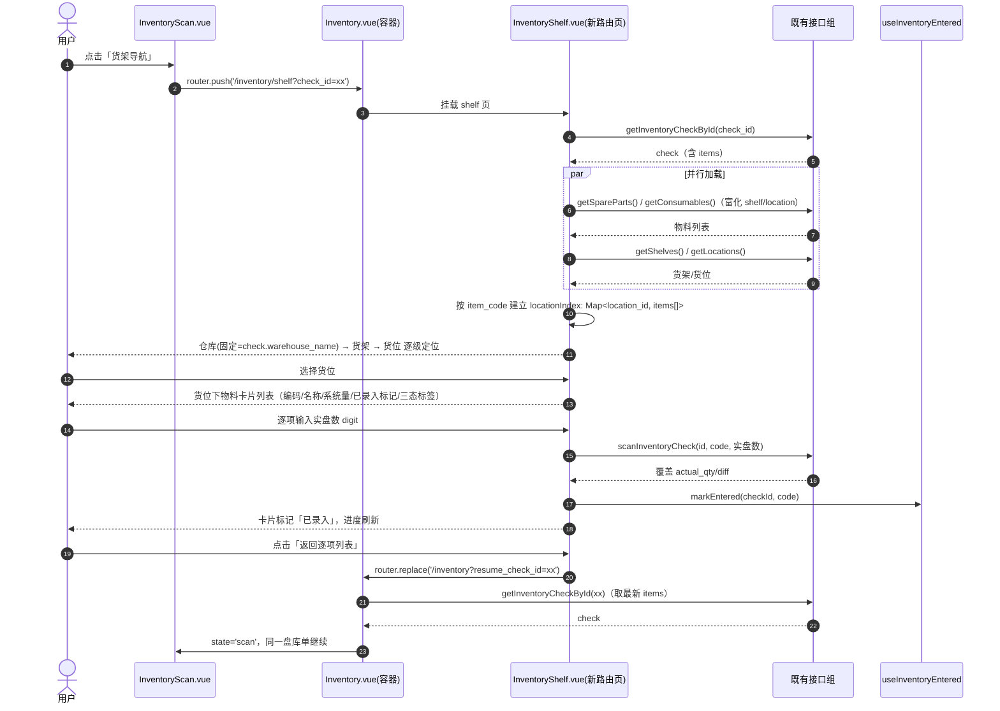
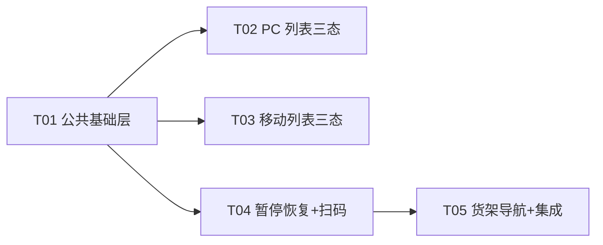

# 工器具管理系统 · 盘库交互增强 + 库存三态增量设计（P0 范围）

> 作者：高见远（software-architect-3）｜阶段：增量开发
> 依据：PM 增量 PRD（已确认版）+ 用户已锁定决策 1~7 + 现状代码逐文件核实（materials.js / PC / 移动端）
> 适用范围：PC 端（vue-frontend）+ 移动端（mobile-frontend）；后端仅 1 行**可选**改动
> 设计原则：纯前端为主；零新增第三方依赖；复用既有扫码/级联/导出能力；单文件职责内聚、跨文件约定收敛到共享层

---

## 1. 实现方案与框架选型

### 1.1 核心难点分析

| # | 难点 | 现状核实结论 | 方案 |
|---|------|-------------|------|
| 1 | 库存"三态"口径统一 | 后端 `enrichSpare` 的 `is_low_stock = isSpareLowStock(sp)`（单条 `stock_qty<=warning_qty`）；消耗品低库存为 `warning_qty!=null && stock_qty<=warning_qty`；两者均**无"缺货(stock_qty<=0)"态**。PC 备件表用 `is_low_stock` 预警标签 + 状态列；PC 消耗品表用两态（库存预警/正常）；移动端 MaterialCard/ConsumableList 也是两态 | 抽**纯函数 `stockStatus()`**，PC/移动端各一份镜像。优先级：`stock_qty<=0 → out(缺货)` → `is_low_stock`（备件后端字段）或 `warning_qty 判定`（消耗品回退）→ `low(需补仓)` → 否则 `normal(正常)`（决策 #3） |
| 2 | 盘点"已录入"判定 | 服务端 `items` 无 `entered` 字段；`POST /inventory-checks/:id/scan` **不传 actual_qty 时默认取系统量**（diff=0），仅凭 diff 无法区分"已扫未改"与"未扫" | 前端 **localStorage 记录已录入编码集合**（key=`inventory_entered_<checkId>`）；判定 = `actual_qty!==system_qty` **或** 编码在本地集合（决策 #3/#6"有录入痕迹"语义）。恢复/进度/货架导航共用同一组合式 `useInventoryEntered` |
| 3 | 扫码能力复用 | `useScanner.ts`（html5-qrcode）已封装摄像头+手电筒+手动输入降级；`ScanTool.vue` 的 `onCodeDetected` 硬绑"领用/购物车"分发，**不可改动**（回归风险） | 新增轻量弹窗 `InventoryScannerPopup.vue` 内部复用 `useScanner`，只 `emit('code', raw)`，业务门禁放页面；不动 `ScanTool.vue` |
| 4 | 货架导航盘点 | 盘库单 `items` 只有 code/名称/数量，**无货架/货位信息**；`GET /shelves?warehouse_id=`、`GET /storage-locations?shelf_id=` 已存在；`ToolManagement.vue` 已实现 仓库→货架→货位 三级级联过滤（tag 选项面板 + 过滤计算） | 纯前端：货架页拉 `getSpareParts()/getConsumables()`（已富化 `shelf_id/storage_location_id/warehouse_id/location_name/shelf_name`）+ `getShelves()/getLocations()`，以 `item_code` 为键映射到 `check.items`，构建 `Map<location_id, items[]>`；复用 ToolManagement 的级联交互模式（决策 #2） |
| 5 | 工具编码拦截 | 后端 `scan` 按前缀 BJ-/XH-/G- 处理，G- 会**追加工具明细**、本仓库无此编码也会追加 | **前端硬门禁**：`G-` 前缀、无法识别前缀、或编码不在当前 `check.items` → toast「不在本次盘点范围」，**不调接口、不追加明细**（决策 #7） |
| 6 | 暂停/恢复 | 后端 `POST /inventory-checks` 已限"同仓库仅 1 个 pending"；`GET /inventory-checks` 返回全量 list（含 items），前端自行过滤；移动端 `Inventory.vue` 返回即离开，DB 中 pending 单本就保留 | 暂停=复用 `status='pending'` + 前端 resume，**零后端改动**（决策 #5）：新增"暂停并退出"按钮与首屏 pending 恢复入口；恢复时经 `GET /inventory-checks/:id` 取最新 items |
| 7 | 备件数量库存领用 | 上一轮已拆分物料订单：**PC 备件"加入领用篮"已走 `cartStore.addToCart`（item_type='spare'）物料购物车**（`MaterialCartView.vue` 扣 `stock_qty`）；移动端备件领用走 `borrowSpareByCode`（生成物料工单，不扣 stock_qty）；移动端 `store/cart.ts` **仅支持 tool**，移动购物车 `createOrder({tool_ids})` 不支持备件 | PC：仅把按钮启用条件 `status==='available'` → `stock_qty>0`，流程不变。移动端：**保留 borrowSpareByCode**（推荐，理由见 §8），按钮启用改 `stock_qty>0` |

### 1.2 技术选型与架构模式

- **纯前端为主，后端仅 1 行可选改动**：盘库暂停/恢复、扫码盘点、货架导航、库存三态全部基于既有接口实现。唯一可选后端改动 = `POST /spare-parts/code/:code/borrow` 启用判定 `status==='available'` → `(stock_qty||0)>0`（对齐决策 #4 领用启用条件；不做则记录边界，见 §9-B）。
- **零新增第三方依赖**：移动端扫码复用既有 `html5-qrcode@^2.3.8`（经 `useScanner.ts`）；PC 导出复用既有 `xlsx@^0.18.5`；三态标签用既有 `el-tag`/`van-tag`；localStorage 用原生。
- **架构模式**：延续现有「页面组件（View）+ 组合式函数（composables）+ 纯函数工具（utils）+ Pinia/api」分层；新增共享层 `utils/stock.ts`（PC/移动镜像）与 `composables/useInventoryEntered.ts`，页面只做编排，不散落判定逻辑。
- **复用参考实现**：货架导航页复刻 `ToolManagement.vue` 的 仓库→货架→货位 级联交互；扫码复用 `useScanner`；PC 导出复用 `xlsx` 既有写法。

---

## 2. 文件列表（相对路径，标注 新增/修改/不变/是否需后端）

### 2.1 后端（backend）

| 文件 | 状态 | 是否需后端 | 说明 |
|------|------|-----------|------|
| `backend/routes/materials.js` | 修改（可选，1 行） | 是（可选） | `POST /spare-parts/code/:code/borrow`：`if (sp.status !== 'available')` → `if ((sp.stock_qty||0) <= 0)`，对齐数量库存领用语义（决策 #4）。不做则跳过，见 §9-B |
| `backend/routes/materials.js` | 不变 | 否 | 盘库模块（GET/POST inventory-checks、scan、complete）全部复用，零改动 |

### 2.2 PC 端（vue-frontend）

| 文件 | 状态 | 是否需后端 | 说明 |
|------|------|-----------|------|
| `vue-frontend/src/utils/stock.ts` | **新增** | 否 | `StockStatus` 类型 + `stockStatus()` 纯函数 + `STOCK_STATUS_META`（与移动端镜像同步，注释互标） |
| `vue-frontend/src/views/SparePartManagement.vue` | 修改 | 否 | P0-1：删状态筛选下拉/状态列/借次列；新增"库存状态"三态 el-tag 列；数量列保留并置前；"加入领用篮"启用改 `stock_qty>0`（已走物料购物车，流程不变）；导出删状态/借次、增库存状态列 |
| `vue-frontend/src/views/ConsumableManagement.vue` | 修改 | 否 | P0-1：状态列改"库存状态"三态列；导出增库存状态列 |
| `vue-frontend/src/views/InventoryCheck.vue` | 修改 | 否 | P0 一致性（决策 #6）：备件实盘数量由 max=1 放开为整数 digit（`el-input-number :min="0"` 去 max=1 分支），去掉"备件一物一码：在位填 1，缺失填 0"提示 |
| `vue-frontend/src/types/index.ts` | 不变 | 否 | 已有 `InventoryCheckItem/InventoryCheck/SparePart(warning_qty/is_low_stock)`，无需改 |

### 2.3 移动端（mobile-frontend）

| 文件 | 状态 | 是否需后端 | 说明 |
|------|------|-----------|------|
| `mobile-frontend/src/utils/stock.ts` | **新增** | 否 | 与 PC 镜像的 `stockStatus()` + `STOCK_STATUS_META`（含 van-tag type: success/warning/danger） |
| `mobile-frontend/src/composables/useInventoryEntered.ts` | **新增** | 否 | 已录入标记：`getEnteredCodes/markEntered/isItemEntered`（localStorage 封装） |
| `mobile-frontend/src/components/InventoryScannerPopup.vue` | **新增** | 否 | 扫码弹窗：复用 `useScanner`，props `show`，emit `code/update:show/close`，含手动输入降级 |
| `mobile-frontend/src/api/material.ts` | 修改 | 否 | 新增 `getInventoryCheckById(id)`（后端已有 `GET /inventory-checks/:id`，前端未包装） |
| `mobile-frontend/src/types/index.ts` | 修改 | 否 | `SparePart` 补 `warning_qty?/is_low_stock?`；`InventoryCheckItem` 补 `entered?: boolean`（前端瞬时标记） |
| `mobile-frontend/src/views/Inventory.vue` | 修改 | 否 | P0-3/P0-5：首屏按 `route.query.resume_check_id` 恢复 pending 单进 scan 态；scan 态"货架导航"跳转路由；导航栏返回=暂停语义（保留 pending） |
| `mobile-frontend/src/views/inventory/InventoryCreate.vue` | 修改 | 否 | P0-3/P1：加载 `getInventoryChecks()` 过滤 `status==='pending'` 展示"继续未完成盘库单"入口卡片（单号/仓库/进度 X/Y/开始时间），emit `resume(check)` |
| `mobile-frontend/src/views/inventory/InventoryScan.vue` | 修改 | 否 | P0-3/P0-4/P0-6：新增"暂停并退出"按钮；浮动扫码按钮+定位高亮滚动+预填实盘数（默认系统量可改）；备件 checkbox→digit 实盘输入；entered 标记（`useInventoryEntered`） |
| `mobile-frontend/src/views/inventory/InventoryShelf.vue` | **新增** | 否 | P0-5：货架导航盘点页（仓库固定=盘库单仓库→货架→货位 逐级定位，货位下物料卡片 digit 录入，结果汇入同一盘库单） |
| `mobile-frontend/src/views/inventory/InventoryResult.vue` | 不变 | 否 | 完成落账与差异汇总，无需改 |
| `mobile-frontend/src/views/SparePartList.vue` | 修改 | 否 | P0-2：卡片 status 标签→三态库存状态彩标；展示"数量：N 件"；详情弹窗"状态"cell→"库存状态"三态；领用按钮启用改 `stock_qty>0`（流程保留 borrowSpareByCode，文案改"领用"） |
| `mobile-frontend/src/views/ConsumableList.vue` | 修改 | 否 | P0-2：卡片两态标签→三态库存状态彩标；展示"数量：N {unit}"；直领按钮（列表+详情）启用改 `stock_qty>0` |
| `mobile-frontend/src/components/ScanResultPopup.vue` | 修改 | 否 | 决策 #4 一致性：备件"借出次数"cell→"当前库存 N 件"+三态标签；备件领用按钮启用改 `stock_qty>0` |
| `mobile-frontend/src/views/ToolManagement.vue` | 不变 | 否 | 货架导航参考实现，仅作对照 |
| `mobile-frontend/src/router/index.ts` | 修改 | 否 | 新增路由 `/inventory/shelf`（query: `check_id`） |
| `mobile-frontend/src/components/MaterialCard.vue` | 不变（可选） | 否 | 物料领用页卡片两态标签（库存预警/正常），本轮 P0-2 未要求；如需口径统一可顺带切三态（P1 项，见 §9-F） |

### 2.4 文档产物

| 文件 | 状态 | 说明 |
|------|------|------|
| `docs/system_design-inventory-incremental-arch3.md` | **新增** | 本文档 |
| `docs/class-diagram-inventory-incremental-arch3.mermaid` | **新增** | 类图 |
| `docs/sequence-diagram-inventory-incremental-arch3.mermaid` | **新增** | 三条时序图 |

---

## 3. 数据结构与接口

### 3.1 前端类型扩展点

```ts
// mobile-frontend/src/types/index.ts（修改）
export interface SparePart {
  // ...既有字段不变
  warning_qty?: number | null   // 新增：后端 enrichSpare 已返回
  is_low_stock?: boolean        // 新增：后端 enrichSpare 已返回
}

export interface InventoryCheckItem {
  item_type: 'spare' | 'consumable' | 'tool'
  item_id: number
  item_code: string
  item_name: string
  system_qty: number
  actual_qty: number
  diff: number
  entered?: boolean             // 新增：前端瞬时标记（不持久化到后端）
}
```

```ts
// mobile-frontend/src/utils/stock.ts（新增；PC 端 vue-frontend/src/utils/stock.ts 镜像，注释互标"两端同步"）
export type StockStatus = 'normal' | 'low' | 'out'

export interface StockStatusInput {
  stock_qty?: number | null
  warning_qty?: number | null
  is_low_stock?: boolean        // 备件后端字段；消耗品缺省时回退 warning_qty 判定
}

export function stockStatus(item: StockStatusInput): StockStatus {
  const qty = Number(item.stock_qty ?? 0)
  if (qty <= 0) return 'out'                                    // 缺货（决策 #3）
  const low = item.is_low_stock != null
    ? !!item.is_low_stock
    : (item.warning_qty != null && qty <= item.warning_qty)     // 需补仓
  return low ? 'low' : 'normal'
}

export const STOCK_STATUS_META: Record<StockStatus, { label: string; tag: 'success' | 'warning' | 'danger' }> = {
  normal: { label: '正常',  tag: 'success' },
  low:    { label: '需补仓', tag: 'warning' },
  out:    { label: '缺货',  tag: 'danger' }
}
```

```ts
// mobile-frontend/src/composables/useInventoryEntered.ts（新增）
// localStorage key: `inventory_entered_<checkId>`，值为编码数组（JSON），幂等写入
export function getEnteredCodes(checkId: number): Set<string>
export function markEntered(checkId: number, code: string): void
/** 已录入判定：actual_qty 与 system_qty 不一致 或 有录入痕迹（本地集合） */
export function isItemEntered(checkId: number, item: { item_code: string; system_qty: number; actual_qty: number }): boolean
```

```ts
// mobile-frontend/src/components/InventoryScannerPopup.vue（新增）
// props:  { show: boolean }
// emits:  { 'update:show': [v: boolean], code: [raw: string], close: [] }
// 内部：useScanner({ elementId:'inventory-scanner-viewport', onSuccess: raw => emit('code', raw) })
//      + 手动输入降级 + 手电筒开关（复用 ScanTool.vue 的交互，但业务分发在父页面）
```

```ts
// mobile-frontend/src/api/material.ts（修改，追加）
export const getInventoryCheckById = (id: number) =>
  api.get(`/inventory-checks/${id}`).then(r => r.data)
```

```ts
// InventoryScan.vue 内部局部接口（沿用现有写法，去掉 checked）
interface ScanItem extends InventoryCheckItem {
  entered: boolean
  actualInput: string   // 备件/消耗品统一 digit 实盘输入
}
```

### 3.2 类图（Mermaid classDiagram）

```mermaid
classDiagram
  direction LR
  class StockStatus {
    <<enum>>
    normal
    low
    out
  }
  class stockStatus {
    <<pure function>>
    +stockStatus(item: StockStatusInput) StockStatus
  }
  class STOCK_STATUS_META {
    <<const>>
    +Record~StockStatus, {label, tag}~
  }
  class useInventoryEntered {
    <<composable>>
    +getEnteredCodes(checkId: number) Set~string~
    +markEntered(checkId: number, code: string) void
    +isItemEntered(checkId: number, item) boolean
  }
  class InventoryCheck {
    +check_id number
    +check_no string
    +warehouse_id number
    +warehouse_name string
    +status 'pending'|'completed'
    +operator_id number
    +operator_name string
    +items InventoryCheckItem[]
    +started_at string
    +completed_at string|null
  }
  class InventoryCheckItem {
    +item_type 'spare'|'consumable'|'tool'
    +item_id number
    +item_code string
    +item_name string
    +system_qty number
    +actual_qty number
    +diff number
    +entered boolean
  }
  class SparePart {
    +spare_id number
    +spare_code string
    +spare_name string
    +stock_qty number
    +warning_qty number|null
    +is_low_stock boolean
    +shelf_id number
    +storage_location_id number
    +location_name string
  }
  class Consumable {
    +consumable_id number
    +consumable_code string
    +consumable_name string
    +stock_qty number
    +warning_qty number|null
    +shelf_id number
    +storage_location_id number
    +location_name string
  }
  class InventoryScannerPopup {
    +props.show boolean
    +emitCode(raw string)
    +useScanner()
  }
  class Inventory {
    +state 'create'|'scan'|'result'
    +check InventoryCheck
    +onMountedResume() void
    +onResume(check) void
    +onPause() void
    +goShelf() void
  }
  class InventoryCreate {
    +warehouses Warehouse[]
    +pendingChecks InventoryCheck[]
    +progressOf(check) string
    +emitResume(check) void
  }
  class InventoryScan {
    +items ScanItem[]
    +onScannedCode(raw string) Promise~void~
    +scrollToItem(code string) void
    +prefillAndSubmit(item) Promise~void~
    +submitItem(item) Promise~void~
    +emitPause() void
    +goShelf() void
  }
  class InventoryShelf {
    +check InventoryCheck
    +shelves Shelf[]
    +locations StorageLocation[]
    +locationIndex Map~number, InventoryCheckItem[]~
    +onLocationSelect(loc) void
    +submitItem(item) Promise~void~
    +backToList() void
  }
  class ScanItem {
    <<InventoryCheckItem 扩展>>
    +actualInput string
    +entered boolean
  }

  InventoryCheck "1" *-- "many" InventoryCheckItem
  Inventory "1" o-- "1" InventoryCheck
  Inventory --> InventoryCreate
  Inventory --> InventoryScan
  InventoryShelf ..> InventoryCheck : 读取+写入(scan接口)
  InventoryScan ..> InventoryScannerPopup : 复用扫码
  InventoryScan ..> stockStatus : 三态展示
  InventoryScan ..> useInventoryEntered : entered 标记
  InventoryCreate ..> useInventoryEntered : 恢复进度 X/Y
  InventoryShelf ..> useInventoryEntered : entered 标记
  InventoryShelf ..> stockStatus : 三态展示
  SparePart ..> stockStatus : 输入
  Consumable ..> stockStatus : 输入
```

---

## 4. 程序调用流程（时序图）

### 4.1 流程一：盘库暂停 / 恢复（P0-3 / P1 恢复详情）



### 4.2 流程二：扫码盘点（P0-4 / P0-6）



### 4.3 流程三：货架导航盘点（P0-5）



> 说明：货架导航是**独立路由页**（区别于 Inventory.vue 内部三态容器）。返回逐项列表时通过 `resume_check_id` query 让 Inventory.vue 自动恢复 scan 态，避免页面重挂载丢失上下文；由于货架页录入已实时经 scan 接口落库，恢复时重新拉取即可，无需本地状态传递。

---

## 5. 任务列表（有序、含依赖、按实现顺序）

> 拆分原则：按功能模块/层次分组，单任务 ≥3 个相关文件，总任务数 5（硬上限）。T02/T03/T04 仅依赖 T01 可并行；T05 依赖 T04。

### T01：项目基础设施/公共基础层（三态 + entered + 扫码弹窗 + 类型/API 补全）

- **源文件**：
  - `vue-frontend/src/utils/stock.ts`（新增）
  - `mobile-frontend/src/utils/stock.ts`（新增）
  - `mobile-frontend/src/types/index.ts`（修改：SparePart 补 warning_qty/is_low_stock；InventoryCheckItem 补 entered）
  - `mobile-frontend/src/composables/useInventoryEntered.ts`（新增）
  - `mobile-frontend/src/components/InventoryScannerPopup.vue`（新增，复用 useScanner）
  - `mobile-frontend/src/api/material.ts`（修改：新增 getInventoryCheckById）
- **是否需后端**：否
- **依赖**：无
- **优先级**：P0
- **说明**：本任务是后续所有页面改造的地基：统一三态判定、已录入标记、扫码弹窗能力、类型与 API 补全。验收：`stockStatus({qty:0})→out`、`{qty<=warning}→low`、其余→normal；ScannerPopup 能开摄像头并 emit code；getInventoryCheckById 返回单张盘库单。

### T02：PC 端物料列表三态改造 + 盘点录入 digit（P0-1 / 决策 #6）

- **源文件**：
  - `vue-frontend/src/views/SparePartManagement.vue`（修改）
  - `vue-frontend/src/views/ConsumableManagement.vue`（修改）
  - `vue-frontend/src/views/InventoryCheck.vue`（修改：备件实盘 digit，去掉 max=1 与"一物一码"提示）
- **是否需后端**：否
- **依赖**：T01
- **优先级**：P0
- **说明**：备件表删状态筛选下拉/状态列/借次列；两表新增"库存状态"三态 el-tag 列；数量列保留并置前；"加入领用篮"启用改 `stock_qty>0`（流程已走物料购物车）；导出同步（备件删状态/借次、增库存状态；消耗品增库存状态）。InventoryCheck 备件实盘由 0/1 放开为 digit。

### T03：移动端物料列表三态改造 + 领用启用条件（P0-2 / 决策 #4）

- **源文件**：
  - `mobile-frontend/src/views/SparePartList.vue`（修改）
  - `mobile-frontend/src/views/ConsumableList.vue`（修改）
  - `mobile-frontend/src/components/ScanResultPopup.vue`（修改：备件"借出次数"cell→"当前库存 N 件"+三态；领用启用改 stock_qty>0）
  - `backend/routes/materials.js`（修改，**可选 1 行**：borrow 接口 status→stock_qty 判定）
- **是否需后端**：仅可选 1 行
- **依赖**：T01
- **优先级**：P0
- **说明**：卡片 status 可用/借出标签→三态库存状态彩标；展示"数量：N 件"；领用/直领按钮启用基于 `stock_qty>0`。移动端备件领用**保留 borrowSpareByCode**（推荐方案及理由见 §8）。

### T04：盘库暂停/恢复 + 扫码盘点 + 备件 digit（P0-3 / P0-4 / P0-6 / P1 恢复详情）

- **源文件**：
  - `mobile-frontend/src/views/Inventory.vue`（修改：resume 接线、route.query.resume_check_id 自动恢复、暂停退出路由）
  - `mobile-frontend/src/views/inventory/InventoryCreate.vue`（修改：pending 单入口卡片 + 进度 X/Y）
  - `mobile-frontend/src/views/inventory/InventoryScan.vue`（修改：暂停并退出、浮动扫码+定位高亮+预填、备件 digit、entered）
- **是否需后端**：否
- **依赖**：T01
- **优先级**：P0
- **说明**：扫码门禁（G-/非本仓库编码→toast 不调接口、不追加明细）；恢复时经 `getInventoryCheckById` 载入 items 并按 `isItemEntered` 标记 entered；暂停复用 pending 状态 + 前端 resume，**不新增后端状态字段**。

### T05：货架导航盘点页 + 路由集成（P0-5）

- **源文件**：
  - `mobile-frontend/src/views/inventory/InventoryShelf.vue`（新增）
  - `mobile-frontend/src/router/index.ts`（修改：`/inventory/shelf?check_id=`）
  - `mobile-frontend/src/views/Inventory.vue`（修改：scan 态"货架导航"入口与返回恢复接线）
- **是否需后端**：否
- **依赖**：T04
- **优先级**：P0
- **说明**：复刻 ToolManagement 三级级联（仓库固定为盘库单仓库→货架→货位），货位下物料卡片 digit 录入，结果经 scan 接口汇入同一盘库单；返回逐项列表用 `resume_check_id` 自动恢复；未分配货位物料由逐项列表兜底。

### 任务依赖图



---

## 6. 依赖包列表

**无需新增任何第三方依赖**（全部复用既有依赖）：

- `html5-qrcode@^2.3.8`（移动端，扫码，经 `useScanner.ts` 复用）
- `vant@^4.9.0`（移动端，van-tag/van-popup/van-field/van-action-sheet）
- `element-plus@^2.x`（PC，el-tag/el-table/el-input-number）
- `xlsx@^0.18.5`（PC，导出 Excel）

---

## 7. 共享知识（跨文件约定）

1. **库存三态判定唯一入口**：`stockStatus(item)` 放 `vue-frontend/src/utils/stock.ts` 与 `mobile-frontend/src/utils/stock.ts`（两份镜像，注释互标"两端同步，改一处必须改另一处"）。口径（决策 #3）：`stock_qty<=0 → out(缺货)`；`is_low_stock==true`（备件，后端单条比较）或 `warning_qty!=null && stock_qty<=warning_qty`（消耗品回退）→ `low(需补仓)`；否则 `normal(正常)`。禁止页面内自造口径。
2. **已录入标记唯一入口**：统一走 `useInventoryEntered`（localStorage `inventory_entered_<checkId>`），禁止各页面自造逻辑；判定 = `actual_qty !== system_qty` **或** 编码在本地集合（决策 #3"有录入痕迹"）。扫码命中即 `markEntered`（幂等）。`entered` 为前端瞬时字段，不落库。
3. **扫码能力复用**：所有盘点扫码一律复用 `InventoryScannerPopup.vue`（内部 `useScanner`），**禁止**改 `ScanTool.vue` 的 borrow/cart 分发，避免回归领用流程；弹窗只 emit 原始 code，业务门禁放页面。
4. **扫码门禁规则**（决策 #7）：`G-` 前缀、无法识别前缀、或编码不在当前 `check.items` → toast「不在本次盘点范围」，**不调接口、不追加明细**。只有 BJ-/XH- 且命中 items 才调 `POST /inventory-checks/:id/scan`。
5. **盘点录入交互**（决策 #6）：备件与消耗品均用 digit 实盘数量输入（备件允许 >1，匹配 stock_qty）；空白=未录入不提交；`blur`/确认时提交覆盖。
6. **暂停语义**（决策 #5）：不新增后端状态字段；暂停=保留 `status='pending'` 返回物料中心，恢复=前端按 pending 单载入（`getInventoryCheckById` 取最新）。
7. **接口口径**：`POST /inventory-checks/:id/scan` 的 `actual_qty` 缺省时后端取系统量；前端扫码预填默认值即 `system_qty`，用户可改后 blur 再次提交覆盖。
8. **PC/移动端 types 保持兼容**：`InventoryCheck/InventoryCheckItem` 两端同名同构；`entered` 为前端瞬时字段，序列化/落库时忽略。
9. **货架导航数据映射**：`InventoryShelf` 以 `item_code` 为键，把 `getSpareParts()/getConsumables()` 的 `shelf_id/storage_location_id/warehouse_id/location_name/shelf_name/unit` 映射到 `check.items`，构建 `Map<location_id, items[]>`；映射不到的物料（未分配货位）不参与导航，由逐项列表兜底。
10. **PC 备件"加入领用篮"**：走既有 `cartStore.addToCart`（item_type='spare'）物料购物车（`MaterialCartView.vue`/`MaterialOrderManagement.vue` 扣 `stock_qty`），**不改流程**，仅启用条件改为 `stock_qty>0`。

---

## 8. 移动端备件领用方案（推荐结论）

**推荐：`SparePartList.vue` 保留 `borrowSpareByCode` 流程，仅把按钮启用条件由 `status==='available'` 改为 `stock_qty>0`，文案由「扫码领用（生成工单）」改为「领用」。**

理由：
1. 用户决策 #4 明确本轮只改"展示字段 + 启用条件"，不重构领用流程；
2. 移动端 `MaterialDispense.vue`/`ScanResultPopup.vue` 的备件领用同样走 `borrowSpareByCode`，保留可维持移动端内部一致，避免"列表页走物料购物车、领用页走旧流程"的分裂；
3. 切换物料购物车需改造移动端 `store/cart.ts`（当前 `CartItem` 仅 tool_id/tool_name/tool_code）、移动端 `ShoppingCart.vue`（当前 `createOrder({tool_ids})` 仅支持工具）、路由与订单提交逻辑等多处，风险大且超出本轮范围；
4. PC 备件走物料购物车、移动端备件走 borrow 工单是既有双轨状态，本轮不做统一（与决策 #4 的"保留"一致）。

**已知边界（列入 §9-B）**：`borrowSpareByCode` 后端仍校验 `status==='available'` 且不扣 `stock_qty`。若希望按钮可用性与后端一致，做 T03 中的 1 行后端改动（status→stock_qty 判定）；若不做，存在"旧 reserved/borrowed 历史数据下按钮可点但接口拒绝"的边界，属可接受降级（前端可 catch 提示）。

---

## 9. 待明确事项

| # | 事项 | 建议 | 影响 |
|---|------|------|------|
| A | 移动端备件领用：保留 borrow 工单 vs 切物料购物车 | **保留 borrow 工单**（推荐，见 §8） | 若改购物车，T03 范围显著扩大（cart store/购物车页/路由/订单提交均需改造） |
| B | 后端 borrow 接口 `status==='available'` 判定是否同步改为 `stock_qty>0` | 建议做（1 行，可选，T03） | 不做则存在历史 status 数据下按钮可点但接口拒绝的边界 |
| C | PC `InventoryCheck.vue` 备件实盘 digit 是否纳入本轮 | 纳入（决策 #6 语义统一，已列入 T02） | 不纳入则 PC 盘库仍限 0/1，与数量库存不符 |
| D | "已录入痕迹"用 localStorage 记录，多设备不共享 | 本轮接受；如需跨设备共享，P2 加后端 entered 字段 | 仅影响"已录入"标记与进度展示，不影响盘库正确性 |
| E | 货架导航页物料 location 映射依赖全量拉取 `getSpareParts()/getConsumables()` | 本轮接受（纯前端）；数据量大时 P2 让 `POST /inventory-checks` 明细携带 shelf/location | 纯前端，无后端改动 |
| F | `MaterialCard.vue`（物料领用页卡片）两态标签是否本轮顺带切三态 | P1 一致性项，本轮可不做 | 影响物料领用页展示口径与列表页的一致性 |
| G | P2 项（GET /inventory-checks 服务端过滤、备件历史 status 字段处置） | 本轮不做，DB 保留即可 | 无 |
