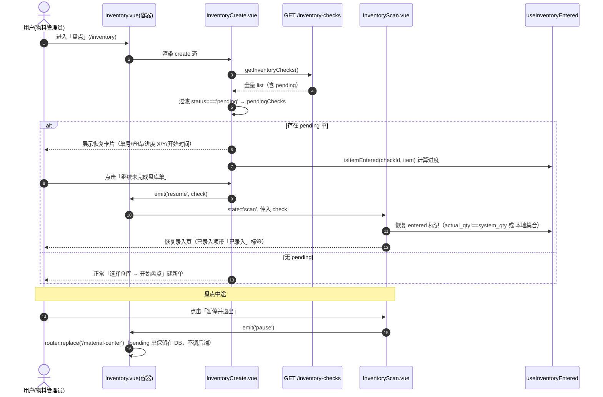
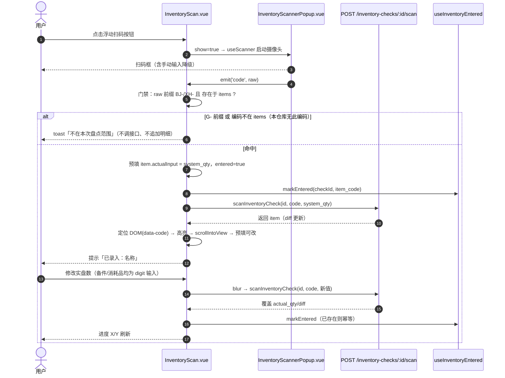
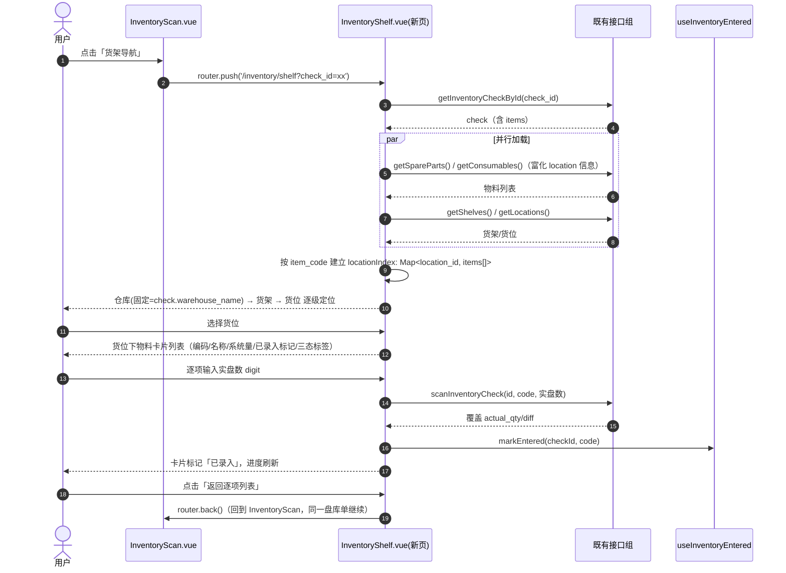
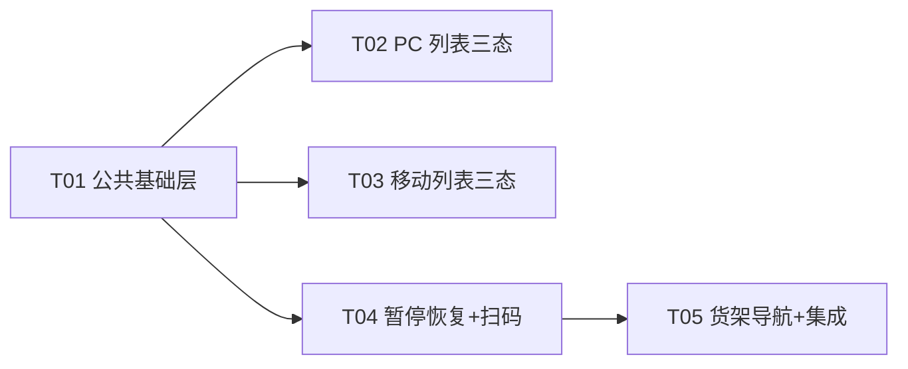

# 工器具管理系统 · 盘库与库存三态增量设计（P0 范围）

> 作者：高见远（软件架构师）｜阶段：增量开发（盘库交互增强 + 库存三态展示）
> 依据：PM 增量 PRD（已确认版）+ 用户已锁定决策 1~7 + 现状代码核实
> 适用范围：PC 端（vue-frontend）+ 移动端（mobile-frontend）；后端仅 1 行可选改动

---

## 1. 实现方案与框架选型

### 1.1 核心难点分析

| 难点 | 现状 | 结论 |
|------|------|------|
| 库存"三态"判定口径统一 | 备件用后端 `is_low_stock`（单条 `stock_qty<=warning_qty`），消耗品前端自行 `warning_qty!=null && stock_qty<=warning_qty`；两者均无"缺货(stock_qty<=0)"态 | 抽出**纯函数 `stockStatus()`** 两端各一份，输入 `{stock_qty, warning_qty, is_low_stock}` 输出 `normal/low/out`，杜绝各页面口径漂移 |
| 盘点"已录入"标记 | 服务端 `items` 无 entered 字段；`scan` 接口默认 `actual_qty=system_qty`（diff=0），无法仅凭 diff 区分"已扫未改" | 前端 **localStorage 记录已录入编码集合**（key=`inventory_entered_<checkId>`），恢复/进度条/货架导航共用；判定规则 = `actual_qty!==system_qty` **或** 编码在本地集合内（决策 #3/#6 语义） |
| 扫码能力复用 | `useScanner.ts`（html5-qrcode）已封装摄像头+手电筒+手动输入降级，`ScanTool.vue` 的 `onCodeDetected` 硬绑领用/购物车分发 | **新增轻量弹窗组件 `InventoryScannerPopup.vue` 复用 `useScanner`**，只回传原始 code；不改 `ScanTool.vue`，零回归风险 |
| 货架导航盘点 | `ToolManagement.vue` 已实现 仓库→货架→货位 三级级联过滤；但 `check.items` 只有 code/名称/数量，**无货架货位信息** | 纯前端方案：货架页拉取 `getSpareParts()/getConsumables()`（已富化 `shelf_id/storage_location_id/warehouse_id`），按 `item_code` 建索引映射到盘库单明细；不改后端 |
| 工具编码拦截 | 后端 `scan` 接口按前缀 BJ-/XH-/G- 均会处理（G- 会追加工具明细，与本仓库无关的编码也会被追加） | **前端硬门禁**：`G-` 前缀或编码不在当前 `check.items` 内 → 直接 toast「不在本次盘点范围」，不调接口、不追加明细（决策 #7） |

### 1.2 技术选型与架构模式

- **纯前端为主，后端仅 1 行可选改动**：
  - 盘库暂停/恢复、扫码盘点、货架导航、库存三态展示全部可基于既有接口实现；
  - 唯一的后端可选改动是 `POST /spare-parts/code/:code/borrow` 的启用判定由 `status==='available'` 改为 `stock_qty>0`（1 行，对齐决策 #4「领用按钮启用基于 stock_qty>0」）；如团队不希望动后端，可跳过并记录边界（见 §6 待明确事项 B）。
- **不新增任何第三方依赖**：移动端扫码复用既有 `html5-qrcode@^2.3.8`（`useScanner.ts`）；PC 导出复用既有 `xlsx@^0.18.5`；三态标签用既有 `el-tag` / `van-tag`。
- **架构模式**：延续现有「页面组件 + 组合式函数（composables）+ 纯函数工具」模式；新增 2 个纯函数/组合式共享层（`stock.ts`、`useInventoryEntered.ts`），页面只做编排。
- **复用参考实现**：货架导航页复刻 `ToolManagement.vue` 的仓库→货架→货位级联交互（tag 选项面板 + 过滤计算），但数据源改为「盘库单 items × 物料富化索引」。

---

## 2. 文件清单

### 2.1 后端（backend）

| 文件 | 状态 | 说明 |
|------|------|------|
| `backend/routes/materials.js` | 修改（可选，1 行） | `POST /spare-parts/code/:code/borrow`：`if (sp.status !== 'available')` → `if ((sp.stock_qty||0) <= 0)`，对齐数量库存语义 |

### 2.2 PC 端（vue-frontend）

| 文件 | 状态 | 说明 |
|------|------|------|
| `vue-frontend/src/utils/stock.ts` | **新增** | `StockStatus` 类型 + `stockStatus()` 纯函数 + `STOCK_STATUS_META`（与移动端镜像同步） |
| `vue-frontend/src/views/SparePartManagement.vue` | 修改 | P0-1：删状态筛选/状态列/借次列，新增"库存状态"三态列，数量列置前，领用按钮启用改 `stock_qty>0`，导出增库存状态、删状态/借次 |
| `vue-frontend/src/views/ConsumableManagement.vue` | 修改 | P0-1：状态列改"库存状态"三态列，导出增库存状态列 |
| `vue-frontend/src/views/InventoryCheck.vue` | 修改 | P0 一致性（决策 #6）：备件实盘数量由 max=1 放开为整数 digit，去掉「备件一物一码」提示 |
| `vue-frontend/src/types/index.ts` | 不变 | 已有 `InventoryCheckItem/InventoryCheck/SparePart(warning_qty/is_low_stock)`，无需改 |

### 2.3 移动端（mobile-frontend）

| 文件 | 状态 | 说明 |
|------|------|------|
| `mobile-frontend/src/utils/stock.ts` | **新增** | 与 PC 镜像的 `stockStatus()` 纯函数 + 元信息（van-tag type） |
| `mobile-frontend/src/composables/useInventoryEntered.ts` | **新增** | 已录入标记：`getEnteredCodes/markEntered/isItemEntered`（localStorage 封装） |
| `mobile-frontend/src/components/InventoryScannerPopup.vue` | **新增** | 扫码弹窗：复用 `useScanner`，props `show`，emit `code/update:show/close`，含手动输入降级 |
| `mobile-frontend/src/api/material.ts` | 修改 | 新增 `getInventoryCheckById(id)`（后端已有 `GET /inventory-checks/:id`，前端未包装） |
| `mobile-frontend/src/types/index.ts` | 修改 | `SparePart` 补 `warning_qty`/`is_low_stock`；`InventoryCheckItem` 补 `entered?: boolean`（前端瞬时标记） |
| `mobile-frontend/src/views/Inventory.vue` | 修改 | P0-3/P0-5：首屏透传 pending 恢复；scan 态新增"货架导航"跳转、暂停退出路由 |
| `mobile-frontend/src/views/inventory/InventoryCreate.vue` | 修改 | P0-3：加载并展示「未完成盘库单」入口卡片（单号/仓库/进度 X/Y/开始时间，P1 增强），emit `resume(check)` |
| `mobile-frontend/src/views/inventory/InventoryScan.vue` | 修改 | P0-3/P0-4/P0-6：暂停并退出按钮、浮动扫码按钮+定位高亮滚动+预填、备件改 digit、entered 标记 |
| `mobile-frontend/src/views/inventory/InventoryShelf.vue` | **新增** | P0-5：货架导航盘点页（仓库固定→货架→货位 逐级定位，货位下物料卡片 digit 录入） |
| `mobile-frontend/src/views/inventory/InventoryResult.vue` | 不变 | 完成落账与差异汇总，无需改 |
| `mobile-frontend/src/views/SparePartList.vue` | 修改 | P0-2：卡片 status 标签→三态库存状态彩标，展示"数量：N 件"，详情弹窗同步，领用按钮启用改 `stock_qty>0` |
| `mobile-frontend/src/views/ConsumableList.vue` | 修改 | P0-2：卡片两态标签→三态库存状态彩标，直领按钮启用改 `stock_qty>0` |
| `mobile-frontend/src/views/ToolManagement.vue` | 不变 | 货架导航参考实现，仅作对照 |
| `mobile-frontend/src/router/index.ts` | 修改 | 新增路由 `/inventory/shelf`（query: `check_id`） |

### 2.4 文档产物

| 文件 | 状态 | 说明 |
|------|------|------|
| `docs/system_design-inventory-incremental.md` | **新增** | 本文档 |
| `docs/class-diagram-inventory-incremental.mermaid` | **新增** | 类图（数据模型 + 服务/工具类） |
| `docs/sequence-diagram-inventory-incremental.mermaid` | **新增** | 三条时序图（暂停恢复 / 扫码盘点 / 货架导航） |

---

## 3. 数据结构与接口

### 3.1 前端类型扩展点

```ts
// mobile-frontend/src/types/index.ts（修改）
export interface SparePart {
  // ...既有字段不变
  warning_qty?: number | null   // 新增：后端 enrich 已返回
  is_low_stock?: boolean        // 新增：后端 enrich 已返回
}

export interface InventoryCheckItem {
  item_type: 'spare' | 'consumable' | 'tool'
  item_id: number
  item_code: string
  item_name: string
  system_qty: number
  actual_qty: number
  diff: number
  entered?: boolean             // 新增：前端瞬时标记（服务端不持久化）
}
```

```ts
// mobile-frontend/src/utils/stock.ts（新增，PC 端 vue-frontend/src/utils/stock.ts 镜像）
export type StockStatus = 'normal' | 'low' | 'out'

export interface StockStatusInput {
  stock_qty?: number | null
  warning_qty?: number | null
  is_low_stock?: boolean        // 备件后端字段；消耗品缺省时回退 warning_qty 判定
}

export function stockStatus(item: StockStatusInput): StockStatus {
  const qty = Number(item.stock_qty ?? 0)
  if (qty <= 0) return 'out'                                    // 缺货
  const low = item.is_low_stock != null
    ? !!item.is_low_stock
    : (item.warning_qty != null && qty <= item.warning_qty)     // 需补仓
  return low ? 'low' : 'normal'
}

export const STOCK_STATUS_META: Record<StockStatus, { label: string; tag: 'success' | 'warning' | 'danger' }> = {
  normal: { label: '正常',  tag: 'success' },
  low:    { label: '需补仓', tag: 'warning' },
  out:    { label: '缺货',  tag: 'danger' }
}
```

```ts
// mobile-frontend/src/composables/useInventoryEntered.ts（新增）
// localStorage key: `inventory_entered_<checkId>`，值为编码数组（JSON）
export function getEnteredCodes(checkId: number): Set<string>
export function markEntered(checkId: number, code: string): void
/** 已录入判定：actual_qty 与 system_qty 不一致 或 有录入痕迹（本地集合） */
export function isItemEntered(checkId: number, item: { item_code: string; system_qty: number; actual_qty: number }): boolean
```

```ts
// mobile-frontend/src/components/InventoryScannerPopup.vue（新增）
// props:  { show: boolean }
// emits:  { 'update:show': [v: boolean], code: [raw: string], close: [] }
// 内部：useScanner({ onSuccess: raw => emit('code', raw) }) + 手动输入降级 + 手电筒开关
```

```ts
// mobile-frontend/src/api/material.ts（修改，追加）
export const getInventoryCheckById = (id: number) =>
  api.get(`/inventory-checks/${id}`).then(r => r.data)
```

### 3.2 类图（Mermaid classDiagram）

```mermaid
classDiagram
  class StockStatus {
    <<enum>>
    normal
    low
    out
  }
  class stockStatus {
    <<pure function>>
    +stockStatus(item) StockStatus
  }
  class STOCK_STATUS_META {
    <<const>>
    +Record~StockStatus, {label, tag}~
  }
  class useInventoryEntered {
    <<composable>>
    +getEnteredCodes(checkId) Set~string~
    +markEntered(checkId, code) void
    +isItemEntered(checkId, item) boolean
  }
  class InventoryCheck {
    +check_id number
    +check_no string
    +warehouse_id number
    +warehouse_name string
    +status 'pending'|'completed'
    +operator_id number
    +operator_name string
    +items InventoryCheckItem[]
    +started_at string
    +completed_at string|null
  }
  class InventoryCheckItem {
    +item_type 'spare'|'consumable'|'tool'
    +item_id number
    +item_code string
    +item_name string
    +system_qty number
    +actual_qty number
    +diff number
    +entered boolean
  }
  class InventoryScannerPopup {
    +props.show boolean
    +emitCode(raw string)
    +useScanner()
  }
  class Inventory {
    +state 'create'|'scan'|'result'
    +check InventoryCheck
    +onResume(check) void
    +onPause() void
    +goShelf() void
  }
  class InventoryCreate {
    +warehouses Warehouse[]
    +pendingChecks InventoryCheck[]
    +emitResume(check) void
  }
  class InventoryScan {
    +items ScanItem[]
    +onScannedCode(raw string) Promise~void~
    +scrollToItem(item) void
    +submitItem(item) Promise~void~
    +emitPause() void
    +emitShelf() void
  }
  class InventoryShelf {
    +check InventoryCheck
    +shelves Shelf[]
    +locations StorageLocation[]
    +locationIndex Map~number, InventoryCheckItem[]~
    +emitBack() void
  }
  class ScanItem {
    <<InventoryCheckItem 扩展>>
    +actualInput string
    +entered boolean
  }

  InventoryCheck "1" *-- "many" InventoryCheckItem
  Inventory "1" o-- "1" InventoryCheck
  Inventory --> InventoryCreate
  Inventory --> InventoryScan
  Inventory --> InventoryShelf
  InventoryScan ..> InventoryScannerPopup : 复用扫码
  InventoryScan ..> stockStatus : 三态展示
  InventoryScan ..> useInventoryEntered : entered 标记
  InventoryCreate ..> useInventoryEntered : 恢复进度 X/Y
  InventoryShelf ..> useInventoryEntered : entered 标记
  InventoryShelf ..> stockStatus : 三态展示
```

> 说明：`ScanItem` 为 `InventoryScan.vue` 内部局部接口（`extends InventoryCheckItem { actualInput: string; entered: boolean }`），沿用现有写法。

---

## 4. 程序调用流程（时序图）

### 4.1 流程一：盘库暂停 / 恢复（P0-3）



### 4.2 流程二：扫码盘点（P0-4 / P0-6）



### 4.3 流程三：货架导航盘点（P0-5）



---

## 5. 任务列表（有序，含依赖）

> 任务拆分原则：按功能模块/层次分组，单任务 ≥3 相关文件，总任务数 5（硬上限）。T02/T03/T04 仅依赖 T01，可并行；T05 依赖 T04。

### T01：库存三态与盘库公共基础层（项目基础设施）

- **源文件**：
  - `mobile-frontend/src/utils/stock.ts`（新增）
  - `vue-frontend/src/utils/stock.ts`（新增）
  - `mobile-frontend/src/types/index.ts`（修改：SparePart 补 warning_qty/is_low_stock；InventoryCheckItem 补 entered）
  - `mobile-frontend/src/composables/useInventoryEntered.ts`（新增）
  - `mobile-frontend/src/components/InventoryScannerPopup.vue`（新增，复用 useScanner）
  - `mobile-frontend/src/api/material.ts`（修改：新增 getInventoryCheckById）
- **依赖**：无
- **优先级**：P0
- **说明**：本任务为后续所有页面改造的地基：统一三态判定、已录入标记、扫码弹窗能力、类型与 API 补全。验收：`stockStatus()` 对 `{qty:0}`→out、`{qty<=warning}`→low、其余→normal；ScannerPopup 能开摄像头并 emit code。

### T02：PC 端物料列表三态改造 + 盘点录入 digit（P0-1 / 决策 #6）

- **源文件**：
  - `vue-frontend/src/views/SparePartManagement.vue`（修改）
  - `vue-frontend/src/views/ConsumableManagement.vue`（修改）
  - `vue-frontend/src/views/InventoryCheck.vue`（修改：备件实盘 digit，max 放开）
- **依赖**：T01
- **优先级**：P0
- **说明**：备件表删状态筛选下拉/状态列/借次列；两表新增"库存状态"三态 el-tag 列；数量列置前；"加入领用篮"启用改 `stock_qty>0`；导出同步（删状态/借次、增库存状态）。InventoryCheck 备件实盘由 0/1 放开为 digit。

### T03：移动端物料列表三态改造 + 领用启用条件（P0-2）

- **源文件**：
  - `mobile-frontend/src/views/SparePartList.vue`（修改）
  - `mobile-frontend/src/views/ConsumableList.vue`（修改）
  - `backend/routes/materials.js`（修改，可选 1 行：borrow 接口 status→stock_qty 判定）
- **依赖**：T01
- **优先级**：P0
- **说明**：卡片 status 可用/借出标签 → 三态库存状态彩标；展示"数量：N 件"；领用/直领按钮启用基于 `stock_qty>0`。移动端 SparePartList 领用**保留 borrowSpareByCode 流程**（推荐方案，理由见 §8）。

### T04：盘库暂停/恢复 + 扫码盘点 + 备件 digit（P0-3 / P0-4 / P0-6）

- **源文件**：
  - `mobile-frontend/src/views/Inventory.vue`（修改：resume 接线、暂停退出路由）
  - `mobile-frontend/src/views/inventory/InventoryCreate.vue`（修改：pending 单入口卡片）
  - `mobile-frontend/src/views/inventory/InventoryScan.vue`（修改：暂停并退出、浮动扫码+定位高亮、备件 digit、entered）
- **依赖**：T01
- **优先级**：P0
- **说明**：扫码门禁（G-/非本仓库编码 → toast 不调接口）；恢复时载入 items 并按 `isItemEntered` 标记 entered；暂停复用 pending 状态 + 前端 resume，**不新增后端状态字段**。

### T05：货架导航盘点页 + 路由集成（P0-5）

- **源文件**：
  - `mobile-frontend/src/views/inventory/InventoryShelf.vue`（新增）
  - `mobile-frontend/src/router/index.ts`（修改：`/inventory/shelf?check_id=`）
  - `mobile-frontend/src/views/Inventory.vue`（修改：scan 态增加"货架导航"入口按钮与返回接线）
- **依赖**：T04
- **优先级**：P0
- **说明**：复刻 ToolManagement 三级级联（仓库固定为盘库单仓库→货架→货位），货位下物料卡片 digit 录入，结果汇入同一盘库单；未分配货位物料在逐项列表兜底。

### 任务依赖图



---

## 6. 依赖包列表

**无需新增任何第三方依赖**（全部复用既有依赖）：

- `html5-qrcode@^2.3.8`（移动端，扫码，经 `useScanner.ts` 复用）
- `vant@^4.9.0`（移动端，van-tag/van-popup/van-field/van-action-sheet）
- `element-plus@^2.9.0`（PC，el-tag/el-table/el-input-number）
- `xlsx@^0.18.5`（PC，导出 Excel）

---

## 7. 共享知识（跨文件约定）

1. **库存三态判定唯一入口**：`stockStatus(item)` 放 `vue-frontend/src/utils/stock.ts` 与 `mobile-frontend/src/utils/stock.ts`（两份镜像，注释互相标注同步要求）。口径：`stock_qty<=0 → out(缺货)`；`is_low_stock==true` 或 `warning_qty!=null && stock_qty<=warning_qty → low(需补仓)`；否则 `normal(正常)`。备件优先用后端 `is_low_stock`，消耗品回退 warning_qty 判定（决策 #3）。
2. **已录入标记**：统一走 `useInventoryEntered`（localStorage `inventory_entered_<checkId>`），禁止各页面自造逻辑；判定 = `actual_qty !== system_qty` **或** 编码在本地集合。扫码命中即 `markEntered`（幂等）。
3. **扫码能力复用**：所有盘点扫码一律复用 `InventoryScannerPopup.vue`（内部 `useScanner`），**不要**改 `ScanTool.vue` 的 borrow/cart 分发，避免回归领用流程；弹窗只 emit 原始 code，业务门禁放页面。
4. **扫码门禁规则**（决策 #7）：`G-` 前缀、无法识别前缀、或编码不在当前 `check.items` → toast「不在本次盘点范围」，**不调接口、不追加明细**。只有 BJ-/XH- 且命中 items 才调 `POST /inventory-checks/:id/scan`。
5. **盘点录入交互**（决策 #6）：备件与消耗品均用 digit 实盘数量输入；空白=未录入不提交；备件允许 >1（匹配 stock_qty）。
6. **暂停语义**（决策 #5）：不新增后端状态字段；暂停=保留 `status='pending'` 返回物料中心，恢复=前端按 pending 单载入。
7. **接口口径**：`POST /inventory-checks/:id/scan` 的 `actual_qty` 缺省时后端取系统量；前端扫码预填默认值即 `system_qty`，用户可改后 blur 再次提交覆盖。
8. **PC/移动端 types 保持兼容**：`InventoryCheck/InventoryCheckItem` 两端同名同构；`entered` 为前端瞬时字段，序列化/落库时忽略。
9. **货架导航数据映射**：`InventoryShelf` 以 `item_code` 为键，把 `getSpareParts()/getConsumables()` 的 `shelf_id/storage_location_id/warehouse_id/location_name/shelf_name/unit` 映射到 `check.items`，构建 `Map<location_id, items[]>`；映射不到的物料（未分配货位）不参与导航，由逐项列表兜底。

---

## 8. 移动端备件领用方案（推荐）

**推荐：SparePartList 保留 `borrowSpareByCode` 流程，仅把按钮启用条件改为 `stock_qty>0`，文案由「扫码领用（生成工单）」改为「领用」。**

理由：
1. 用户决策 #4 明确本轮只改"展示字段 + 启用条件"，不重构领用流程；
2. 移动端物料领用页 `MaterialDispense.vue`/`ScanResultPopup.vue` 同样走 `borrowSpareByCode`，保留可维持移动端内部一致，避免"列表页走物料购物车、领用页走旧流程"的分裂；
3. 切换物料购物车需改造 mobile `store/cart.ts`（当前只支持 tool）、移动版购物车页、路由等多处，风险大且超出本轮范围；
4. 备件物料订单（PC MaterialCartView 扣 stock_qty）与移动端 borrow 工单并存是既有状态，本轮不统一。

**已知边界（列入待明确事项 B）**：`borrowSpareByCode` 后端仍校验 `status==='available'` 且不扣 `stock_qty`，与"数量库存"语义不一致。若希望按钮可用性与后端一致，建议做 T03 中的 1 行后端改动（status→stock_qty 判定）；若不做，存在"旧 reserved/borrowed 历史数据下按钮可点但接口拒绝"的边界，属可接受降级。

---

## 9. 待明确事项

| # | 事项 | 建议 | 影响 |
|---|------|------|------|
| A | 移动端备件领用：保留 borrow 工单 vs 切物料购物车 | 保留 borrow 工单（推荐，见 §8） | 若改购物车，任务范围显著扩大（T03 需新增 cart/购物车改造） |
| B | 后端 borrow 接口 `status==='available'` 判定是否同步改为 `stock_qty>0` | 建议做（1 行，可选） | 不做则存在历史 status 数据下按钮可点但接口拒绝的边界 |
| C | PC `InventoryCheck.vue` 备件实盘 digit 是否纳入本轮 | 建议纳入（决策 #6 语义统一，已列入 T02） | 不纳入则 PC 盘库仍限 0/1，与数量库存不符 |
| D | "已录入痕迹"用 localStorage 记录，多设备不共享 | 本轮接受；如需跨设备共享，P2 加后端 entered 字段 | 仅影响"已录入"标记与进度展示，不影响盘库正确性 |
| E | 货架导航页物料 location 映射依赖全量拉取 `getSpareParts()/getConsumables()` | 本轮接受（纯前端）；数据量大时 P2 让 `POST /inventory-checks` 明细携带 shelf/location | 纯前端，无后端改动 |
| F | P2 项（GET /inventory-checks 服务端过滤、备件历史 status 字段处置） | 本轮不做，DB 保留即可 | 无 |
