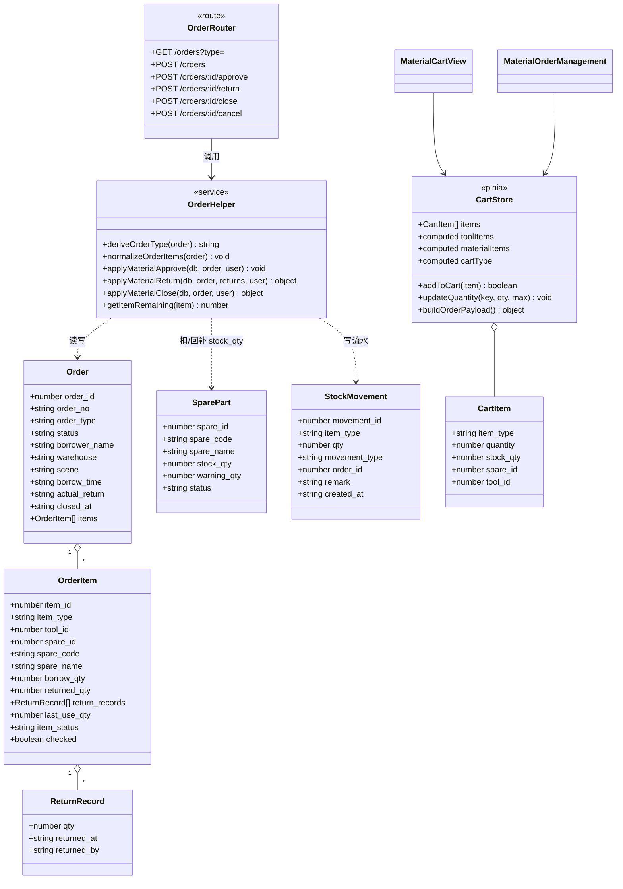
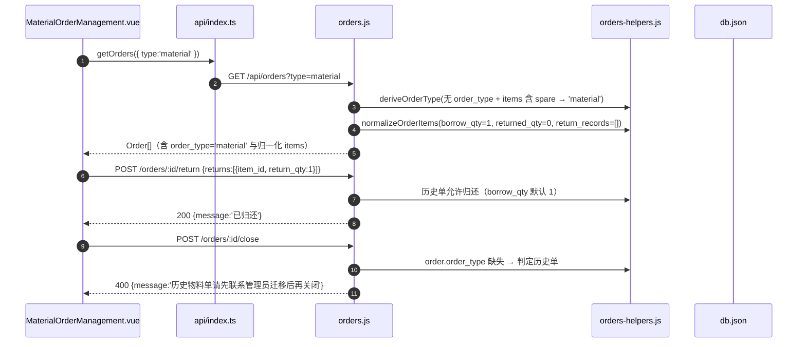

# 增量架构设计：工具/物料领用单分离 + 备件按量归还 + 工单关闭

> 适用系统：工器具/物料管理系统（Node + Express 后端 `backend/`，JSON 库 `backend/db.json`，同步工具 `backend/routes/db.js`；Vue3 + Element Plus PC 前端 `vue-frontend/`）
> 文档性质：**增量修改**，不重写系统，仅描述本次变更。与既有 `docs/system_design.md`（备件低库存改造）独立并存。
> 架构师：Bob（Architect）　|　依据：用户原话 + 主理人已拍板决策 D1–D7 + 产品经理 PRD DB1–DB4/BE1–BE6/PC1–PC6

---

## Part A：系统设计

## 1. 实现方案 + 框架选型

### 1.1 技术难点与应对

| # | 难点 | 应对方案 |
|---|------|----------|
| 1 | 同一张 `orders` 表承载工具单与物料单，历史数据无 `order_type` | **读取时推导 + 操作时归一化**：`deriveOrderType(order)` 纯函数（有字段用字段；无字段按 `items[]` 任一 `item_type==='spare'\|'consumable'` → `material`，否则 `tool`）；所有读接口返回归一化后的 `order_type`；所有写操作对历史备件条目按 `borrow_qty=1, returned_qty=0` 兜底 |
| 2 | 备件从「件级状态」升级为「数量级库存」后，借出/归还/关闭三阶段库存联动 | 三阶段只动 `stock_qty`：**approve 扣减 borrow_qty**（写 borrow 流水）、**return 回补 return_qty**（写 return 流水）、**close 仅统计 last_use_qty**（写 consume 流水，不重复扣减）。全部收敛到 `orders-helpers.js` 纯函数，便于单测 |
| 3 | 状态机新增终态 `closed`，且部分归还期间保持 `borrowed` | 订单级 `status` 维持粗粒度；条目级 `returned_qty` 累计归还进度；`closed` 为终态，关闭后禁止再归还 |
| 4 | 前端购物车要单类型隔离、两套提交 payload | 单一 Pinia store（`cart.ts`）内部按 `item_type` 分组；`addToCart` 强制单类型（混合时拒绝并提示）；两个购物车页面分别过滤 `toolItems` / `materialItems`，分别提交 `tool_ids` / `spare_items` |
| 5 | 向后兼容：移动端扫码领用/归还、`PUT /orders/:id/status`、旧 `tool_ids`/`spare_ids` 入参、旧全量归还 | ① `POST /orders` 继续接受 `tool_ids`+`spare_ids`（旧备件视为 qty=1）；② `POST /orders/:id/return` 不传 `returns[]` 时默认全量归还剩余；③ `PUT /orders/:id/status` 的 approved 分支与 approve 共用同一物料扣库存逻辑；④ 工具单流程零改动 |

### 1.2 关键结论（明确选型）

- **后端：复用 `orders.js`，不拆 `material-orders` 路由**。理由：两条路由若都挂 `/orders` 会与 Express 挂载顺序冲突；订单状态机（pending→borrowed→returned/closed、审批/拒绝/取消）只有一份才不易漂移。将**业务纯逻辑抽到新增 `orders-helpers.js`**，orders.js 只做路由、鉴权与参数校验，可单测、可复用。
- **stock_movements 写入复用 `materials.js` 的 `writeMovement`**（新增一行导出，不复制实现），避免流水结构双份漂移；orders.js 通过 `require('./materials')` 引用（无循环依赖）。
- **流水类型不新增枚举**：沿用 `movement_type: 'out'|'in'|'adjust'`（`stock-movements` 校验与 StockMovement.vue 展示零回归），用 `qty` 符号 + `remark` 语义区分：借出 `out/-N/物料领用-借出扣减`、归还 `in/+N/物料归还-回补`、关闭 `out/-N/物料关闭-最后使用(仅统计)`，并统一带 `order_id` 追溯。
- **前端：单一 cart store + 两个页面 + 两个列表页 + 菜单拆子菜单**（详见 1.3）。
- **兼容策略**：不写一次性迁移（不落库回填 `order_type`），避免风险；`order_type` 缺失本身即「历史单」标记，用于关闭拦截（D6）。读取与操作均幂等归一化。

### 1.3 前端拆分方式

```
菜单（MainLayout.vue）
└── 领用管理（子菜单）
    ├── 工具领用单   /orders?type=tool      → OrderManagement.vue（改：过滤 tool）
    └── 物料领用单   /material-orders       → MaterialOrderManagement.vue（新增）
购物车徽标（Header）→ 按 cartType 跳 /cart（工具）或 /material-cart（物料）
路由（router/index.ts）
    /cart            → ShoppingCart.vue（改：仅工具条目，提交 tool_ids）
    /material-cart   → MaterialCartView.vue（新增：数量步进器，提交 spare_items）
    /orders          → OrderManagement.vue（改：type=tool 过滤）
    /material-orders → MaterialOrderManagement.vue（新增）
```

### 1.4 架构模式

- 后端：**Route（orders.js）+ Service（orders-helpers.js 纯函数）+ JSON Store（db.js）**，近似 MVC 的 Controller/Service 分层，便于单测。
- 前端：Vue3 `<script setup>` Composition API + Pinia（cart store）+ Element Plus 组件，页面内聚归还弹窗/关闭弹窗。

---

## 2. 文件列表

### 后端（4 改 1 增 1 测）

| 文件 | 类型 | 职责 |
|------|------|------|
| `backend/routes/orders-helpers.js` | **新增** | 纯函数：`deriveOrderType` / `normalizeOrderItems` / `applyMaterialApprove` / `applyMaterialReturn` / `applyMaterialClose` / `getItemRemaining`，供 orders.js 与单测复用 |
| `backend/routes/orders.js` | 改 | 接入 helpers：GET type 过滤、POST 拆单校验、approve/return/close、cancel 修复（备件状态恢复）、delete 允许 closed、PUT status 复用物料逻辑 |
| `backend/routes/materials.js` | 改 | ① 底部导出 `writeMovement`（约 1 行）；② 扫码借出 `POST /spare-parts/code/:code/borrow` 创建单补 `order_type:'material'`、条目补 `borrow_qty:1, returned_qty:0, return_records:[]`（约 3 行） |
| `backend/tests/orders-material.test.mjs` | **新增** | 单测：推导规则、创建校验、approve 扣库存、部分归还回补、close 摘要、历史单 close 400 |

### 前端（4 改 2 增）

| 文件 | 类型 | 职责 |
|------|------|------|
| `vue-frontend/src/types/index.ts` | 改 | `Order`/`OrderItem`/`StockMovement` 扩展 `order_type`/`borrow_qty`/`returned_qty`/`return_records`/`last_use_qty`/`closed_at`/`ReturnRecord` 类型 |
| `vue-frontend/src/api/index.ts` | 改 | `getOrders(params?)` 支持 type 过滤、新增 `closeOrder(id)`、`returnOrder(id, returns?)` 带 returns、类型标注 |
| `vue-frontend/src/store/cart.ts` | 改 | 单类型强制（混合拒绝）、`toolItems`/`materialItems`/`cartType` 分组、`updateQuantity` 上限钳制、`buildOrderPayload()` |
| `vue-frontend/src/views/MaterialOrderManagement.vue` | **新增** | 物料领用单列表页：列=单号/领用人/备件明细/借出合计/已归还/状态/领出时间/操作(归还/关闭工单/详情)，含归还弹窗、关闭工单弹窗、详情弹窗，筛选状态/时间/关键词 |
| `vue-frontend/src/views/MaterialCartView.vue` | **新增** | 物料购物车：备件条目+数量步进器（上限=可用库存）、用途/预计归还，提交 `spare_items` |
| `vue-frontend/src/views/OrderManagement.vue` | 改 | 仅工具单（`getOrders({type:'tool'})`）、打印标题改「工具领用单」、`closed` 状态兼容显示 |
| `vue-frontend/src/views/ShoppingCart.vue` | 改 | 仅工具条目（`toolItems`），提交 `tool_ids` |
| `vue-frontend/src/router/index.ts` | 改 | 新增 `/material-orders`、`/material-cart` 两条路由 |
| `vue-frontend/src/layouts/MainLayout.vue` | 改 | 「领用管理」拆为「工具领用单」「物料领用单」子菜单；购物车徽标按 `cartType` 跳转 |

### 文档 / QA

| 文件 | 类型 | 职责 |
|------|------|------|
| `qa_scripts/qa_material_orders.mjs` | **新增** | 端到端冒烟：创建/审批/归还/关闭/历史单兼容全流程断言 |
| `docs/system_design-order-split.md` | **新增** | 本文档 |
| `docs/class-diagram-order-split.mermaid` | **新增** | 类图 |
| `docs/sequence-diagram-order-split.mermaid` | **新增** | 时序图 |

---

## 3. 数据结构与接口

### 3.1 orders 集合字段变更

```
Order {
  order_id: number
  order_no: string
  order_type?: 'tool' | 'material'      // 新增；历史单缺失 → 读取推导（DB1）
  borrower_name: string
  borrower_id: number
  borrower_phone?: string
  status: 'pending'|'approved'|'borrowed'|'returned'|'rejected'|'cancelled'|'closed'  // closed 新增（DB3）
  warehouse: string
  scene: string
  borrow_time: string
  expected_return: string|null
  actual_return: string|null
  purpose: string
  require_approval: boolean
  closed_at?: string                    // 新增，close 时写入
  created_at: string
  items: OrderItem[]
}
```

### 3.2 items 条目结构

工具条目（**不新增字段**，保持现状）：
```
{ item_id, tool_id, tool_code, tool_name, item_status: 'reserved'|'borrowed'|'returned' }
```

物料（备件）条目（DB2）：
```
{
  item_id: number
  item_type: 'spare'
  spare_id: number, spare_code: string, spare_name: string
  borrow_qty: number                   // 新增，>0 整数；历史单默认 1
  returned_qty: number                 // 新增，累计归还，默认 0
  return_records: [{ qty, returned_at, returned_by }]  // 新增，默认 []
  last_use_qty?: number                // 新增，close 时写入 = borrow_qty - returned_qty
  item_status: 'reserved'|'borrowed'|'returned'|'closed'  // closed 新增
}
```

### 3.3 spare_parts / stock_movements

- `spare_parts` **字段不变**：`stock_qty` 语义保持「真实库存」；领出扣、归还回补、关闭不再扣（D2/D3）。`status` 流转 available→reserved(pending)→borrowed(approve)→available(return/close 不涉及工具状态)。
- `stock_movements` **字段不变、类型枚举不变**（复用 `out/in/adjust`），新增约定（DB4）：
  - 借出：`movement_type:'out', qty:-borrow_qty, order_id, remark:'物料领用-借出扣减'`
  - 归还：`movement_type:'in', qty:+return_qty, order_id, remark:'物料归还-回补'`
  - 关闭：`movement_type:'out', qty:-last_use_qty, order_id, remark:'物料关闭-最后使用(仅统计)'`（**不重复扣 stock_qty**）

### 3.4 REST 接口（新增/修改）

| 方法 | 路径 | 入参 | 出参 | 状态码 | 说明 |
|------|------|------|------|--------|------|
| GET | `/api/orders?type=tool\|material` | query `type`（可选） | `Order[]`（已富化 `order_type`、条目归一化、image_url） | 200 | **改**：type 过滤含历史推导（BE1） |
| POST | `/api/orders` | `{ tool_ids?:number[]; toolkit?:string }` 或 `{ spare_items:[{spare_id:number, qty:number}] }` 或旧 `{ spare_ids:number[] }`；公共 `{ warehouse, scene, expected_return, purpose }` | `Order` | 201/200,400 | **改**：拆单校验（BE2） |
| POST | `/api/orders/:id/approve` | - | `{message}` | 200,400,403,404 | **改**：物料单扣 `stock_qty -= borrow_qty` + borrow 流水，库存不足 400（BE3） |
| POST | `/api/orders/:id/reject` | - | `{message}` | 200,400,403,404 | 保持；已兼容备件状态恢复 |
| POST | `/api/orders/:id/return` | `{ returns?:[{item_id?:number, spare_id?:number, return_qty:number}] }` | `{message, order}` | 200,400,403,404 | **改**：物料按量回补；不传 returns 默认全还剩余；全还→returned，否则保持 borrowed（BE4） |
| POST | `/api/orders/:id/close` | - | `{message, summary:{order_id, order_no, status:'closed', items:[{item_id, spare_id, spare_name, borrow_qty, returned_qty, last_use_qty}], total_last_use_qty, closed_at}}` | 200,400,404 | **新增**：仅物料单；历史单 400 提示联系管理员（BE5/D6） |
| POST | `/api/orders/:id/cancel` | - | `{message}` | 200,400,403,404 | **改**：修复备件 status 恢复（现仅恢复工具） |
| PUT | `/api/orders/:id/status` | `{status:'approved'\|'rejected'\|'cancelled'}` | `{message}` | 200,400,403 | 保持；approved 分支与 approve 共用物料扣库存逻辑 |
| GET | `/api/orders/:id/checklist` | - | `{items}` | 200,404 | 保持；物料单仍返回归一化明细，但归还不再强制 checked（D7） |
| POST | `/api/orders/:id/checklist` | `{tool_id, checked}` | `{message, item}` | 200,400,404 | 保持（工具单专用） |
| DELETE | `/api/orders/:id` | - | `{message}` | 200,400,403,404 | **改**：允许删除 `closed` 终态单 |

### 3.5 校验规则（BE2）

- 入参互斥：同时传 `tool_ids`/`toolkit` 与 `spare_items`/`spare_ids` → **400「工具与物料不可混提」**。
- 物料单：`spare_items` 每项 `spare_id` 必须存在且 `status==='available'`（创建时）；`qty` 必须为正整数且 `qty ≤ 该备件记录 stock_qty`。
- 旧 `spare_ids` 兼容：视为 `qty=1` 逐条。
- 工具单：`tool_ids` 校验沿用现状（status==='available'）。

### 3.6 类图



---

## 4. 程序调用流程

### 4.1 物料单主流程（创建 → 审批扣库存 → 按量归还 → 关闭工单）

```mermaid
sequenceDiagram
    autonumber
    actor User as 领用人(PC)
    participant MC as MaterialCartView.vue
    participant CS as cart.ts
    participant API as api/index.ts
    participant OR as orders.js
    participant H as orders-helpers.js
    participant DB as db.json

    User->>MC: 选择备件并设置数量 qty(≤stock_qty)
    MC->>CS: addToCart(spare, qty)（单类型强制）
    User->>MC: 填写用途/预计归还，提交
    MC->>API: createOrder({ spare_items:[{spare_id,qty}], scene, purpose })
    API->>OR: POST /api/orders
    OR->>H: deriveOrderType→'material'; 校验混提/存在性/qty≤stock_qty
    OR->>DB: 写入 order(order_type='material', items:[{borrow_qty,returned_qty:0,return_records:[]}])
    OR->>DB: spare.status='reserved'
    OR-->>MC: 201 order(pending)

    User->>OR: 审批 POST /orders/:id/approve
    OR->>H: applyMaterialApprove: 逐条校验 stock_qty≥borrow_qty
    H->>DB: stock_qty-=borrow_qty; spare.status='borrowed'; borrow_count+1
    H->>DB: writeMovement('out', -borrow_qty, '物料领用-借出扣减', order_id)
    OR-->>User: {message:'已批准'}

    User->>OR: POST /orders/:id/return {returns:[{item_id, return_qty}]}
    OR->>H: applyMaterialReturn: 0≤return_qty≤剩余(borrow_qty-returned_qty)
    H->>DB: stock_qty+=return_qty; item.returned_qty+=return_qty; return_records.push
    H->>DB: writeMovement('in', +return_qty, '物料归还-回补', order_id)
    alt 全部还清
        H->>DB: order.status='returned'; actual_return=now
    else 部分归还
        H->>DB: order.status 保持 'borrowed'（条目 returned_qty 记进度）
    end
    OR-->>User: {message, order}

    User->>OR: POST /orders/:id/close
    OR->>H: applyMaterialClose: 历史单(order_type缺失)→400；否则逐条 last_use_qty=borrow_qty-returned_qty
    H->>DB: writeMovement('out', -last_use_qty, '物料关闭-最后使用(仅统计)', order_id)
    H->>DB: order.status='closed'; closed_at=now; item.item_status='closed'
    OR-->>User: {message, summary}
```

### 4.2 历史单兼容推导与归还/关闭拦截



---

## 5. 任务列表（Part B）

> 本任务为**存量系统增量改造**，无新增脚手架/配置文件/依赖，故 T01 承担「基础设施/共享契约层」角色（类型、API、store、后端共享工具导出），作为一切后续任务的基座。

| 任务 | 名称 | 涉及文件 | 依赖 | 优先级 | 验收点 |
|------|------|----------|------|--------|--------|
| **T01** | 数据契约与共享能力层 | `vue-frontend/src/types/index.ts`（改）、`vue-frontend/src/api/index.ts`（改）、`vue-frontend/src/store/cart.ts`（改）、`backend/routes/materials.js`（改：导出 writeMovement + 扫码借出补 order_type/borrow_qty/returned_qty/return_records） | 无 | **P0** | ① TS 类型含 order_type/borrow_qty/returned_qty/return_records/last_use_qty/closed_at/ReturnRecord；② api 新增 getOrders(params)/closeOrder/returnOrder(id, returns)；③ cart 单类型强制（混合 addToCart 返回 false + 提示）、toolItems/materialItems/cartType、updateQuantity 上限钳制、buildOrderPayload；④ materials.js 导出 writeMovement 且扫码借出创建的订单为 material 单（条目 borrow_qty=1） |
| **T02** | 后端订单核心逻辑（物料三阶段 + 兼容） | `backend/routes/orders-helpers.js`（新增）、`backend/routes/orders.js`（改）、`backend/tests/orders-material.test.mjs`（新增） | T01 | **P0** | ① GET /orders?type 过滤含推导；② POST /orders 拆单校验（混提 400、qty≤stock_qty）；③ approve 扣 stock_qty+borrow 流水、库存不足 400；④ return 按量回补、全还→returned、部分→borrowed、默认全还；⑤ close 摘要、历史单 400、consume 流水不重复扣；⑥ cancel 修复备件状态恢复；⑦ DELETE 允许 closed；⑧ 单测全绿（npm 手跑 node tests/orders-material.test.mjs） |
| **T03** | 物料领用单前端闭环 | `vue-frontend/src/views/MaterialOrderManagement.vue`（新增）、`vue-frontend/src/views/MaterialCartView.vue`（新增）、`vue-frontend/src/router/index.ts`（改） | T01,T02 | **P0** | ① 路由 /material-orders、/material-cart 可用；② 物料列表列=单号/领用人/备件明细/借出合计/已归还/状态/领出时间/操作，筛选状态/时间/关键词；③ 新建流程：备件列表+数量步进器（上限=stock_qty）+用途/预计归还→提交 spare_items；④ 归还弹窗逐条显示借出/已归还/本次归还默认=剩余、校验≤剩余→调 BE4；⑤ 关闭工单弹窗显示每条目 借出−已还=最后使用数量 自动计算摘要+提示文案→调 BE5 |
| **T04** | 工具领用单零回归 | `vue-frontend/src/views/OrderManagement.vue`（改）、`vue-frontend/src/views/ShoppingCart.vue`（改）、`vue-frontend/src/layouts/MainLayout.vue`（改：领用管理子菜单 + 购物车徽标按 cartType 跳转） | T01,T02,T03 | **P0** | ① /orders 仅显示工具单（getOrders({type:'tool'})）；② 工具购物车仅工具条目、提交 tool_ids；③ 工具归还/清点/审批/拒绝/取消/删除流程与现状一致；④ 打印标题为「工具领用单」；⑤ 菜单出现「工具领用单」「物料领用单」两项，徽标按类型跳对应购物车 |
| **T05** | 端到端联调与兼容回归 | `qa_scripts/qa_material_orders.mjs`（新增）、`backend/test-material-smoke.mjs`（改，追加回归断言）、`vue-frontend/`（`npm run build` 构建验证） | T03,T04 | P1 | ① e2e 脚本覆盖：物料创建→审批扣库存→部分归还→关闭摘要→历史单 close 400→工具单零回归冒烟；② 前端 vue-tsc/vite build 无 TS 错误；③ 低库存/盘库接口回归通过（不破坏既有改造） |

**P0 闭环 = T01–T04**（后端闭环 T01+T02，前端物料 T03，前端工具零回归 T04）。

---

## 6. 依赖包

**无新增第三方依赖**。全部复用既有栈：
- 后端：`express` / `express-validator` / `crypto` / `fs`（均已存在）
- 前端：`vue` / `pinia` / `vue-router` / `element-plus` / `axios`（均已存在）
- 测试：Node 内置 `node:test` / `assert`（`backend/tests/*.test.mjs` 已采用同风格，无需新装）

---

## 7. 共享知识（跨文件约定）

1. **order_type 推导规则**：`order.order_type` 存在则用之；否则 `items[]` 任一 `item_type==='spare' || item_type==='consumable'` → `'material'`，否则 `'tool'`。所有读接口返回富化后的 `order_type`；**不写库回填**（缺失即历史单标记）。
2. **条目归一化**：读接口与写操作对备件条目统一 `item_type = item.item_type || 'tool'`；备件条目 `borrow_qty = item.borrow_qty || 1`、`returned_qty = item.returned_qty || 0`、`return_records = item.return_records || []`。
3. **数量语义**：`borrow_qty`=借出数量（>0 整数）；`returned_qty`=累计已归还（默认 0，`Σ return_records[].qty`）；`last_use_qty = borrow_qty − returned_qty`（关闭时自动计算，不手填）；**剩余可还 = borrow_qty − returned_qty**。
4. **status 流转**：
   - 工具单：`pending →(approve) borrowed →(return 全量) returned`；`pending → rejected/cancelled`；无 closed。
   - 物料单：`pending →(approve 扣库存) borrowed →(部分归还) 保持 borrowed →(close) closed`；`pending → rejected/cancelled`；`borrowed →(全还) returned`。
   - `closed` 为终态：关闭后禁止归还/再关闭/再审批。
5. **stock_movements 约定**：复用 `movement_type 'out'|'in'|'adjust'`；`qty` 符号 = 借出负、归还正、关闭负（仅统计不重复扣）；`remark` 前缀 `物料领用-借出扣减` / `物料归还-回补` / `物料关闭-最后使用(仅统计)`；一律带 `order_id`。手动出入库/盘库/消耗品直领逻辑**不动**。
6. **可用库存口径（BE6）**：可用数 = 该备件记录 `stock_qty`（记录级）。创建时宽松校验 `qty ≤ stock_qty`（仅 `available` 可领）；approve 时强校验 `stock_qty ≥ borrow_qty`，不足 400 并保持 pending（由管理员拒绝/调整）。**不维护独立「在途占用」计数**——领出即扣、归还即回补，`stock_qty` 始终是真实库存，低库存（`stock_qty ≤ warning_qty`）与盘库逻辑天然正确。
7. **历史单兼容**：历史备件单默认 `borrow_qty=1` 且可正常归还；`close` 对无 `order_type` 字段的历史单返回 400「历史物料单请先联系管理员迁移后再关闭」。
8. **移动端兼容**：移动端扫码领用生成的物料单走同一 approve 扣库存链路；移动端 `returnOrder(id)` 无 returns body → 后端默认全还剩余。
9. **响应格式**：沿用 `{message}` / 直接返回实体（本项目无统一信封，前端 api 层 `.then(r => r.data)` 透传）。
10. **时间格式**：统一 `nowCST()`（`YYYY-MM-DDTHH:mm:ss.SSS+08:00`）。

---

## 8. 待明确事项 / 实现注意点

1. **approve 库存不足的订单处置**：保持 `pending` 不自动拒绝，由管理员拒绝或调整——需要 UI 提示语（物料列表「批准失败：库存不足」）。
2. **closed 单删除**：允许删除（与 returned/cancelled/rejected 同级）；如业务不允许删除终态单，可只删 returned/cancelled/rejected，需实现时确认。
3. **打印标题**：现 OrderManagement.vue 打印区标题写死「物料领用单」，本设计将其改为「工具领用单」（工具页）；物料页打印沿用「物料领用单」，需在实现时确认打印版式是否需要「数量/已归还/最后使用」列。
4. **Dashboard**：`orders_*` 统计未区分类型，本次不改；如需「closed 数量」统计可放入 P1 后续。
5. **扫码领用（materials.js borrow）**：本次仅补 `order_type`/`borrow_qty` 字段，移动端 UI 不强制改；如移动端物料单需要归还填数量，属后续移动端任务。
6. **低库存/盘库共存**：本次只通过 `stock_qty` 联动，不触碰 `computeSpareLowStock`/`buildSpareModelMap`/盘库落账逻辑；T05 需回归 `spare-low-stock.test.mjs`。
7. **并发写库**：`writeDB` 已有锁，但 approve 校验与扣减之间无事务；极端并发下两个审批可能同时通过校验——现有系统一致性问题，本次不引入事务（最小变更），如需可后续加乐观锁。
