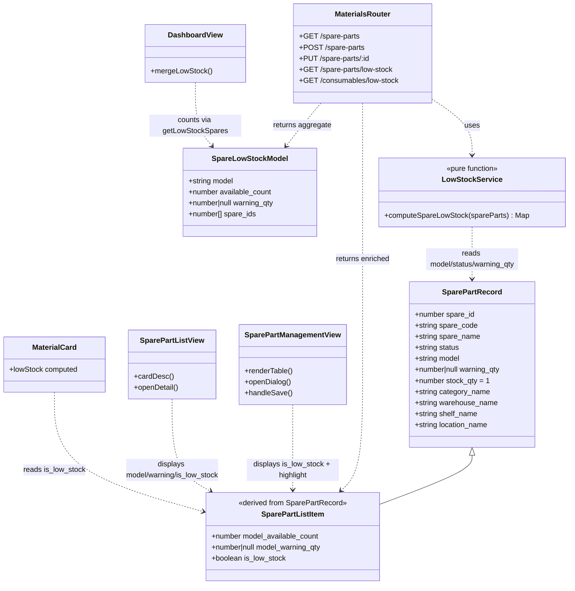
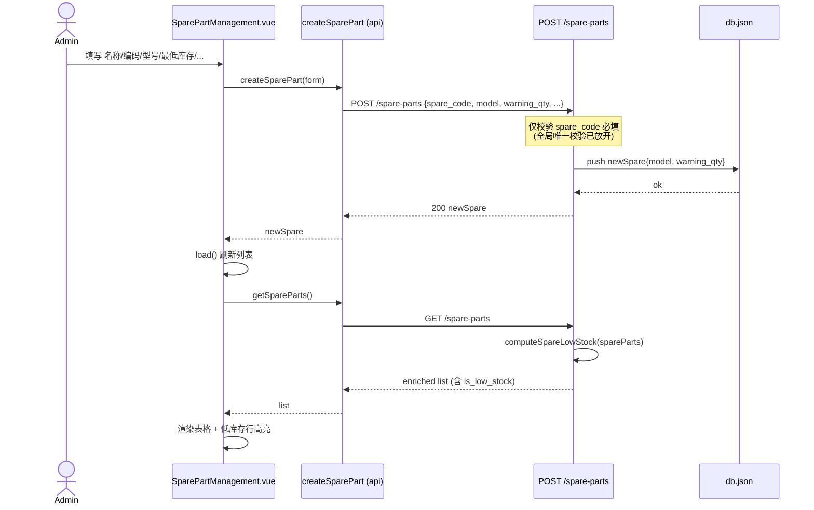
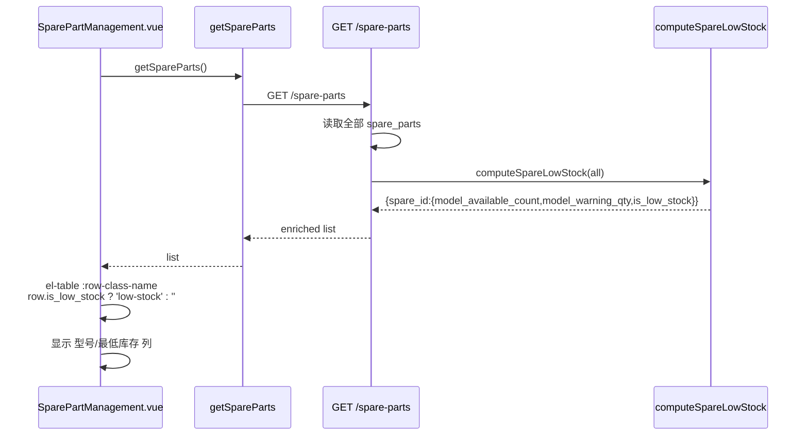
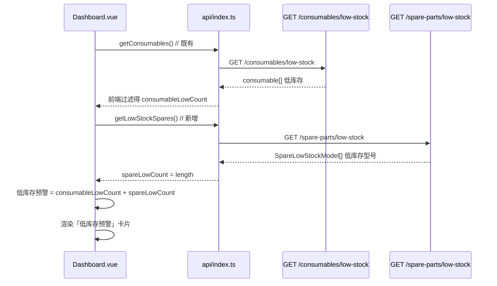
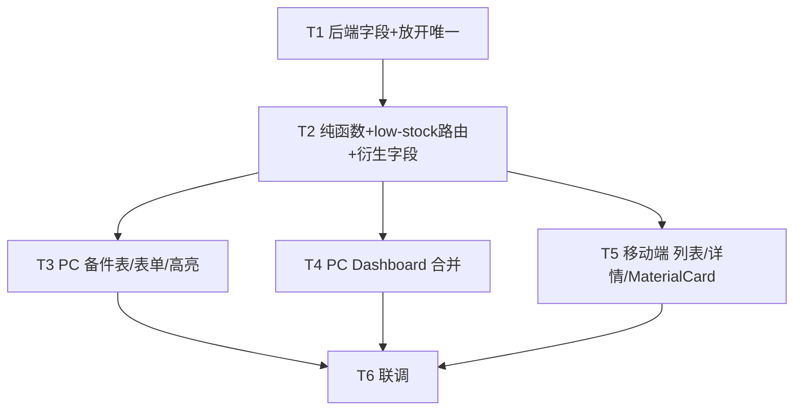

# 增量架构设计：物料最低库存设置（备件补齐「型号分组 + warning_qty」）

> 适用系统：已上线物料管理系统（Node + Express 后端 / Vue3 + Element Plus PC 前端 / Vant4 移动端 / JSON `db.json`）
> 文档性质：**增量修改**，不重写系统，仅描述本次变更。
> 架构师：高见远（Bob）　|　依据：增量 PRD（PM 许清楚）+ 主理人裁决（Q1–Q6）

---

## 1. 实现方案 + 框架选型

### 1.1 技术难点与方案
| 难点 | 方案 |
|------|------|
| 备件"低库存"概念与消耗品不同（备件是件级冗余、按型号聚合判定） | 后端封装**纯函数** `computeSpareLowStock(spareParts)`，列表接口与 low-stock 接口**共用**同一判定逻辑，保证一致性 |
| 放开 `spare_code` 唯一后，同型号多件共存 | 仅删除全局唯一校验块；`spare_code` 仍 `notEmpty`（序列号必填） |
| 前端"型号级"预警展示统一 | 后端在列表响应中直接附带衍生字段 `model_available_count` / `model_warning_qty` / `is_low_stock`，前端只做展示，不在前端重算 |

### 1.2 框架选型（无新增依赖）
- **后端**：纯 Express 既有栈（`express` / `express-validator` / `multer` / `sharp`），**不新增任何框架或库**。
- **PC 前端**：Vue3 + Element Plus + TypeScript 既有栈。
- **移动端**：Vue3 + Vant4 既有栈。
- **数据持久化**：沿用 `readDB()/writeDB()` + `db.json`，备件新增字段以**缺省值**落库（Q3：旧数据 `model` 缺省 `''`、`warning_qty` 缺省 `null`），不迁移旧数据、不建型号主数据表（Q1）。

### 1.3 架构模式
保持现有"单文件路由 + 富函数"风格（仿 `tools.js` / 现有 `materials.js`）。新增逻辑全部落在 `backend/routes/materials.js` 内，**不新增后端文件**。

---

## 2. 文件列表及相对路径（修改清单）

> 全部为**修改**，无新增后端文件、无新增前端页面文件。

| # | 相对路径 | 类型 | 本次改动点（精确位置） |
|---|----------|------|------------------------|
| 1 | `backend/routes/materials.js` | 修改 | ① `POST /spare-parts`：解构并落库 `model`/`warning_qty`，**删除**第189-191行 `spare_code` 全局唯一校验块（保留 `notEmpty` 校验）；② `PUT /spare-parts/:id`：补 `model`/`warning_qty` 读写；③ `GET /spare-parts`：列表项附带 `model_available_count`/`model_warning_qty`/`is_low_stock`；④ 新增 `computeSpareLowStock()` 纯函数；⑤ 新增 `GET /spare-parts/low-stock` 路由 |
| 2 | `vue-frontend/src/views/SparePartManagement.vue` | 修改 | ① `<el-table>` 增加「型号」「最低库存」两列；② 新增/编辑表单增加「型号」「最低库存」输入项；③ 新增备件 `openDialog` 默认值补 `model:''`、`warning_qty:null`；④ 低库存行高亮（`:row-class-name`） |
| 3 | `vue-frontend/src/views/Dashboard.vue` | 修改 | 物料统计区「低库存消耗品」卡片改为「低库存预警」= 消耗品低库存数 + 备件低库存型号数；分别调用两类 low-stock 后合并计数 |
| 4 | `vue-frontend/src/api/index.ts` | 修改 | 新增 `getLowStockSpares = () => request.get('/spare-parts/low-stock').then(r => r.data)`（与既有 `getLowStockConsumables` 对齐） |
| 5 | `mobile-frontend/src/views/SparePartList.vue` | 修改（P1） | ① 卡片 `cardDesc` 暴露型号；② 详情弹层增加「型号」「最低库存」单元格；③ 列表项按 `is_low_stock` 显示「库存预警」标签 |
| 6 | `mobile-frontend/src/components/MaterialCard.vue` | 修改（P1） | 修复备件低库存判定：优先用 `current.is_low_stock === true`；消耗品回退原 `warning_qty!=null && stock_qty<=warning_qty` 逻辑 |
| 7 | `mobile-frontend/src/api/material.ts` | 可能修改（P1） | 可选新增 `getLowStockSpares`（与 `getLowStockConsumables` 对齐），供移动端直接取备件低库存型号时使用 |
| 8 | `vue-frontend/src/types/index.ts` | 可能修改（可选） | `SparePart` 接口补充 `model?`、`warning_qty?`、`model_available_count?`、`model_warning_qty?`、`is_low_stock?`（仅类型提示，非运行时必需） |

---

## 3. 数据结构与接口

### 3.1 `spare_parts` 数据项新增字段（落库）
| 字段 | 类型 | 缺省 | 说明 |
|------|------|------|------|
| `model` | `string` | `''` | 型号；同型号多件可共存（Q3） |
| `warning_qty` | `number \| null` | `null` | 最低库存阈值；`null` 表示未设阈值（不预警，共享知识） |

> 件级冗余存储（Q1）：每件备件自带 `model` + `warning_qty`，不建型号主数据表；同一 `model` 的各件 `warning_qty` 由管理员保持一致。

### 3.2 `GET /spare-parts` 列表项附带衍生字段
在既有 enriched 对象（含 `category_name`/`warehouse_name` 等）基础上，每项追加：

| 衍生字段 | 类型 | 计算规则 |
|----------|------|----------|
| `model_available_count` | `number` | 同 `model` 且 `status==='available'` 的件数（空 `model` 单独计为一组） |
| `model_warning_qty` | `number \| null` | 该件自身 `warning_qty` |
| `is_low_stock` | `boolean` | `model !== '' && warning_qty != null && model_available_count < warning_qty` |

> 设计决策：空 `model` 不参与"型号级低库存"（无法分组），故 `is_low_stock` 对空 `model` 恒为 `false`；仅 `warning_qty` 为 `null` 时也不预警。

### 3.3 `GET /spare-parts/low-stock` 返回结构（新增）
- 中间件：`authenticate`（与 `consumables/low-stock` 一致）。
- 返回：**明文 JSON 数组**（`res.json(list)`，镜像 `consumables/low-stock` 的传输形态，无信封）。
- 元素 schema（型号聚合对象）：

| 字段 | 类型 | 说明 |
|------|------|------|
| `model` | `string` | 型号（聚合键；空 `model` 不纳入） |
| `available_count` | `number` | 该型号下 `status==='available'` 件数 |
| `warning_qty` | `number \| null` | 该型号最低库存阈值（取同组首件值，同组冗余一致） |
| `spare_ids` | `number[]` | 该型号下全部备件 `spare_id` 列表 |

- 聚合筛选条件：`model !== '' && warning_qty != null && available_count < warning_qty`（低库存型号才返回）。

### 3.4 `GET /consumables/low-stock` 真实返回结构（已 Read 确认，作为镜像参照）
```js
// backend/routes/materials.js L503-508
router.get('/consumables/low-stock', authenticate, (req, res) => {
  const db = readDB();
  const list = (db.consumables || []).filter(c => c.warning_qty != null && c.stock_qty <= c.warning_qty);
  res.json(list);   // ← 明文数组：通过过滤的消耗品完整记录
});
```
**镜像要点**：① 同样 `res.json(数组)` 明文返回、无信封；② 消耗品是"件级"低库存（逐条记录），备件是"型号级"低库存（聚合对象）——两者都是"低库存单元列表"，结构对应。

### 3.5 类图（组件 / 数据 / 路由关系）
> 完整 Mermaid 见 `docs/class-diagram.mermaid`。



---

## 4. 程序调用流程（时序图）

> 完整 Mermaid 见 `docs/sequence-diagram.mermaid`。覆盖三条主流程：①新增备件带型号+预警值→保存；②列表加载→后端算 is_low_stock→前端高亮；③Dashboard→分别调两类 low-stock→合并计数。

**流程一：新增备件（带型号 + 最低库存）→ 保存**


**流程二：列表加载 → 后端算 is_low_stock → 前端高亮**


**流程三：Dashboard → 分别调两类 low-stock → 合并计数**


---

## 5. 任务列表（有序、含依赖、按实现顺序）

| 任务ID | 任务名称 | 源文件 | 依赖 | 优先级 |
|--------|----------|--------|------|--------|
| **T1** | 后端：备件加 `model`+`warning_qty` 落库；放开 `spare_code` 唯一校验 | `backend/routes/materials.js` | 无 | P0 |
| **T2** | 后端：低库存纯函数 `computeSpareLowStock` + `GET /spare-parts/low-stock` + 列表衍生字段 | `backend/routes/materials.js` | T1 | P0 |
| **T3** | PC：备件表加型号/最低库存列 + 表单输入 + 低库存行高亮 | `vue-frontend/src/views/SparePartManagement.vue` | T2 | P0 |
| **T4** | PC：Dashboard 合并备件与消耗品低库存统计 | `vue-frontend/src/views/Dashboard.vue`、`vue-frontend/src/api/index.ts` | T2 | P0 |
| **T5** | 移动端：备件列表/详情暴露型号+最低库存；修复 `MaterialCard` 备件预警判定 | `mobile-frontend/src/views/SparePartList.vue`、`mobile-frontend/src/components/MaterialCard.vue`、`mobile-frontend/src/api/material.ts`(可选) | T2 | P1 |
| **T6** | 联调验证：两条主流程（新增带阈值备件→列表高亮；Dashboard 合并计数）端到端验证 | 上述全部 | T1–T5 | P0/P1 |

> 依赖说明：T2 依赖 T1 的数据字段（model/warning_qty 已落库才能计算衍生字段）；T3/T4/T5 均依赖 T2 的 `is_low_stock` 衍生字段与 `GET /spare-parts/low-stock` 接口；T6 为收尾联调。

### 任务依赖图


---

## 6. 依赖包列表

| 包 | 变化 | 说明 |
|----|------|------|
| （无） | — | 后端/前端均无新增或升级的 npm 依赖；全部沿用既有栈 |

---

## 7. 共享知识（跨文件约定）

1. **`is_low_stock` 判定规则（统一）**：
   - 备件：`model !== '' && warning_qty != null && model_available_count < warning_qty`
   - 消耗品（既有，前端过滤）：`warning_qty != null && stock_qty <= warning_qty`
2. **`warning_qty` 为 `null` 时不预警**（无论备件/消耗品）。
3. **衍生字段命名统一**：`model_available_count`（该型号可用件数）、`model_warning_qty`（该件阈值）、`is_low_stock`（布尔）；前端直接读取，不在前端重算判定。
4. **移动端 `getSpareParts` 调用约定**：`api/material.ts` 内部已 `.then(r => r.data)` 解包，调用方拿到的是**已解包数组**，**切勿再写 `.data`**。同理 PC `getSpareParts`/`getConsumables` 亦已解包。
5. **`spare_code` 仍必填**（序列号），但不再全局唯一；放开后允许同 `model` 多件共存。
6. **低库存聚合口径**：`GET /spare-parts/low-stock` 仅纳入 `model !== ''` 的型号；`spare_ids` 含该型号全部件（含非 available），`available_count` 仅计 `available`。
7. **传输形态一致**：两类 low-stock 接口均明文 `res.json(数组)`，无 `{code,data,message}` 信封；前端按数组长度/过滤计数。
8. **盘库逻辑（Q4）、消耗品 `model` 后端落库（Q5）本期不动**；P2（批量设阈值/消息通知/移动端 Dashboard 低库存卡片）本期不做。

---

## 8. 待明确事项

- **无**。下列裁决已闭环：Q1 件级冗余、Q2 镜像返回+前端合并+不建聚合接口、Q3 放开唯一但必填+旧数据缺省、Q4 盘库不动、Q5 消耗品 model 后端不动、Q6 P1 含移动端列表/详情+修 MaterialCard（移动端 Dashboard 卡片归 P2）。
- **设计决策备注（供工程师知悉，非阻塞）**：空 `model` 不参与型号级低库存（避免旧数据 lone 项误报）；`GET /spare-parts/low-stock` 的 `warning_qty` 取同组首件值（依赖件级冗余一致，由管理员保证）。

---

## 9. Read 文件与关键结论回溯（交付说明）

- 已 Read：`backend/routes/materials.js`、`backend/db.json`、`vue-frontend/src/views/{SparePartManagement,ConsumableManagement,Dashboard}.vue`、`vue-frontend/src/api/index.ts`、`vue-frontend/src/types/index.ts`、`mobile-frontend/src/views/{SparePartList,ConsumableList,Dashboard}.vue`、`mobile-frontend/src/components/MaterialCard.vue`、`mobile-frontend/src/api/material.ts`。
- 核心结论：① `consumables/low-stock` 返回明文数组（已确认），备件 low-stock 镜像其传输形态、元素改为型号聚合对象；② spare_code 唯一校验在第189-191行需删除；③ 列表接口需复用 `computeSpareLowStock` 计算衍生字段；④ PC Dashboard 当前前端过滤消耗品低库存，需补 spare 调用合并；⑤ MaterialCard 因备件无 `stock_qty` 致预警恒不触发，改读 `is_low_stock`。
