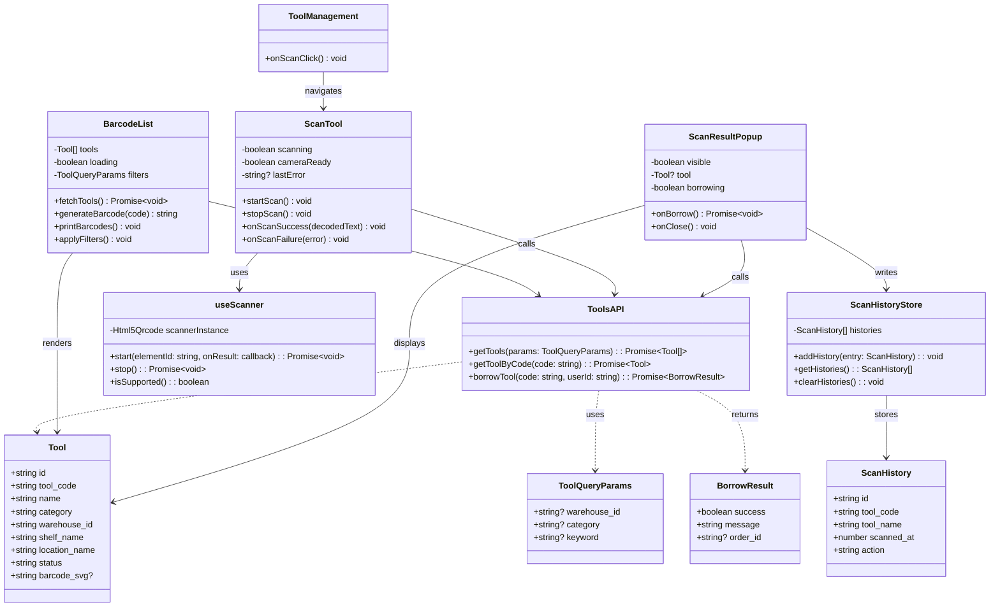
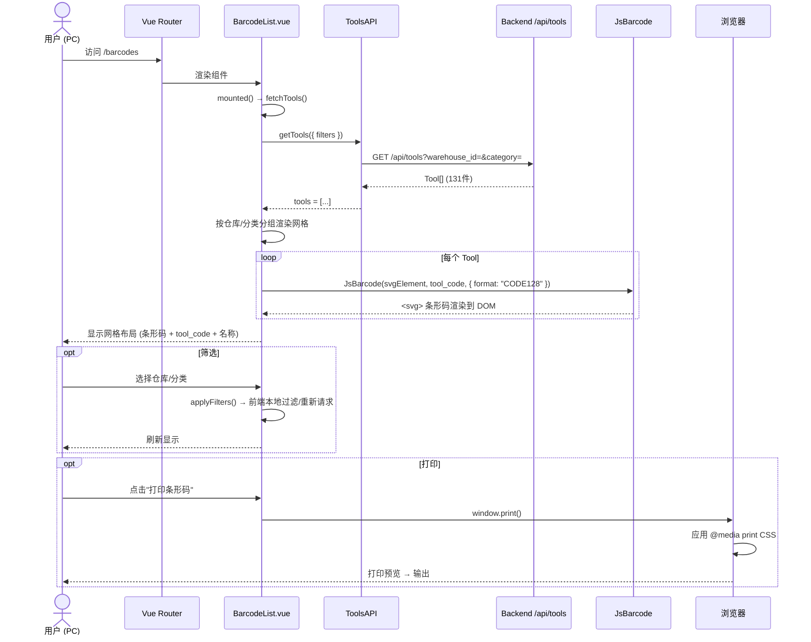
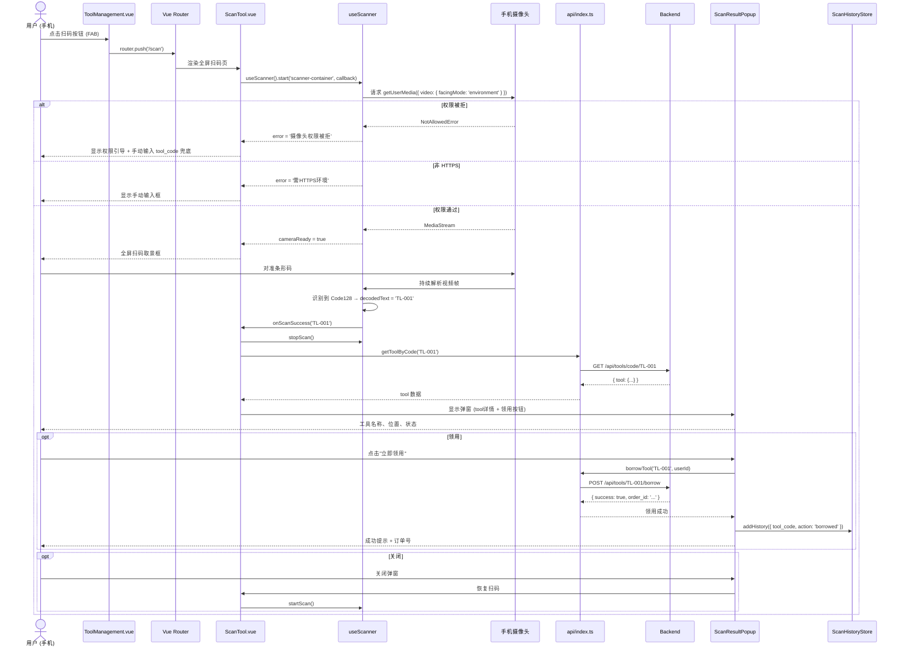
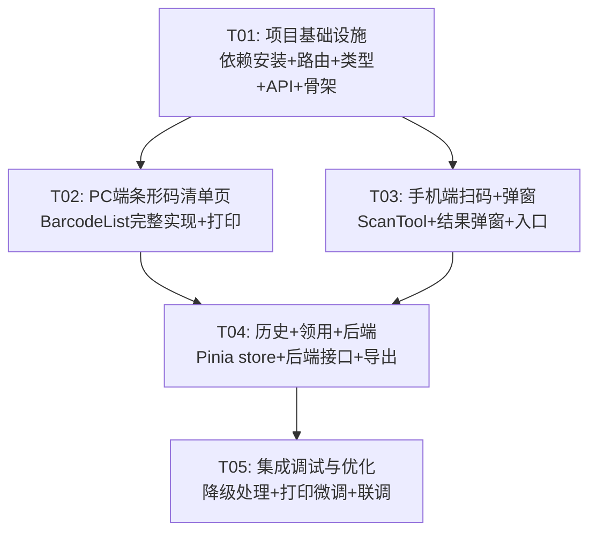

# 条形码+扫码功能 — 系统设计文档

> **设计者**：Bob (Architect)
> **日期**：2026-01-13
> **基线**：基于 PRD v1.0

---

## Part A: 系统设计

---

### 1. 实现方案

#### 1.1 核心挑战

| 挑战 | 分析 | 对策 |
|------|------|------|
| Code128 条形码生成 | 131 件工具，需在 PC 端批量渲染为可打印网格 | JsBarcode 全前端 SVG 模式，零后端依赖 |
| 手机摄像头扫码 | 需在 HTTPS 下调用 getUserMedia，同时兼容 Code128 一维码 | html5-qrcode 库（内置 Code128 支持）+ Vant 全屏 overlay |
| 打印/导出 | 条形码清单需高质量打印或导出 PDF | `window.print()` + `@media print` CSS（优先）；P1 阶段用 html2canvas + jsPDF |
| 摄像头权限 | 非 HTTPS 环境 `getUserMedia` 不可用 | 引导用户升级 HTTPS；dev 环境提供手动输入 tool_code 兜底 |
| 扫码直接领用 | 扫码后应一键完成领用 | 手机端弹窗展示工具详情 + "立即领用"按钮，调用现有领用逻辑（购物车/订单） |

#### 1.2 架构模式

- **PC端**：沿用 Vue 3 + Element Plus 的组件化 SPA 模式，新增 `/barcodes` 路由
- **手机端**：沿用 Vue 3 + Vant 4 + Pinia 的页面-组件模式，新增 `/scan` 路由 + 扫码 composable
- **扫码逻辑**：封装为 `useScanner` composable，便于复用和测试

#### 1.3 框架与库选型

| 用途 | 库 | 版本 | 选型理由 |
|------|----|------|----------|
| 条形码生成 | `jsbarcode` | ^3.11.6 | 纯 JS、支持 Code128、SVG/Canvas 双模式、轻量 (~40KB) |
| 扫码识别 | `html5-qrcode` | ^2.3.8 | 支持 Code128/Code39/EAN 等一维码、持续扫描模式、TypeScript 类型完备 |
| PDF 导出 (P1) | `html2canvas` + `jspdf` | ^1.4.1 / ^2.5.1 | 前端截图+拼PDF，无需后端 |
| 打印 (P0) | 浏览器原生 `window.print()` | — | 零依赖，CSS `@media print` 控制分页 |

> **关于 html5-qrcode**：虽然名字含 "qrcode"，该库 v2.x 已支持 Code128、Code39、EAN-13 等一维码格式。配置 `formatsToSupport: [Html5QrcodeSupportedFormats.CODE_128]` 即可限定只扫 Code128。

#### 1.4 为什么不选其他方案

| 候选方案 | 放弃理由 |
|----------|----------|
| bwip-js | 功能强大但 API 更复杂，JsBarcode 对 Code128 已足够 |
| QuaggaJS | 已停止维护，TypeScript 支持差 |
| zxing-js/library | 体积大 (~400KB)，API 对一维码不友好 |
| 微信 JS-SDK 扫一扫 | 仅限微信环境，不通用 |

---

### 2. 文件列表

#### 2.1 PC端 (`vue-frontend/`)

```
vue-frontend/
├── package.json                          # [修改] 新增 jsbarcode 依赖
├── src/
│   ├── router/
│   │   └── index.ts                      # [修改] 新增 /barcodes 路由
│   ├── views/
│   │   └── BarcodeList.vue               # [新建] 条形码清单页 (~300行)
│   ├── api/
│   │   └── tools.ts                      # [修改/新建] 工具列表 API 封装（若无则新建）
│   ├── types/
│   │   └── tool.ts                       # [修改] Tool 类型补充 barcode 相关字段
│   └── styles/
│       └── barcode-print.css             # [新建] 打印专用样式
```

#### 2.2 手机端 (`mobile-frontend/`)

```
mobile-frontend/
├── package.json                          # [修改] 新增 html5-qrcode 依赖
├── src/
│   ├── router/
│   │   └── index.ts                      # [修改] 新增 /scan 路由
│   ├── views/
│   │   ├── ToolManagement.vue            # [修改] 增加扫码FAB按钮
│   │   └── ScanTool.vue                  # [新建] 全屏扫码页 (~200行)
│   ├── components/
│   │   └── ScanResultPopup.vue           # [新建] 扫码结果弹窗 (~150行)
│   ├── composables/
│   │   └── useScanner.ts                 # [新建] 扫码逻辑封装 (~100行)
│   ├── api/
│   │   └── index.ts                      # [修改] 新增按 code 查工具、领用接口
│   ├── store/
│   │   └── scanHistory.ts                # [新建] Pinia 扫码历史 store
│   └── types/
│       └── scan.ts                       # [新建] 扫码相关类型定义
```

#### 2.3 后端 (`backend/`)

```
backend/
├── routes/
│   └── tools.js                          # [修改] 新增 GET /api/tools/code/:code、POST /api/tools/:code/borrow
└── db.json                               # [修改] 可选：预置 scan_history 字段
```

---

### 3. 数据结构与接口



---

### 4. 程序调用流程

#### 4.1 PC端：条形码清单页加载与打印



#### 4.2 手机端：扫码 → 识别 → 弹窗 → 领用



---

### 5. 待明确事项 (UNCLEAR)

| # | 事项 | 当前假设 | 影响 |
|---|------|----------|------|
| 1 | 领用逻辑：是走现有购物车→订单流程，还是独立的一键领用？ | 假设为**独立一键领用**（POST /api/tools/:code/borrow），与购物车解耦 | 若需走购物车流程，ScanResultPopup 需引入 cart store |
| 2 | 用户身份：领用需要哪个 userId？ | 假设 mobile-frontend 已有登录态，可从 Pinia userStore 获取；若无，领用按钮暂时禁用并提示登录 | 需确认现有登录机制 |
| 3 | 条形码格式：tool_code 的具体格式？例如 `TL-001` 还是纯数字？ | 假定为字符串，Code128 支持全部 ASCII，无论格式均可编码 | 无影响 |
| 4 | 扫码历史存储：localStorage 还是后端持久化？ | P0 阶段用 Pinia + localStorage 持久化，P1 可选后端存储 | 多设备同步需求 |
| 5 | PC端 `src/api/tools.ts` 是否已存在？ | 假设不存在，任务中新建；若已有则仅追加 getTools 方法 | 文件新建 vs 修改 |
| 6 | 131 件工具数据：是否已在 db.json 中？ | 假设已存在，tool_code 字段已填充 | 若无则需补充数据迁移 |

---

## Part B: 任务分解

---

### 6. 依赖包列表

```
# PC端 (vue-frontend/)
- jsbarcode@^3.11.6                          # Code128 条形码生成

# 手机端 (mobile-frontend/)
- html5-qrcode@^2.3.8                        # 扫码识别（支持 Code128 一维码）
- @types/w3c-image-capture@^1.0.10           # 摄像头 API 类型（devDependency，可选）

# P1 阶段（暂不安装，任务 T04 时再装）
# - html2canvas@^1.4.1                        # DOM 截图
# - jspdf@^2.5.1                              # PDF 生成
```

---

### 7. 任务列表（按依赖排序）

| ID | 任务名 | 源文件 | 依赖 | 优先级 |
|----|--------|--------|------|--------|
| **T01** | **项目基础设施** | `vue-frontend/package.json`（修改）、`mobile-frontend/package.json`（修改）、`vue-frontend/src/router/index.ts`（修改）、`mobile-frontend/src/router/index.ts`（修改）、`vue-frontend/src/types/tool.ts`（修改/新建）、`mobile-frontend/src/types/scan.ts`（新建）、`vue-frontend/src/api/tools.ts`（新建）、`mobile-frontend/src/api/index.ts`（修改）、`vue-frontend/src/views/BarcodeList.vue`（新建-骨架）、`mobile-frontend/src/views/ScanTool.vue`（新建-骨架）、`mobile-frontend/src/composables/useScanner.ts`（新建） | 无 | P0 |
| **T02** | **PC端条形码清单页** | `vue-frontend/src/views/BarcodeList.vue`（完整实现）、`vue-frontend/src/styles/barcode-print.css`（新建）、`vue-frontend/src/api/tools.ts`（补充筛选参数） | T01 | P0 |
| **T03** | **手机端扫码 + 结果弹窗** | `mobile-frontend/src/views/ScanTool.vue`（完整实现）、`mobile-frontend/src/views/ToolManagement.vue`（修改）、`mobile-frontend/src/components/ScanResultPopup.vue`（新建）、`mobile-frontend/src/composables/useScanner.ts`（补充） | T01 | P0 |
| **T04** | **扫码历史 + 领用 + 后端接口** | `mobile-frontend/src/store/scanHistory.ts`（新建）、`mobile-frontend/src/api/index.ts`（补充领用/按code查询）、`backend/routes/tools.js`（修改）、`vue-frontend/src/views/BarcodeList.vue`（补充PDF导出）、`vue-frontend/src/styles/barcode-print.css`（补充导出样式） | T02, T03 | P1 |
| **T05** | **集成调试与优化** | `mobile-frontend/src/views/ScanTool.vue`（HTTPS检测+降级）、`mobile-frontend/src/composables/useScanner.ts`（错误处理完善）、`vue-frontend/src/views/BarcodeList.vue`（打印微调）、`mobile-frontend/src/views/ToolManagement.vue`（扫码入口微调） | T04 | P0 |

#### 任务详情

---

#### T01: 项目基础设施

**说明**：安装所有依赖，注册路由，创建类型定义、API 封装、composable 骨架和页面骨架文件。

**新建/修改文件**：

| 操作 | 文件 | 内容 |
|------|------|------|
| 修改 | `vue-frontend/package.json` | 添加 `"jsbarcode": "^3.11.6"` 到 dependencies |
| 修改 | `mobile-frontend/package.json` | 添加 `"html5-qrcode": "^2.3.8"` 到 dependencies |
| 修改 | `vue-frontend/src/router/index.ts` | 新增路由 `{ path: '/barcodes', name: 'Barcodes', component: () => import('@/views/BarcodeList.vue') }` |
| 修改 | `mobile-frontend/src/router/index.ts` | 新增路由 `{ path: '/scan', name: 'ScanTool', component: () => import('@/views/ScanTool.vue') }` |
| 新建 | `vue-frontend/src/types/tool.ts` | Tool 接口定义：`id, tool_code, name, category, warehouse_id, shelf_name, location_name, status` |
| 新建 | `mobile-frontend/src/types/scan.ts` | `ScanResult`, `ScanHistory`, `BorrowResult` 接口定义 |
| 新建 | `vue-frontend/src/api/tools.ts` | `getTools(params): Promise<Tool[]>` 封装 GET /api/tools |
| 修改 | `mobile-frontend/src/api/index.ts` | 新增 `getToolByCode(code)` 和 `borrowTool(code)` 方法（签名先行） |
| 新建 | `vue-frontend/src/views/BarcodeList.vue` | 骨架：`<template>` 含标题+占位区，`<script setup>` 含 fetchTools 调用 |
| 新建 | `mobile-frontend/src/views/ScanTool.vue` | 骨架：全屏容器 + 返回按钮，`<script setup>` 引入 useScanner |
| 新建 | `mobile-frontend/src/composables/useScanner.ts` | 导出 `useScanner()`，返回 `{ start, stop, isSupported, error }` |

**验收标准**：
- `npm install` 在两端均无报错
- 访问 `/barcodes`（PC）显示骨架页
- 访问 `/scan`（手机）显示骨架页
- TypeScript 编译无类型错误

---

#### T02: PC端条形码清单页

**说明**：完整实现 BarcodeList.vue，包含：工具栏筛选、网格布局条形码渲染、打印功能。

**新建/修改文件**：

| 操作 | 文件 | 内容 |
|------|------|------|
| 修改 | `vue-frontend/src/views/BarcodeList.vue` | 完整实现：Element Plus 筛选栏（仓库下拉/分类下拉）+ 响应式网格（4-6列）+ 每个卡片含 JsBarcode SVG + tool_code + 名称 + 位置；`mounted` 时调用 JsBarcode 为每个 tool 生成 SVG；打印按钮触发 `window.print()` |
| 新建 | `vue-frontend/src/styles/barcode-print.css` | `@media print` 规则：隐藏导航/侧边栏、网格按 A4 分页（`page-break-after: always` 每N行）、条形码 SVG 保持尺寸 |

**关键技术点**：
- JsBarcode 使用方式：`JsBarcode('#barcode-' + tool.id, tool.tool_code, { format: 'CODE128', width: 2, height: 60, displayValue: true, fontSize: 12 })`
- 网格使用 CSS Grid：`grid-template-columns: repeat(auto-fill, minmax(180px, 1fr))`
- 打印时通过 `@media print` 切换为 3 列、A4 纸适配
- 筛选在前端完成（131件数据量小），或带参数重新请求 API

**验收标准**：
- 页面加载后 131 个条形码全部渲染为清晰 SVG
- 按仓库/分类筛选后显示正确
- 点击打印 → 浏览器打印预览中条形码清晰、分页正确

---

#### T03: 手机端扫码 + 结果弹窗

**说明**：完整实现 ScanTool.vue 全屏扫码页、ToolManagement.vue 扫码入口、ScanResultPopup.vue 弹窗组件。

**新建/修改文件**：

| 操作 | 文件 | 内容 |
|------|------|------|
| 修改 | `mobile-frontend/src/views/ScanTool.vue` | 全屏扫码界面：顶部返回按钮 + 闪光提示，中央 `<div id="scanner-container">` 渲染摄像头画面，底部"手动输入编码"兜底入口；`onMounted` → `useScanner().start('scanner-container', onResult)` |
| 修改 | `mobile-frontend/src/views/ToolManagement.vue` | 在右下角增加 Vant `FloatingBubble` 或 `Fab` 扫码按钮，`@click="router.push('/scan')"` |
| 新建 | `mobile-frontend/src/components/ScanResultPopup.vue` | Vant `Popup` + `Card`：展示工具名称、编码、仓库位置、状态；底部"立即领用"按钮 + "关闭"按钮；领用中 loading 状态 |
| 修改 | `mobile-frontend/src/composables/useScanner.ts` | 完整实现 `start(id, onSuccess, onError)` → 初始化 `new Html5Qrcode(id)` → `start({ facingMode: 'environment' }, { fps: 10, qrbox: { width: 250, height: 100 }, formatsToSupport: [Html5QrcodeSupportedFormats.CODE_128] }, onSuccess, onError)` |

**关键技术点**：
- html5-qrcode 配置 `formatsToSupport: [Html5QrcodeSupportedFormats.CODE_128]` 只扫 Code128
- `qrbox` 设为宽矩形（250×100），适配一维码比例
- 扫描成功后立即 `stop()` 防止重复识别
- 摄像头权限失败时降级为手动输入框

**验收标准**：
- ToolManagement 页面可见扫码按钮
- 点击后进入全屏扫码页，摄像头正常工作
- 对准 Code128 条形码后识别成功，弹出工具详情弹窗
- 弹窗展示完整信息，关闭后可继续扫码

---

#### T04: 扫码历史 + 领用 + 后端接口

**说明**：实现扫码历史记录存储、后端按 code 查询和领用接口、PC 端 PDF 导出。

**新建/修改文件**：

| 操作 | 文件 | 内容 |
|------|------|------|
| 新建 | `mobile-frontend/src/store/scanHistory.ts` | Pinia store：`histories: ScanHistory[]`，`addHistory()`、`clearHistories()`，使用 `pinia-plugin-persistedstate` 或手动 `watch` + `localStorage` 持久化 |
| 修改 | `mobile-frontend/src/api/index.ts` | 实现 `getToolByCode(code)` → `GET /api/tools/code/:code`，`borrowTool(code)` → `POST /api/tools/:code/borrow` |
| 修改 | `backend/routes/tools.js` | 新增 `GET /api/tools/code/:code` → 按 tool_code 精确查找；新增 `POST /api/tools/:code/borrow` → 校验+记录领用 |
| 修改 | `vue-frontend/src/views/BarcodeList.vue` | 新增"导出PDF"按钮，用 html2canvas 截图网格区域 → jsPDF 拼接（P1 功能，基础实现即可） |
| 修改 | `mobile-frontend/src/components/ScanResultPopup.vue` | 集成 borrowTool API 调用，领用成功后写入 scanHistoryStore |

**验收标准**：
- 扫码后点击领用 → 后端记录成功 → 弹窗提示"领用成功"
- 扫码历史正确写入 localStorage，刷新不丢失
- PC 端可导出 PDF 文件
- 后端 `GET /api/tools/code/:code` 返回正确工具

---

#### T05: 集成调试与优化

**说明**：HTTPS/摄像头权限降级处理、打印/扫码体验微调、最终联调测试。

**新建/修改文件**：

| 操作 | 文件 | 内容 |
|------|------|------|
| 修改 | `mobile-frontend/src/composables/useScanner.ts` | 检测 `!window.isSecureContext` → 返回明确错误信息；`getUserMedia` 被拒 → 返回权限引导文案 |
| 修改 | `mobile-frontend/src/views/ScanTool.vue` | 非 HTTPS 或权限被拒时：隐藏摄像头区域，显示 Vant `Empty` 组件 + 手动输入 tool_code 的 `Field` + `Button` |
| 修改 | `vue-frontend/src/views/BarcodeList.vue` | 打印预览微调：确保条形码不跨页断裂、添加页眉页脚 |
| 修改 | `mobile-frontend/src/views/ToolManagement.vue` | 扫码按钮增加权限徽标（如扫码历史计数） |

**验收标准**：
- HTTP 环境下手动输入降级可用
- 拒绝摄像头权限后显示引导文案
- 打印输出条形码清晰、不截断
- 两端功能联调通过

---

### 8. 共享知识 (跨文件约定)

```
1. 条形码格式：统一使用 Code128，JsBarcode 参数：{ format: "CODE128", width: 2, height: 60, displayValue: true, fontSize: 12, margin: 10 }

2. tool_code 字段约定：字符串类型，如 "TL-001"，Code128 支持全部 ASCII 字符，无格式限制

3. 扫码回调签名：
   onScanSuccess: (decodedText: string, decodedResult: Html5QrcodeResult) => void
   onScanFailure: (errorMessage: string, error: Html5QrcodeError) => void

4. API 响应格式：沿用现有 { code: number, data: any, message: string } 格式
   - GET /api/tools → { code: 200, data: Tool[], message: 'ok' }
   - GET /api/tools/code/:code → { code: 200, data: Tool, message: 'ok' } 或 { code: 404, data: null, message: '未找到工具' }
   - POST /api/tools/:code/borrow → { code: 200, data: { order_id: string }, message: '领用成功' }

5. localStorage Key 约定：
   - 扫码历史: "scan_history" → JSON.stringify(ScanHistory[])

6. useScanner 仅支持单例：全局只有一个 Html5Qrcode 实例，离开页面时 onUnmounted 自动 stop()

7. 移动端 base 路径：所有路由前缀 /m/（已配置），新增 /scan → 实际访问 /m/scan

8. 打印 CSS 约定：PC 端 @media print 使用 @import 或 <link media="print"> 引入 barcode-print.css
```

---

### 9. 任务依赖图



---

## 附录: 关键代码片段（参考）

### A1. useScanner composable 核心结构

```typescript
// mobile-frontend/src/composables/useScanner.ts
import { ref, onUnmounted } from 'vue'
import { Html5Qrcode, Html5QrcodeSupportedFormats } from 'html5-qrcode'

export function useScanner() {
  const error = ref<string | null>(null)
  const scanning = ref(false)
  let scanner: Html5Qrcode | null = null

  async function start(
    elementId: string,
    onSuccess: (text: string) => void,
    onFail?: (msg: string) => void
  ) {
    if (!window.isSecureContext) {
      error.value = '扫码需要 HTTPS 环境，请使用手动输入'
      return
    }
    scanner = new Html5Qrcode(elementId)
    try {
      await scanner.start(
        { facingMode: 'environment' },
        {
          fps: 10,
          qrbox: { width: 250, height: 100 },
          formatsToSupport: [Html5QrcodeSupportedFormats.CODE_128],
        },
        (decodedText) => {
          scanning.value = false
          scanner?.stop()
          onSuccess(decodedText)
        },
        (errMsg) => onFail?.(errMsg)
      )
      scanning.value = true
    } catch (e: any) {
      error.value = e.message || '摄像头启动失败'
    }
  }

  async function stop() {
    if (scanner?.isScanning) await scanner.stop()
    scanning.value = false
  }

  onUnmounted(() => stop())

  return { start, stop, error, scanning }
}
```

### A2. JsBarcode 调用模式

```typescript
// vue-frontend/src/views/BarcodeList.vue 中
import JsBarcode from 'jsbarcode'

function renderBarcode(tool: Tool) {
  const svgEl = document.getElementById(`barcode-${tool.id}`)
  if (svgEl) {
    JsBarcode(svgEl, tool.tool_code, {
      format: 'CODE128',
      width: 2,
      height: 60,
      displayValue: true,
      fontSize: 12,
      margin: 10,
    })
  }
}
```
